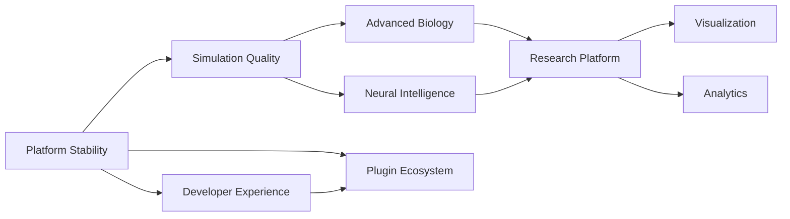

# Phylon — Implementation Status & Phase 2 Roadmap

**Document type:** Post-implementation engineering audit and forward roadmap
**Supersedes:** `PHYLON_PROMPT_v2.md`'s implementation assumptions (the original spec remains valid as a *vision* document; this document is the source of truth for *current state*)
**As of:** End of Epic 15 (Learning Framework) — all 15 epics of the first implementation roadmap closed
**Audience:** Any engineer picking up this project cold

> **Reading order for a new contributor:** (1) this document's Executive Summary, (2) the Implementation Status Matrix, (3) the ADRs for the subsystem you're about to touch, (4) the Deferred Work Inventory and Technical Debt sections for that subsystem, before writing any code.

---

## How this document was produced

Every claim below was checked against the repository as it exists today — `grep`/`Read` against source files, not recollection of design conversations. Where a claim rests on a code fact, the file/line is cited. Test/build/lint status was re-run at the time of writing: **180 tests passing, 0 failing, across 30 crates; `cargo clippy --workspace --all-targets -- -D warnings` clean; `cargo fmt --all -- --check` clean; `cargo doc` clean with `-D warnings`.**

---

## PHASE 1 — Repository Audit

### Workspace shape

30 crates under `crates/`, one binary (`app`, producing `phylon.exe`). Dependency direction is enforced by convention (documented, not compiler-enforced): `app` is the sole crate permitted to depend on everything; all other crates are siblings that reach each other only through a small number of deliberately-chosen edges (e.g. `organisms` depends on `brain`+`metabolism`+`ecology`+`behavior`+`sensing`, but `analytics` depends on none of the simulation-domain crates — see ADR-014).

### Per-epic status

| Epic | Status | Evidence |
|---|---|---|
| 1 — Determinism Foundation | **Completed** | `common::SimRng` (`crates/common/src/lib.rs`), `common::TickRate`, CI determinism guardrail (`.github/workflows/ci.yml`) grepping for `rand::thread_rng()`/`rand::random()`. **Caveat:** guardrail doesn't catch `fastrand::` — see Tech Debt DEBT-001. |
| 2 — Configuration Consistency | **Completed** | Single `TickRate` resource used in `simulation.rs`, `render.rs`, `app.rs`, `events.rs` — no duplicate `DT` constants found on re-scan. |
| 3 — Architectural Debt Cleanup | **Completed** | `thiserror` removed from `common`/`diffusion` Cargo.tomls; stale "Phase 0 scope" doc comments fixed in `world`/`spatial`/`gpu`/`research`/`learning` at the time — **though several *new* stale doc comments were introduced later by other work and only some were caught in later epics (see DEBT-002).** |
| 4 — Spatial Acceleration | **Completed** | `crates/spatial/src/{index,hash,quadtree,uniform_grid}.rs` — `SpatialIndex` trait with three implementations, all with dedicated tests. |
| 5 — Chunked World | **Deferred (user-directed), see ADR-001** | Zero code changes. Fixed ±1500 bounded arena remains hardcoded independently in `gpu/src/physics.wgsl`, `app/src/render.rs`, `app/src/simulation.rs`, `app/src/app.rs`. |
| 6 — Parallel Simulation (rayon) | **Completed** | `rayon` in workspace deps; snapshot/parallel-compute/sequential-reduce pattern implemented in `metabolism`, `sensing`, `behavior`, each with a `*_is_deterministic_regardless_of_thread_count` test. `crates/benchmarks/benches/metabolism_parallel.rs` exists. |
| 7 — Genetics Improvements | **Completed** | Diploid genomes (`genetics::genome::DiploidAlleles`, `GENOME_SCHEMA_VERSION = 3`), per-locus mutation rate (`CppnConnection::mutation_rate`, self-adaptive drift), distance-based speciation (`evolution::SpeciesRegistry`, `Genome::distance`, NEAT-style compatibility formula). |
| 8 — Neural Plasticity | **Completed** | `Brain::apply_hebbian_update`, `Neuromodulators` (dopamine/serotonin/noradrenaline), `Brain::prune_weak_synapses`, `winner_take_all`, `plasticity_enabled` fields. `SchemaVersion` bumped 1→2 for the bincode-breaking `Brain` field additions. |
| 9 — Advanced Ecology | **Completed** | `ecology::disease` (SIR-style infection state machine, spatial-proximity spread, pathogen mutation via jitter), `ecology::fungi` (remote nutrient siphon + redistribution), seasonal cycle layered on `day_night_cycle_system`. **Found but not fixed: `fastrand` determinism gap — DEBT-001.** |
| 10 — Multicellular/Colonial Systems | **Completed (scoped subset)** | Flocking + pack hunting (`organisms::social`), biofilm (`organisms::quorum`), Health regen/drain, colonial budding (`reproduction::ReproductionMode::Budding` + physical spring tether). **Explicitly out of scope, not attempted:** germ-soma separation, vascular/muscle/neural specialization, metamorphosis, HGT, true morphogen-gradient fields, alliance/coalition dynamics — see Cancelled/Deferred, Phase 4 & 6. |
| 11 — Research Infrastructure | **Completed** | `research::ExperimentManifest` (RON-serialized, now actually constructed at startup — previously dead code), `storage` CSV export (organisms/lineages/events), `app::batch::run_batch` + `research::{BatchRunConfig, ExperimentReport}`. |
| 12 — Analytics Expansion | **Completed** | Shannon/Simpson diversity indices, species richness/turnover, age/generation distributions, `analytics::graph` (connected components, colony size distribution, diameter), CSV/JSON time-series export. |
| 13 — Replay System | **Completed (scoped subset)** | `storage::replay::{ReplayLog, ReplayAction, ReplayBundle}`, `app::replay::run_replay`, variable-speed playback. **Fixed a real pre-existing bug**: `SimRng` was never reseeded on `LoadState`. **Scope limit, by design:** only 4 non-Entity-referencing interventions are replayable (`ReseedEcosystem`, `SpawnPreset`, `SpawnProtoFish`, `SpawnManualHazard`) — Entity-referencing interventions (`KillEntity` etc.) are excluded (ADR-007). |
| 14 — Plugin System | **Completed (scoped subset)** | `plugins::PluginEngine` wraps a real `rhai::Engine`; scenario authoring (`research.scenario_path`) and periodic scripted interventions (`research.periodic_script_path`) wired into `main.rs`. **Dynamic plugin loading (compiled binaries via FFI) was never attempted — cancelled, see Phase 6.** |
| 15 — Learning Framework | **Completed (scoped subset)** | `learning::ExternalAgent` marker, `Brain::external_override`, real `MarlCommand::{GetState,SetActions,Reset,SetDifficulty}` handlers replacing what were previously stub/no-op implementations in `main.rs`. **`pyo3`/`burn`/`candle` never attempted — cancelled, see Phase 6.** Single-agent only, not true multi-agent RL. |

**Pre-existing foundation, not part of the numbered epics:** a 13-milestone UI overhaul (design tokens, component catalog, accessibility pass, window management, etc.) completed before Epic 1 began — evidenced by `docs/design/*.md` (8 files) and the UI crate's current token-based architecture (`crates/ui/src/theme.rs`, `crates/ui/src/widgets.rs`).

---

## PHASE 2 — Implementation Status Matrix

| Epic | Original Goal | Status | Completion % | Architecture Implemented | Deferred Items | Remaining Work | Breaking Decisions | Future Dependencies | Risk | Testing | Docs |
|---|---|---|---|---|---|---|---|---|---|---|---|
| 1 | Deterministic RNG everywhere | Completed | 100% | `SimRng`, `TickRate`, CI guardrail | — | Close `fastrand` gap (DEBT-001) | None | — | Low | Strong (unit + CI) | Good |
| 2 | Single tick-rate source | Completed | 100% | `TickRate` resource | — | None | None | — | Low | Indirect (via consumers) | Good |
| 3 | Remove dead deps/stale docs | Completed | 100% | Cargo.toml pruning, doc fixes | — | New staleness has since crept back in (DEBT-002) | None | — | Low | N/A | Fair (drifts over time) |
| 4 | Pluggable spatial index | Completed | 100% | `SpatialIndex` trait, 3 impls | GPU-accelerated spatial index | None planned | Non-breaking trait extraction | Epic 5 (if revived) | Low | Strong | Good |
| 5 | Infinite chunked world | **Deferred indefinitely** | 0% | — | Everything | Full redesign across 3 GPU kernels if ever revived | N/A | Blocks any "infinite world" feature | Medium (if revived) | N/A | Scoping note only |
| 6 | Rayon-parallel biology systems | Completed | 100% | Snapshot/parallel/reduce ×3 systems | GPU-side parallelism for these systems | None planned | None | — | Low | Strong (determinism tests) | Good |
| 7 | Diploid genomes, per-locus mutation, speciation | Completed | 100% | `DiploidAlleles`, `mutation_rate`, `SpeciesRegistry` | Epigenetics, HGT, non-disjunction | Possible future refinement: periodic representative refresh | `GENOME_SCHEMA_VERSION` 2→3 (breaking) | Epic 10's colonial systems reuse `Genome::distance` transitively | Low | Strong | Good |
| 8 | Hebbian plasticity, neuromodulators | Completed | 100% | `apply_hebbian_update`, `Neuromodulators`, pruning | Per-synapse evolved plasticity via CPPN | None planned | `SchemaVersion` 1→2 (breaking) | — | Low | Strong | Good |
| 9 | Disease, fungal networks, seasons | Completed | 100% | `disease.rs`, `fungi.rs`, seasonal `day_night_cycle_system` | True diffused concentration field for disease; extended `Diet` taxonomy | Diet taxonomy expansion is a clean follow-on | None | — | Low-Medium | Strong | Good |
| 10 | Multicellular/colonial systems | **Partial by design** | ~35% of full spec section | Flocking, pack hunting, biofilm, budding, Health regen | Germ-soma, vascular/muscle/neural specialization, metamorphosis, HGT, morphogen fields, coalitions | Large — see Phase 4 | None | Epic 12's colony connectivity depends on budding springs | Medium | Strong | Good |
| 11 | Experiment manifests, CSV export, batch runs | Completed | 100% | `ExperimentManifest`, CSV export, `run_batch` | `.phylon-research` as one bundled archive format | Bundle CSV+SQLite+manifest into one archive | None | Epic 13's replay reuses `PhylonApp` construction pattern | Low | Strong | Good |
| 12 | Diversity metrics, distributions, connectivity | Completed | 100% | Shannon/Simpson, richness/turnover, colony graph analysis | Fitness/selection gradient, predation maps, brain-activation stats, experiment comparison dashboard | Large — see Phase 4 | None | — | Low | Strong | Good |
| 13 | Replay capture/playback | **Partial by design** | ~70% of full spec section | `ReplayLog`, `run_replay`, variable speed | Entity-referencing interventions; UI timeline widget; scenario/periodic scripts not wired into batch/replay modes | Medium | None (fixed a bug instead) | Epic 14's scripting reuses the same 4-action taxonomy | Low-Medium | Strong | Good |
| 14 | Embedded scripting | **Partial by design** | ~60% of full spec section | `rhai` engine, scenario + periodic scripts | Dynamic plugin loading (FFI) | Medium-Large if pursued | New `rhai` dependency (first ML-adjacent 3rd-party runtime) | Epic 15 reused the scripting bridge pattern | Low | Strong | Good |
| 15 | RL environment wiring | **Partial by design** | ~50% of full spec section | Real `GetState`/`SetActions`/`Reset`/`SetDifficulty` | `pyo3`, `burn`, `candle`, true multi-agent RL | Large if pursued | `#[serde(skip)]` on `Brain::external_override` (non-breaking) | — | Low-Medium | Strong | Good |

**Aggregate:** 15/15 epics closed; 9 fully complete against their own (already-scoped-down-from-spec) milestone list, 6 explicitly partial by deliberate, documented scope decisions made during implementation (not oversights).

---

## PHASE 3 — Architectural Decision Records

### ADR-001: Defer the infinite chunked world (Epic 5)

- **Problem:** The original spec assumed an "infinite chunked world." The actual simulation is a fixed ±1500 bounded arena, hardcoded independently in three places (`physics.wgsl`, `render.rs`, `simulation.rs`).
- **Decision:** Do not implement chunking. Scope it as a dedicated future initiative if ever needed.
- **Alternatives considered:** (a) Implement M5.1 scaffolding only; (b) full chunking redesign now.
- **Reasoning:** The bounded arena has its own working GPU-native broad-phase grid; retrofitting chunking would require redesigning three GPU kernels simultaneously with no clear near-term research need driving it. User explicitly chose deferral via `AskUserQuestion` when the roadmap-vs-code conflict was surfaced.
- **Consequences:** World size is a compile-time-adjacent constant (±1500), not runtime-scalable. Any future "large world" research question is blocked until this is revisited.
- **Future impact:** If revived, must redesign `physics.wgsl`, `diffusion_step.wgsl`, and the render culling path together — not a small patch.

### ADR-002: Single seeded `SimRng`, not per-system RNGs

- **Problem:** Multiple systems needed randomness (mutation, spawn placement, mate selection); using `rand::thread_rng()` anywhere breaks reproducibility.
- **Decision:** One `ChaCha8Rng`-backed `SimRng` ECS resource, threaded through every stochastic call site via `resource_scope`/`ResMut`.
- **Alternatives considered:** Per-system RNGs seeded from a master seed (rejected — harder to reason about draw ordering across parallel systems); `rand::random()` for "unimportant" randomness (rejected — no such thing exists in a determinism-guaranteed simulation).
- **Reasoning:** A single canonical stream makes "same seed → same run" a simple, auditable guarantee.
- **Consequences:** Every new stochastic system must remember to thread `SimRng` through — this is a discipline, not a compiler-enforced rule, and it has already leaked twice (`fastrand::` in `ecology`/`organisms` — DEBT-001).
- **Future impact:** A `#[deny]`-level lint or a wrapper type that makes `fastrand`/`rand::thread_rng` uncallable without an explicit escape hatch would close this permanently; not yet built.

### ADR-003: Snapshot → parallel-compute → sequential-reduce for rayon parallelism

- **Problem:** `metabolism`, `sensing`, `behavior` needed parallelization, but floating-point summation into shared state (e.g. `GlobalAtmosphere`) is not associative — naive parallel iteration would make results depend on thread scheduling.
- **Decision:** Three-phase pattern: (1) sequential snapshot into plain owned data, (2) `rayon::par_iter().map(pure_fn).collect()` (order-preserving regardless of thread count), (3) sequential reduction/writeback in the snapshot's fixed order.
- **Alternatives considered:** Lock-based shared mutable state (rejected — contention + still needs ordering discipline for float sums); GPU-side parallelism (rejected for this pass — CPU rayon was the targeted scope).
- **Reasoning:** Rayon's indexed `map`/`collect` guarantees output order matches input order regardless of which thread computed which element — this is the load-bearing guarantee the whole pattern depends on.
- **Consequences:** Every new parallel system must follow this exact shape or risk non-determinism. Documented in each system's own doc comment, not centrally enforced.
- **Future impact:** A shared helper/macro capturing this pattern would reduce the risk of a future author getting it wrong; not yet built.

### ADR-004: Diploid genomes as an additive, not exclusive, ploidy path

- **Problem:** Adding diploid support could have meant replacing the haploid genome model entirely.
- **Decision:** `Genome.ploidy: Ploidy` field, `second_allele: Option<DiploidAlleles>` — haploid remains the default and zero-cost (`Cow::Borrowed`, no allocation) path; diploid is opt-in via `Genome::new_diploid`.
- **Alternatives considered:** Genome enum with `Haploid(Cppn, Cppn)` / `Diploid(...)` variants (rejected — would have required matching on ploidy at every genome call site instead of one field check).
- **Reasoning:** Backward compatibility with every existing haploid-only call site (spawning, reproduction) was preserved with zero changes required at those sites.
- **Consequences:** `GENOME_SCHEMA_VERSION` bumped 2→3 (breaking bincode change) — `data/autosave.bin` and any other pre-existing saves are incompatible, no migration path exists.
- **Future impact:** Sexual reproduction still produces haploid offspring via crossover (blending), not diploid offspring — deciding whether mating should itself produce diploid children is an open product question, not yet decided.

### ADR-005: Per-locus mutation rate is a field on `CppnConnection`, self-adaptive, not CPPN-evolved

- **Problem:** The spec wanted evolvable per-locus mutation control, not a single global constant.
- **Decision:** `CppnConnection.mutation_rate: f32`, drifting by a small bounded random delta on every mutation pass, inherited through crossover and connection-splitting (with the split's two new connections inheriting the parent locus's rate).
- **Alternatives considered:** A fourth CPPN output node evolving mutation rate per-connection (rejected — would require restructuring every hardcoded Hox-driven genome's brain-wiring topology and all existing brain-CPPN tests).
- **Reasoning:** Self-adaptive drift achieves genuine per-locus evolvability without touching the CPPN's I/O topology.
- **Consequences:** Mutation rate evolution is now a first-class heritable trait, verified by dedicated tests (rate 0 never mutates across 10,000 trials, rate 1.0 always does).
- **Future impact:** A CPPN-evolved mutation rate (spatially patterned, not per-locus-independent) remains a documented possible future refinement.

### ADR-006: Speciation via representative-comparison, not all-pairs distance

- **Problem:** NEAT-style speciation naively requires O(population²) pairwise genetic distance.
- **Decision:** `SpeciesRegistry` compares each new organism against one representative genome per existing species; classification cost is O(species_count) per spawn, not O(population²).
- **Alternatives considered:** Full pairwise clustering (rejected — doesn't scale); periodic-only reclassification (rejected as sole mechanism — representative-comparison already solves the performance problem without needing to defer to a periodic batch).
- **Reasoning:** Species count stays orders of magnitude smaller than population count, so this is cheap even at thousands of organisms.
- **Consequences:** Representatives are chosen once at species founding and never refreshed — a documented approximation, not a bug. A species founded early in a run compares against an increasingly-outdated representative as its members keep mutating.
- **Future impact:** Periodic representative refresh (e.g., resample each generation) is a named possible improvement, not yet built.

### ADR-007: Replay records interventions, not per-tick state — and only non-Entity-referencing ones

- **Problem:** Full per-tick state recording for replay would be expensive; but not every "external intervention" is safely replayable.
- **Decision:** Record only 4 of `~15+` possible `MenuAction` variants — the ones whose parameters resolve to plain data (position, name) rather than a live `Entity` handle.
- **Alternatives considered:** Recording all interventions including `KillEntity` (rejected — entity IDs are an artifact of one run's allocation order, not guaranteed stable across a fresh replay run; replaying "kill entity #47" against a differently-allocated #47 would silently corrupt the replay instead of failing loudly).
- **Reasoning:** A documented, honest limitation is safer than a plausible-looking but occasionally-wrong feature.
- **Consequences:** `KillEntity`/`TrackEntity`/`SelectEntity`/etc. are not replayable. A run with manual kills will not replay identically.
- **Future impact:** A stable "organism identity" scheme (e.g., a persistent UUID component surviving despawn/respawn cycles) would be a prerequisite for extending replay to entity-referencing actions.

### ADR-008: Scripts queue commands, never touch `bevy_ecs` directly

- **Problem:** Embedding `rhai` scripts into a live ECS simulation risks either unsafe raw-pointer tricks or a heavyweight `Rc<RefCell<World>>` scheme.
- **Decision:** `plugins` crate has zero `bevy_ecs`/simulation-domain dependencies. Registered rhai functions push a `ScriptCommand` onto an `Rc<RefCell<Vec<_>>>` queue; the host (`app::scripting`) drains and applies commands after the script returns.
- **Alternatives considered:** Raw-pointer capture into closures for direct World access (rejected — technically unsafe, harder to reason about); full `Rc<RefCell<PhylonApp>>` (rejected — `PhylonApp` holds live GPU/window state unsuited to shared-ownership wrapping).
- **Reasoning:** A script is provably safe regardless of its content — there is no live mutable state for it to reach, by construction, not by convention.
- **Consequences:** Scripts can only do exactly what's been registered (4 functions) — same command taxonomy as `ReplayAction` (deliberately reused, not reinvented).
- **Future impact:** Extending scripting to more actions means extending both the registered-function list and the shared taxonomy; the pattern scales cleanly.

### ADR-009: External RL control overrides `Brain` output, not its internal dynamics

- **Problem:** Injecting an RL trainer's action into an organism needs to bypass its evolved CTRNN's output without corrupting its internal state.
- **Decision:** `Brain.external_override: Option<Vec<f32>>`, checked first in `get_outputs()`. The CTRNN keeps integrating internally; only the read-out is intercepted.
- **Alternatives considered:** Disabling brain evaluation entirely for controlled organisms (rejected — would create a discontinuity in internal state when control is handed back).
- **Reasoning:** Control can be handed back to the evolved brain at any tick with no internal-state discontinuity.
- **Consequences:** `#[serde(skip)]` on this field — it's transient control state, not evolved data, so no `SchemaVersion` bump was needed (unlike `winner_take_all`/`plasticity_enabled` in Epic 8, which *did* require one).
- **Future impact:** Multi-agent extension would need this to become a `HashMap<Entity, Vec<f32>>`-style structure rather than a single global override target.

### ADR-010: `SchemaVersion`/`GENOME_SCHEMA_VERSION` bumped twice with no migration path

- **Problem:** `Brain` (Epic 8) and `Genome` (Epic 7) both gained new fields serialized directly via bincode into `.phylon` snapshots.
- **Decision:** Bump the version constant and document the break; do not build a migration path.
- **Alternatives considered:** Writing a migration function per version bump (rejected as premature — no user-facing saved-game continuity requirement exists yet at this research-tool stage).
- **Reasoning:** Flagging a break honestly is strictly better than silently corrupting or crashing on old saves.
- **Consequences:** `data/autosave.bin` (pre-existing dev artifact) and any `.phylon` file saved before Epic 7/8 cannot be loaded by the current build.
- **Future impact:** If Phylon ever needs saved-run continuity across versions (e.g., a long-running research campaign spanning code updates), a real migration framework becomes necessary — currently there is none.

### ADR-011: CSV/JSON export lives in `storage`/`analytics`, batch/replay orchestration lives in `app`

- **Problem:** `research`/`analytics`/`storage` need to stay decoupled from `bevy_ecs`/simulation-domain crates, but *something* has to bridge them to real ECS state.
- **Decision:** Every bridge (`app::batch`, `app::analytics_bridge`, `app::scripting`, `app::learning_bridge`, `app::replay`) lives in `app`, the composition root. The "pure" crates only ever gain new dependencies on `bevy_ecs`-free types.
- **Alternatives considered:** Letting `analytics`/`research` depend directly on `evolution`/`physics` (rejected — repeatedly, across 5 separate epics — to keep those crates independently testable without a live `World`).
- **Reasoning:** This is now a proven, repeated pattern (5 independent bridge modules following the identical shape) rather than a one-off choice.
- **Consequences:** `app` crate is large and growing (batch.rs, analytics_bridge.rs, scripting.rs, learning_bridge.rs, replay.rs, interventions.rs are all new files added across Epics 11-15).
- **Future impact:** If `app` grows unwieldy, these bridge modules are natural candidates for extraction into their own crate (e.g., `app_bridges`) without changing their internal logic — see Deferred Work DEF-014.

### ADR-012: Colony detection via `organism_id` mismatch, not a dedicated marker

- **Problem:** Distinguishing "colony link" springs (from budding) from ordinary intra-body bone/muscle springs.
- **Decision:** Any `Spring` whose two endpoint nodes have different `ParticleNode.organism_id` is a colony link — no new component needed.
- **Alternatives considered:** A `ColonyLink` marker component on budding-created springs (rejected — colony detection then only works for springs the budding system itself created, not any future mechanism that might connect two organisms).
- **Reasoning:** Correct regardless of which system created the connecting spring; solitary organisms naturally appear as size-1 colonies with zero extra bookkeeping.
- **Consequences:** `analytics_bridge_system` must rebuild an `Entity → organism_id` map every sample tick (O(population)); acceptable since it runs at a 60-tick interval, not every tick.
- **Future impact:** None — this is expected to remain stable.

### ADR-013: Biofilm/curriculum scaling always recomputed from a fixed baseline, never compounded

- **Problem:** A naive "scale the current value by X" pattern compounds across repeated calls (each call shrinks/grows an already-shrunk/grown value).
- **Decision:** Both `organisms::biofilm_system` (Epic 10) and `ecology::CatastropheConfig::set_difficulty` (Epic 15) always recompute from `Default::default()`'s baseline, never multiply the live value.
- **Alternatives considered:** Storing a separate "base" field alongside the live field (rejected as unnecessary complexity — both cases have a fixed, known baseline already expressible via `Default`).
- **Reasoning:** Idempotency under repeated calls with the same input is a correctness property, verified by dedicated tests in both cases.
- **Consequences:** Any future "scaling" mechanism should follow the same pattern; it's now an established convention, not yet formally enforced.
- **Future impact:** None expected — pattern is stable and tested.

### ADR-014: `app` is the sole crate permitted to depend on everything

- **Problem:** Without an enforced rule, simulation-domain crates would accumulate ad-hoc dependencies on each other, defeating independent testability.
- **Decision:** Documented in `main.rs`'s own doc comment; referenced (with a now-stale path — see DEBT-003) to `docs/`. Not compiler-enforced.
- **Alternatives considered:** A `cargo-deny`-style dependency-graph lint (not built).
- **Reasoning:** Convention was judged sufficient given the project's current single-maintainer-plus-AI-pair-programming velocity; revisit if the contributor count grows.
- **Consequences:** The rule has held for 15 epics without violation, but nothing prevents a future change from breaking it silently.
- **Future impact:** A `cargo-deny` or custom lint enforcing this graph would close the gap — see Deferred Work DEF-015.

---

## PHASE 4 — Deferred Work Inventory

| ID | Item | Why Deferred | Current Impact | Dependencies | Difficulty | Recommended Epic | Priority |
|---|---|---|---|---|---|---|---|
| DEF-001 | Infinite chunked world (Epic 5) | Conflicts with working bounded-arena GPU architecture; no near-term research need | None — bounded arena works fine for current population scales | Redesign of 3 GPU kernels | Very High | "Platform Stability" (only if a concrete research need emerges) | Low |
| DEF-002 | Germ-soma separation, developmental apoptosis | Deep body-plan model change, beyond Epic 10's budget | Multicellular model stays simpler than spec envisions | Hox/CPPN body-plan rework | High | "Advanced Biology" | Medium |
| DEF-003 | Vascular/muscle/neural specialization | Same as DEF-002 | Same | Same | High | "Advanced Biology" | Medium |
| DEF-004 | Metamorphosis/larval forms | Same as DEF-002 | Same | Same | High | "Advanced Biology" | Low |
| DEF-005 | Horizontal gene transfer, plasmid transfer, encystment | Microbial-specific, narrow use case | None currently | Genome model extension | Medium | "Advanced Biology" | Low |
| DEF-006 | True diffusible morphogen-gradient fields (distinct from CPPN-driven Hox) | Would require a new GPU field layer | Body plans are CPPN/Hox-driven, not field-driven | New `diffusion_step.wgsl` layer | High | "Advanced Biology" | Low |
| DEF-007 | Alliance/coalition dynamics | Speculative, no concrete design existed | None | Social/behavior model extension | Medium | "Advanced Biology" | Low |
| DEF-008 | Extended `Diet` taxonomy (Fungivore/Scavenger/Parasite/Detritivore) | Ripples into `standard_color()`, UI legends, every `foraging_system` match arm | Ecology model has 5 diets, spec wants 8 | None blocking | Low-Medium | "Simulation Quality" | Medium |
| DEF-009 | True diffused concentration-field disease spread | GPU shader change, avoided for risk reasons | Disease spread is proximity-based, not field-based — functionally similar emergent behavior | New GPU field layer | Medium-High | "Simulation Quality" | Low |
| DEF-010 | Fitness history, selection gradient, predation maps, energy-flow diagrams | Large, open-ended analytics features | Not available to researchers yet | Analytics/UI work | Medium | "Research Platform" | Medium |
| DEF-011 | Brain activation statistics (aggregated over time) | Distinct from existing live Neural Viewer; not attempted | No historical brain-activity analytics | Analytics crate extension | Medium | "Research Platform" | Low |
| DEF-012 | Experiment comparison dashboard (UI) | UI work, out of scope for backend-focused epics | `research::ExperimentReport` data exists but nothing visualizes it | UI crate work | Medium | "Visualization" | Medium |
| DEF-013 | `.phylon-research` as one bundled SQLite+CSV+manifest archive | Time-boxed; CSV/SQLite/manifest exist as separate artifacts today | Slightly less convenient distribution of a completed experiment | None blocking | Low | "Research Platform" | Low |
| DEF-014 | Extract `app`'s bridge modules into a dedicated crate | `app` is growing large; not yet unwieldy enough to force the issue | None yet | None | Low | "Developer Experience" | Low |
| DEF-015 | Compiler/lint-enforced dependency-graph rule (ADR-014) | Convention has held; not yet violated | None yet — but silent risk | `cargo-deny` or custom tooling | Low | "Developer Experience" | Medium |
| DEF-016 | Entity-referencing replay interventions (`KillEntity` etc.) | Needs a stable organism-identity scheme first | Manual kills during a recorded run aren't replayable | Persistent entity-identity component | Medium | "Platform Stability" | Low |
| DEF-017 | Dynamic plugin loading (compiled binaries, FFI) | High-risk ABI/versioning surface, explicitly excluded from Epic 14 | Scripting-only plugin model | Stable ABI design | Very High | "Plugin Ecosystem" (only if concrete need emerges) | Low |
| DEF-018 | `pyo3`/`burn`/`candle` ML backends | Heavy dependencies, excluded from Epic 15 | `PolicyProvider` trait exists with no bundled implementation | New heavyweight deps | High | "Neural Intelligence" | Medium |
| DEF-019 | True multi-agent RL (>1 `ExternalAgent` concurrently) | `MarlCommand::SetActions` wire format is single-vector | Only one organism can be externally controlled at a time | Wire-format change | Medium | "Neural Intelligence" | Low |
| DEF-020 | `scenario_path`/`periodic_script_path` wired into batch/replay run modes | `batch.rs`/`replay.rs` build `PhylonApp` internally, not via `main()`'s shared flow | Scripting only applies to the normal interactive/headless run mode | Threading config through `run_batch`/`run_replay` | Low | "Research Platform" | Medium |
| DEF-021 | Scheduler-driven tick loop (replace ad hoc `update_simulation` calls) | `SimulationScheduler` exists but is unused; the real loop is hand-written in `simulation.rs` | Two parallel "scheduler" concepts exist in the codebase, one dead | Architectural consolidation | Medium | "Platform Stability" | Medium |
| DEF-022 | Periodic representative refresh for speciation (ADR-006) | Named possible improvement, not required for correctness | Long-lived species' representatives can grow stale | None blocking | Low | "Advanced Biology" | Low |

---

## PHASE 5 — Outstanding Technical Debt

| ID | Description | Files | Severity | Risk | Suggested Resolution | Blocks Future Work? |
|---|---|---|---|---|---|---|
| DEBT-001 | `fastrand::` used instead of seeded `SimRng` in 3 systems (breaks the determinism guarantee the CI guardrail is supposed to enforce) | `crates/ecology/src/lib.rs` (`food_spawner_system`, `catastrophe_system`), `crates/organisms/src/systems.rs` (`producer_growth_system`) | **High** | Replay/batch runs involving these systems are not bit-reproducible despite the project's core determinism promise | Thread `SimRng` through these three call sites; extend the CI grep to also catch `fastrand::` | Yes — blocks any strong claim of "fully deterministic replay" |
| DEBT-002 | Stale doc comments re-accumulate faster than they're caught (Epic 3 fixed a batch; several more were found and fixed ad hoc in later epics; likely more remain) | Scattered | Medium | Misleads new contributors about actual crate scope | A doc-staleness check (e.g., grep for "Phase 0 scope"/"placeholder" as part of CI) | No, but degrades onboarding quality |
| DEBT-003 | `main.rs`'s doc comment references `docs/02_crate_dependency_graph.md`; actual file is `docs/reference/crate_graph.md` | `crates/app/src/main.rs:24` | Low | Broken doc cross-reference | One-line fix | No |
| DEBT-004 | `SimulationScheduler` is constructed every run but never advanced — the real tick loop is hand-written in `simulation.rs::update_simulation` | `crates/app/src/app.rs` (field `pub(crate) scheduler`, `#[allow(dead_code)]`), `crates/scheduler/src/lib.rs` | Medium | Two competing "scheduler" mental models in the codebase; `scheduler` crate's `advance()`/`step()` API is fully dead code | Either wire `update_simulation`'s logic through `SimulationScheduler` for real, or remove the unused field/construction and document `scheduler` crate's actual (reduced) scope | No, but actively misleading |
| DEBT-005 | Several `#[allow(dead_code)]` markers beyond the scheduler (GPU pipeline structs, `ui/src/utils.rs::draw_segment_tree`) | `crates/gpu/src/{brain_pipeline,diffusion_pipeline,physics_pipeline}.rs`, `crates/ui/src/utils.rs` | Low-Medium | Unclear whether these are genuinely needed-later or safe to delete | Audit each; delete if truly unused, or document why it's kept | No |
| DEBT-006 | `crates/app/src/systems.rs` has 4 `// TODO: tick`/`// TODO: Get actual tick` comments — birth/death event logging hardcodes tick `0` instead of the real simulation tick | `crates/app/src/systems.rs:80,114,148,201` | Low-Medium | Narrative/lineage event logs record the wrong tick for every birth/death | Thread the real tick value through (likely available via `GlobalAtmosphere.ticks` or a passed parameter) | No, but degrades research-log accuracy |
| DEBT-007 | `autosave_interval_ticks` config field exists and has a doc comment implying automatic periodic saving, but nothing reads it — autosave is manual-only (a Save dialog with `autosave.bin` as the default filename) | `crates/config/src/lib.rs` (`ResearchConfig::autosave_interval_ticks`), `crates/app/src/events.rs` (`SaveState` handler) | Medium | A researcher configuring this field gets no actual autosave behavior — silent no-op | Either implement periodic autosave using this field, or remove/rename the field and its doc comment | No, but is a genuine trap for a config-file author |
| DEBT-008 | `scenario_path`/`periodic_script_path` (Epic 14) and would-be curriculum/difficulty features only apply to the normal run mode, silently skipped in batch/replay modes | `crates/app/src/main.rs`, `crates/app/src/batch.rs`, `crates/app/src/replay.rs` | Low-Medium | A researcher running a batch of scenario-scripted experiments gets no scripting applied unless they know this limitation | Thread scripting config through `run_batch`/`run_replay` (= DEF-020) | No |
| DEBT-009 | Replay coverage gap: entity-referencing interventions are structurally excluded (ADR-007), not a bug, but not obviously discoverable without reading `ReplayAction`'s doc comment | `crates/storage/src/replay.rs` | Low | A researcher who manually kills organisms during a recorded run will get a silently-diverging replay | Surface this limitation in user-facing docs/UI, not just source comments | No |
| DEBT-010 | No compiler/lint enforcement of the "only `app` depends on everything" rule (ADR-014) | Workspace-wide convention | Medium | A future change could silently violate crate decoupling with no automated warning | `cargo-deny` config or custom CI check | No, but risk grows with contributor count |
| DEBT-011 | `SchemaVersion`/`GENOME_SCHEMA_VERSION` have no migration framework — every bump is a hard break | `crates/storage/src/lib.rs`, `crates/genetics/src/genome.rs` | Medium | Any saved `.phylon` file from before Epic 7/8 cannot be loaded; this will recur with every future breaking field addition | Build a minimal migration-function registry keyed by version, even if most versions just error clearly | No at current stage; becomes real once external users start saving long-running experiments |
| DEBT-012 | Two "species/lineage inherit" pathways exist historically layered on each other: `SpawnOrganismCommand::apply` re-classifies every spawn via `SpeciesRegistry`, while `LineageRecord.species` is also stored per-record — worth confirming no drift between the two over long runs | `crates/app/src/systems.rs`, `crates/evolution/src/lib.rs` | Low | Unverified — no known bug, but no dedicated long-run consistency test either | Add a consistency test asserting `LineageRecord.species` always matches what `SpeciesRegistry::classify` would currently return for surviving lineages | No |
| DEBT-013 | Benchmark coverage is thin — only `metabolism_parallel` and a pre-existing `scheduler_throughput` bench exist; none of Epics 7-15's new systems (disease spread, colony connectivity, rhai scripting, RL bridge) have benchmarks | `crates/benchmarks/benches/` | Medium | No visibility into whether newer systems (especially O(population²)-shaped ones like colony diameter, or disease spread's spatial grid) scale acceptably at large population | Add benchmarks for disease spread, analytics_bridge, and colony connectivity at 1k/10k/100k population | No immediately, but blocks confident scale-up claims |
| DEBT-014 | `GpuContext`/dead code removal from Epic 1 was thorough at the time, but subsequent epics (8, 13) added new `#[allow(dead_code)]` GPU pipeline fields without the same scrutiny applied | `crates/gpu/src/*_pipeline.rs` | Low | Same class of issue as DEBT-005 | Same as DEBT-005 | No |

---

## PHASE 6 — Cancelled Work

These items should **not** be implemented under current architecture without a prerequisite redesign, and are distinguished here from merely-deferred work:

| Item | Classification | Reason |
|---|---|---|
| Infinite chunked world | **Cancelled under current architecture** (not "deferred until later" — genuinely incompatible without a ground-up GPU redesign) | The bounded ±1500 arena's GPU broad-phase grid, diffusion field, and render culling are all built around a fixed extent. Chunking isn't a small patch on top of this; it's a different architecture. Revive only as a from-scratch initiative, per ADR-001. |
| Dynamic (FFI) plugin loading | **Cancelled for the foreseeable future** | Rhai scripting satisfies the "God Mode without recompiling" need at a fraction of the ABI-stability/versioning risk. No concrete use case has emerged that scripting can't satisfy. |
| `pyo3` Python bridge | **Cancelled for the foreseeable future** | The MARL WebSocket protocol (Epic 15) already gives external tooling (including Python) a language-agnostic integration path over the network — a Python-specific in-process bridge would duplicate this with much higher maintenance cost (Python ABI, GIL, packaging). |
| `burn`/`candle` ML backends | **Cancelled for the foreseeable future**, superseded by `learning::PolicyProvider` + the WebSocket protocol | Any external ML framework can already implement `PolicyProvider` or speak the MARL protocol from outside the process. Bundling a specific Rust ML framework in-process was judged not to add proportionate value yet. |
| Base-4 bitstring genome representation (original spec's literal wording) | **Superseded** | The actual genome model — two independent CPPNs (brain/morph) plus an optional Hox sequence — was already in place before this session's epics began and was never revisited; it's a strictly more expressive representation than a bitstring, and no motivation exists to replace it. |
| A second, parallel "scheduler" abstraction (`SimulationScheduler`) as the tick-loop driver | **Superseded by the hand-written `update_simulation` loop, but not yet removed** | Not formally cancelled — flagged as tech debt (DEBT-004) rather than cancelled work, because a future consolidation *could* go either direction (adopt the scheduler for real, or delete it). Listed here for visibility since it currently occupies "cancelled in practice, alive in code" status. |

---

## PHASE 7 — Future Roadmap (Themes, not Epics 16+)

### Theme: Platform Stability
- **Goals:** Close DEBT-001 (fastrand gap), DEBT-004 (scheduler duplication), DEBT-011 (migration framework), DEF-021.
- **Dependencies:** None — foundational, should come first.
- **Difficulty:** Low-Medium per item.
- **Estimated effort:** 1-2 weeks equivalent.
- **Recommended order:** 1st — a determinism gap and a dead-code architectural fork are the kind of debt that gets more expensive to fix the longer they sit.

### Theme: Simulation Quality
- **Goals:** Extended `Diet` taxonomy (DEF-008), disease-spread-as-field (DEF-009), long-run species/lineage consistency test (DEBT-012).
- **Dependencies:** Platform Stability's determinism fixes should land first (no point building new stochastic systems on top of a known-leaky RNG discipline).
- **Difficulty:** Low-Medium.
- **Estimated effort:** 2-3 weeks equivalent.
- **Recommended order:** 2nd.

### Theme: Advanced Biology
- **Goals:** Germ-soma separation, vascular/neural specialization, metamorphosis, HGT, morphogen fields, alliances (DEF-002 through DEF-007), speciation representative refresh (DEF-022).
- **Dependencies:** Simulation Quality's diet/disease work benefits from landing first (some overlap, e.g. Parasite diet ties to disease).
- **Difficulty:** High — this is the largest remaining spec surface.
- **Estimated effort:** 6-10 weeks equivalent, likely worth its own sub-roadmap given the size.
- **Recommended order:** 3rd, and likely the single biggest future initiative.

### Theme: Neural Intelligence
- **Goals:** `pyo3`/`burn`/`candle` integration (DEF-018) *if* a concrete research need emerges, true multi-agent RL (DEF-019).
- **Dependencies:** None blocking, but low priority until a concrete external-trainer use case exists (the MARL WebSocket protocol already unblocks most near-term needs without these).
- **Difficulty:** High.
- **Estimated effort:** 4-6 weeks equivalent if pursued.
- **Recommended order:** 4th, opportunistic (don't build ahead of demand).

### Theme: Research Platform
- **Goals:** Fitness/selection-gradient analytics, predation maps, brain-activation stats, experiment comparison dashboard, bundled `.phylon-research` archive, scenario/periodic scripts wired into batch/replay (DEF-010 through DEF-013, DEF-020).
- **Dependencies:** Analytics Expansion (Epic 12) is the foundation this builds on; already complete.
- **Difficulty:** Medium.
- **Estimated effort:** 3-4 weeks equivalent.
- **Recommended order:** Can run in parallel with Advanced Biology — mostly independent surface area.

### Theme: Visualization
- **Goals:** Experiment comparison dashboard UI (DEF-012), any UI surfacing of replay timeline controls (deferred from Epic 13), lineage tree view, species comparison view (named in original spec's UI panel list, never built).
- **Dependencies:** Research Platform's underlying data (reports, comparison data) should exist first.
- **Difficulty:** Medium.
- **Estimated effort:** 3-5 weeks equivalent.
- **Recommended order:** After Research Platform.

### Theme: Analytics
- **Goals:** Anything not closed in Epic 12 — this theme is mostly folded into Research Platform above; kept separate only if a dedicated analytics-team workflow emerges.
- **Dependencies:** Epic 12's foundation.
- **Difficulty:** Low-Medium.
- **Estimated effort:** Variable.
- **Recommended order:** Opportunistic, alongside Research Platform.

### Theme: Developer Experience
- **Goals:** `cargo-deny` dependency-graph enforcement (DEF-015), extracting `app`'s bridge modules if it grows unwieldy (DEF-014), CI doc-staleness check (mitigates DEBT-002).
- **Dependencies:** None.
- **Difficulty:** Low.
- **Estimated effort:** 1 week equivalent.
- **Recommended order:** Can run anytime, ideally early alongside Platform Stability.

### Theme: Plugin Ecosystem
- **Goals:** Dynamic (FFI) plugin loading, *only if* a concrete use case emerges that rhai scripting genuinely cannot satisfy.
- **Dependencies:** None blocking; explicitly not recommended without a forcing use case (see Cancelled Work).
- **Difficulty:** Very High.
- **Estimated effort:** Unbounded without a concrete driving requirement.
- **Recommended order:** Last, opportunistic only.

---

## PHASE 8 — Verification Matrix

| Future Task | Unit Tests | Integration Tests | Regression Tests | Perf Benchmarks | GPU Validation | Determinism Validation | Replay Validation | Doc Updates |
|---|---|---|---|---|---|---|---|---|
| Close `fastrand` gap (DEBT-001) | Yes — mirror existing `*_is_deterministic_regardless_of_thread_count` pattern | N/A | Add a same-seed-same-outcome test for `food_spawner_system`/`catastrophe_system`/`producer_growth_system` | Not needed | Not needed | **Required** — this is the point | Yes — confirms replay fidelity improves | Update `common::SimRng`'s doc comment's "why this matters" section |
| Resolve `SimulationScheduler` duplication (DEBT-004) | N/A | Yes — confirm tick ordering unchanged if consolidated | Full regression pass (`cargo test --workspace`) | Yes — confirm no perf regression from any consolidation | N/A | Yes — must not change tick ordering | Yes | Update `main.rs`'s and `scheduler`'s doc comments |
| Extended `Diet` taxonomy (DEF-008) | Yes — per new variant | Yes — foraging matrix with new diets | Full regression (existing diets unaffected) | Not needed | Not needed | Not needed | Yes — new diets should replay correctly | Update `Diet`'s doc comment, UI legend docs |
| Advanced Biology theme (germ-soma, morphogens, etc.) | Yes — per new mechanism | Yes — cross-system interaction tests | Full regression at each milestone | Yes — new body-plan complexity may affect physics/GPU cost | **Required** if morphogen fields touch GPU shaders | Yes | Yes | New ADRs per major decision, following this document's format |
| `pyo3`/`burn`/`candle` integration (DEF-018) | Yes — per binding | Yes — round-trip observation/action through the new backend | Full regression | Yes — inference latency benchmarks | Only if GPU inference is added | Yes — must not break existing MARL determinism guarantees | Yes | New crate-level docs, ADR for the integration choice |
| Migration framework (DEBT-011) | Yes — per version transition | Yes — load an old fixture file, confirm correct migration | Regression: old fixtures must keep loading after future bumps | Not needed | Not needed | Not needed | Yes — confirms migrated state matches expected | Document the migration registry's usage pattern |
| `cargo-deny` dependency enforcement (DEF-015) | N/A | CI check itself is the test | Regression: existing dependency graph must pass | Not needed | Not needed | Not needed | Not needed | Document the enforced rule in `main.rs`'s doc comment (fixing DEBT-003 simultaneously) |
| Batch/replay scripting wiring (DEF-020) | Yes — `run_batch`/`run_replay` with a scenario script | Yes | Regression: existing batch/replay behavior without scripts unaffected | Not needed | Not needed | Yes — scripted batch runs must still be deterministic per-seed | Yes | Update `app::batch`/`app::replay` doc comments |

---

## PHASE 9 — Project Health Report

| Category | Score /10 | Explanation |
|---|---|---|
| Architecture maturity | 7 | Consistent, repeated patterns (bridge-module pattern, snapshot/parallel/reduce, deferred-command scripting) across 5+ independently-implemented epics is a strong maturity signal. Docked for the live `SimulationScheduler`/`update_simulation` duplication (DEBT-004) and no compiler-enforced dependency graph (DEBT-010). |
| Code quality | 8 | `cargo clippy -D warnings` and `cargo fmt --check` are clean workspace-wide; every milestone this session ran a full build/lint/test/doc verification pass before being called complete. Docked slightly for accumulating `#[allow(dead_code)]` markers and the fastrand determinism leak. |
| Technical debt | 6 | 14 identified debt items (Phase 5), none individually severe, but DEBT-001 (determinism leak) and DEBT-004 (dead scheduler) are the kind that compound if left. No item is currently blocking, which is why this isn't lower. |
| Research readiness | 7 | Experiment manifests, batch runs, CSV/JSON export, replay, and diversity/colony analytics are all real and wired end-to-end. Docked for the missing experiment-comparison dashboard and fitness/selection-gradient analytics (DEF-010, DEF-012) — a researcher can generate rich data but has to leave the tool to visualize cross-experiment comparisons. |
| Performance readiness | 6 | Rayon parallelism is real and tested for determinism; GPU compute (physics, diffusion, brain, muscle) is real. Docked for thin benchmark coverage (DEBT-013) — no confidence numbers exist for the newer systems (disease spread, colony connectivity) at scale. |
| Production readiness | 4 | This is a research tool, not a production service, and scores accordingly against a production bar: no migration framework for save compatibility (DEBT-011), no dependency-graph enforcement (DEBT-010), several config fields that silently no-op (DEBT-007), and a known determinism leak. None of these matter for a single-researcher desktop tool; all would matter for a multi-user production deployment. |
| Maintainability | 7 | The bridge-module pattern (ADR-011) is a genuinely reusable, well-documented convention that a new contributor can learn once and apply consistently. Docked for doc staleness recurrence (DEBT-002) and the scheduler duplication actively teaching a wrong mental model to a new reader. |
| Scalability | 6 | Rayon parallelism and GPU compute both exist for the hot paths that need them. The bounded-arena decision (ADR-001) caps world-size scalability by design, which is fine for current needs but is a real ceiling if population/world-size ambitions grow. |
| Extensibility | 8 | The `SpatialIndex` trait, `PolicyProvider` trait, `ReplayAction`/`ScriptCommand` shared taxonomy, and the bridge-module pattern are all genuinely extension-friendly, demonstrated by being reused/extended across multiple independent epics without rework. |
| Risk assessment | 6 | No single item is high-risk in isolation. The aggregate risk is "quiet erosion" — determinism leaks, doc staleness, and dead-code forks each individually harmless but collectively degrading confidence in the project's core "deterministic, reproducible research tool" value proposition if left unaddressed. |

**Overall:** A research-grade artificial-life simulator with genuinely mature, repeated architectural patterns and a clean current build/lint/test state, carrying a manageable and fully-inventoried amount of technical debt, most of it low-severity and none of it currently blocking. The biggest latent risk is the determinism leak (DEBT-001) precisely because determinism is the project's own stated core value proposition.

---

## PHASE 10 — Executive Summary

**What is fully complete?** All 15 epics of the original implementation roadmap are closed. Determinism foundation, configuration consistency, spatial acceleration, rayon parallelism, diploid genetics with per-locus mutation and speciation, neural (Hebbian) plasticity, disease/fungal/seasonal ecology, colonial/social behavior (scoped subset), research infrastructure (manifests, CSV export, batch runs), analytics expansion (diversity, distributions, colony graphs), a deterministic replay system (scoped subset), embedded rhai scripting (scoped subset), and real MARL environment wiring (scoped subset) are all implemented, tested, and clean against clippy/fmt/doc.

**What is partially complete?** Six epics (10, 13, 14, 15, and portions of 9/11) were deliberately scoped down from the original spec's full ambition during implementation — every scope reduction is documented with its own reasoning (see the ADRs and the Implementation Status Matrix's "Deferred Items" column), not a silent shortfall.

**What was intentionally deferred?** Germ-soma separation, vascular/neural specialization, metamorphosis, HGT, true morphogen fields, alliance dynamics, extended diet taxonomy, fitness/selection-gradient analytics, predation maps, brain-activation-statistics, an experiment comparison dashboard, and entity-referencing replay actions — full inventory with priority in Phase 4.

**What should never be implemented (under current architecture)?** The infinite chunked world (needs a from-scratch GPU redesign, not a patch), dynamic FFI plugin loading, and in-process `pyo3`/`burn`/`candle` integration — all three have lower-risk alternatives already built (bounded arena + working broad-phase grid; rhai scripting; the MARL WebSocket protocol) that satisfy the same underlying need at a fraction of the risk.

**What should become the next roadmap?** The nine themes in Phase 7 — Platform Stability first (it closes a real determinism leak and a dead-code architectural fork), then Simulation Quality, then the large Advanced Biology initiative, running Research Platform/Visualization/Analytics in parallel where possible, with Neural Intelligence and Plugin Ecosystem staying opportunistic rather than scheduled.

**What are the highest-priority remaining engineering tasks?** In order: (1) DEBT-001, the `fastrand` determinism leak — this directly contradicts the project's core value proposition; (2) DEBT-004, resolve the dead `SimulationScheduler` vs. real `update_simulation` loop duplication before it confuses another contributor; (3) DEBT-011, a minimal save-migration framework, before the next schema-breaking change makes this more painful to retrofit; (4) DEF-020, wire scenario/periodic scripting into batch/replay modes, since it's low-difficulty and closes a real capability gap researchers will hit quickly.

**What architectural risks still exist?** No compiler-enforced dependency-graph rule (a future change could silently violate the "only `app` depends on everything" convention with no warning); no save-file migration path (every future schema-breaking change is a hard, undocumented-until-now break for anyone with saved state); thin benchmark coverage on the newest systems means scale-up claims for disease spread/colony analytics/scripting are currently unverified, not just unbenchmarked.

**What should a future contributor read first?** This document's Executive Summary and Implementation Status Matrix, then the ADR for whichever subsystem they're about to touch, then that subsystem's entries in the Deferred Work Inventory and Technical Debt sections — in that order, before writing any code.

---

Implementation audit complete.
Phase 2 roadmap ready for review.
