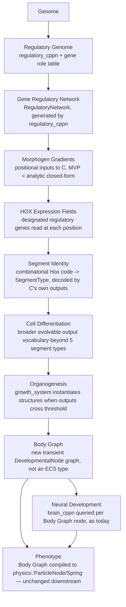
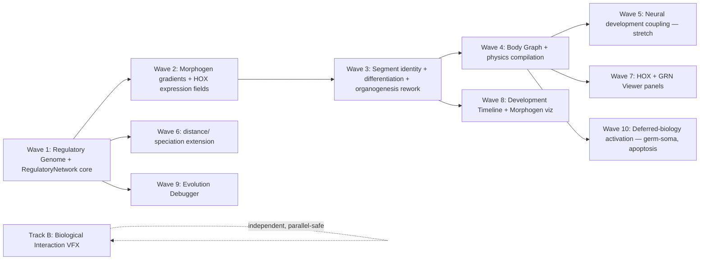

# Phylon — Phase 3 Roadmap

## Evo-Devo, Research Biology, and Scientific Instrumentation

**Document type:** Pre-implementation architecture design and roadmap (analysis only — no code changes made in producing this document).
**Sources reviewed before writing this** (per your instruction, in full): `IMPLEMENTATION_STATUS.md`, `UI_IMPLEMENTATION_STATUS.md`, `UI_PHASE2_ROADMAP.md`, `README.md`, `PHYLON_PROMPT_v2.md`. Every claim about current behavior below was additionally re-verified directly against source (`crates/genetics`, `crates/organisms`, `crates/evolution`, `crates/reproduction`, `crates/diffusion`) rather than taken from memory of prior sessions.
**Status:** Waiting for approval. Nothing here should be implemented until you approve a specific wave.

---

## 1. Why This Phase, and What It Is Not

`IMPLEMENTATION_STATUS.md` already closed the infrastructure question: Epics 1–15 are done or explicitly deferred, with a documented reason and priority for every deferral (§4/§6 of that document). `UI_PHASE2_ROADMAP.md` closed the workbench question: 18 milestones done, frozen, future UI work redirected to a Phase 3 doc. Neither document claims the *organisms* are done — quite the opposite. `IMPLEMENTATION_STATUS.md`'s own Epic 10 entry says multicellular systems are "~35% of full spec section," and DEF-002 through DEF-006 (germ-soma separation, vascular/neural specialization, metamorphosis, morphogen fields) are all filed under **Advanced Biology**, explicitly named as the next frontier, not forgotten work.

This phase is scoped narrowly: **replace the current template/lookup-based body-plan generation with a genuinely regulatory one**, and build the research instrumentation to observe it. It is not a UI phase (UI_PHASE2_ROADMAP.md stays frozen; any new panels here are satellite deliverables gated behind backend data existing) and it is not a return to Epic 1–15's infrastructure work (nothing here reopens a closed epic).

---

## 2. Current Architecture Audit (ground truth, not the original spec's intentions)

| Question | Current answer | Evidence |
|---|---|---|
| Does Hox currently regulate anything, or does it directly encode anatomy? | **Directly encodes.** `Genome.hox: Option<HoxSequence>` — when `Some`, `growth_system` reads `HoxGene.segment: SegmentType` and writes it straight onto `ParticleNode.segment_type`. There is no regulatory step in between. | `genetics/src/genome.rs:57-60` (doc: "the growth system reads the body plan directly from this sequence"), `organisms/src/systems.rs:44-46` |
| What happens when Hox is absent? | `morph_cppn` is queried, but only with a **1-D sequential index** (`segment_idx / max_segments`, `parent_type`) — not a true multi-dimensional positional substrate (HyperNEAT-style). | `organisms/src/systems.rs:53-58` |
| Is there any Gene Regulatory Network today? | **No.** A workspace-wide search for "regulatory/GRN/activator/repressor/expression" returns exactly one hit: diploid dominance resolution (`express_diploid`), which is allele-dominance logic, not a regulatory network. `genetics/src/lib.rs`'s own doc comment lists what's unimplemented and doesn't even mention GRNs — this is greenfield. | `genetics/src/genome.rs:111-140,450-472` |
| Is there morphogen/gradient infrastructure to build on? | `diffusion` crate exists (Laplacian PDE solver) but is scoped entirely to **environmental chemistry** (pheromones, hazard fields, gas exchange) — zero coupling to genetics or body-plan generation today. Reusable as infrastructure, not currently wired to development. | `diffusion/src/lib.rs:1`, wired only via `behavior`/`ecology` |
| Is the body already graph-like? | **Partially.** `physics::ParticleNode`/`Spring` are already a graph (nodes + edges with `node_a`/`node_b`) at the *physics* level. The gap is upstream: `morph_cppn`'s query is linear/sequential, not a branching specification. | confirmed via existing `physics` crate structure (already used this session for the Body Plan tree, Epic/Phase 1 M4) |
| Does brain topology depend on body-plan size? | **Yes, already.** Brain node count is `input_count + hidden_count + effectors.len() + 1` — one output node per muscle/fin effector produced during growth. Neural and morphological development are already coupled at this one point. | `organisms/src/systems.rs:96-101` |
| Does speciation account for Hox? | **No.** `Genome::distance` sums compatibility distance over `brain_cppn` and `morph_cppn` only; Hox never enters it. Reproduction's mate-compatibility check is even narrower (`brain_cppn` node count only). | `genetics/src/genome.rs:148-162`, `reproduction/src/lib.rs:236` |
| Is Hox itself ever mutated? | **No.** `Genome::mutate` mutates both CPPNs; there is no Hox mutation call anywhere. | `genetics/src/genome.rs:361-383` |

**Net finding:** the user's diagnosis is exactly right. Morphology today is a fork between "hardcoded lookup table" (Hox present) and "a CPPN queried too simply to be truly positional" (Hox absent). Neither path has anything resembling regulation, feedback, or positional information in the developmental-biology sense.

---

## 3. Central Architectural Decision — How the GRN Is Realized

Before laying out the 11-stage pipeline, one decision governs almost everything else, so it's presented first rather than buried in an ADR list.

**The Gene Regulatory Network is a third evolvable `Cppn` (`regulatory_cppn`), generating the weights of a small recurrent runtime network (`RegulatoryNetwork`) — not a new execution engine built from scratch.**

This mirrors a pattern the codebase already proves out twice: `brain_cppn` (evolvable, feedforward) generates the weights/biases of `Brain` (a recurrent CTRNN, iteratively simulated every tick). `RegulatoryNetwork` plays the same role `Brain` plays, generated by `regulatory_cppn` the same way `Brain` is generated by `brain_cppn`, iteratively simulated over a small fixed number of *developmental* steps (not simulation ticks) each time a body segment differentiates.

Why this and not a bespoke Boolean-network or ODE-based GRN engine:
- **Reuses everything already evolvable:** NEAT-style crossover, add-node/add-connection mutation, innovation tracking, self-adaptive per-locus mutation rate — all already exist for `Cppn` and need zero new code to apply to `regulatory_cppn`.
- **Preserves determinism trivially:** it's the same `Cppn::evaluate`/`Brain`-style iterate-to-convergence pattern already audited as deterministic; no new RNG source, no new floating-point-order hazard.
- **Activators/repressors/thresholds/feedback loops are not new concepts to invent** — they're exactly what a recurrent network with signed weights and sigmoid activation already expresses. `Neuromodulators`/Hebbian plasticity (Epic 8) already proved this style of small evolvable dynamical system works in this codebase.
- **Scientifically legitimate, not a shortcut:** CPPN/HyperNEAT-generated regulatory networks are an established ALife technique for exactly this kind of developmental modeling, not a simplification invented for this project.

This decision is what keeps the rest of this roadmap's implementation cost bounded — without it, "Gene Regulatory Network" would mean building a second, parallel evolvable-network infrastructure alongside the one that already exists for brains, doubling the surface area for no clear benefit.

---

## 4. The Evo-Devo Pipeline — Design

| Stage | What it is | Maps onto / replaces | New data structures |
|---|---|---|---|
| Genome | Unchanged concept, one new field | `Genome` gains `regulatory_cppn: Cppn`, alongside existing `brain_cppn`/`morph_cppn` | none new |
| Regulatory Genome | The evolvable specification of regulatory genes | New: a fixed-order **gene role table** (analogous to `brain_cppn`'s fixed input/output column convention already documented in `neural_viewer.rs::input_sense_name`) — some output slots are *designated* Hox genes, others are differentiation/effector genes | `RegulatoryGeneRole` enum (Hox, Differentiation, Effector) |
| Gene Regulatory Network | The runtime dynamical system | New: `RegulatoryNetwork`, generated by `regulatory_cppn` exactly as `Brain` is generated by `brain_cppn` | `RegulatoryNetwork` (nodes, signed weighted edges, sigmoid activation, iterated to convergence or a fixed step count) |
| Morphogen Gradients | Positional information fed into the GRN | New, but MVP is **analytic, not diffused**: closed-form functions of position (distance-from-head, normalized AP-axis position) — no GPU/PDE work required for the MVP. True diffused fields (DEF-006) stay a documented future upgrade, not required for this pipeline to function | none new for MVP (plain `f32` inputs) |
| HOX Expression Fields | Which Hox genes are "on" at a given position | Replaces the direct `HoxGene.segment` lookup — instead, the regulatory-gene-role table's Hox-designated outputs, evaluated at this position, form a **combinatorial code** | none new — a `Vec<f32>` slice of `RegulatoryNetwork`'s output |
| Segment Identity | Position → anatomical category | Replaces `systems.rs:207-213`'s literal `SegmentType` match — becomes a small, *fixed but evolvable-in-effect* decode of the Hox code, since the code itself is shaped by evolution | `SegmentType` enum unchanged in shape, changed in how it's produced |
| Cell Differentiation | Broader-than-5-types output vocabulary | New evolvable output genes (via `Cppn`'s existing add-node mutation) beyond today's fixed Head/Torso/Muscle/Tail/Fin — e.g., future Vascular/Ganglion outputs (DEF-003) slot in here with no core-pipeline change | extends `SegmentType` (additive, not breaking, if new variants are added carefully — see §7 migration note) |
| Organogenesis | Threshold crossing → physical structure | This *is* today's `growth_system`, changed to read `RegulatoryNetwork` output instead of `Hox.genes`/`morph_cppn` directly | none new — same `growth_system`, new input source |
| Body Graph | Intermediate developmental representation | **New.** A plain, transient graph (`DevelopmentalNode { role, position_in_lineage, parent }`) built during growth, *compiled* into `physics::ParticleNode`/`Spring` exactly as today — physics/rendering/behavior crates need zero changes | `DevelopmentalNode`, `DevelopmentalGraph` (both `organisms`-crate-internal, never touch `physics`/ECS directly) |
| Neural Development | Brain wiring | **Unchanged mechanism** (`brain_cppn` queried per node/connection pair) — the one coupling point (`effectors.len()` driving output count) is preserved as-is in this phase; deeper coupling (regulatory-gated neural centralization, DEF-003) is an explicit stretch goal, not required | none new for the required scope |
| Phenotype | Final organism | Body Graph compiled to physics + Brain — identical shape to today's spawned organism from every other crate's perspective | none new |

**Load-bearing design property:** every crate *outside* `genetics` and `organisms` — `physics`, `rendering`, `behavior`, `evolution` (except `distance`), `analytics` — needs **zero changes** for the core pipeline to work, because the Body Graph is compiled down to the exact same `ParticleNode`/`Spring` shape those crates already consume. This bounds the blast radius considerably relative to what "replace the developmental pipeline" could have implied.

---

## 5. Architectural Decision Records

### ADR-P3-01: GRN realized as a third evolvable CPPN, not a new engine
Covered in full in §3. **Consequence:** `Genome` gains a field, `GENOME_SCHEMA_VERSION` bumps (breaking, see §7). **Alternative rejected:** a bespoke Boolean/ODE regulatory-network engine — rejected for doubling evolvable-network infrastructure with no determinism or evolvability benefit over reusing `Cppn`.

### ADR-P3-02: Hox becomes a combinatorial expression code, never a direct lookup
**Decision:** `HoxGene.segment: SegmentType` direct-write is removed. Segment identity is decoded from the regulatory network's Hox-designated output genes, evaluated at a position. **Reason:** this is the user's explicit, non-negotiable requirement, and it's also what makes Hox mutable and evolvable for the first time — today's Hox is never mutated at all (§2 finding), a real, quiet gap this closes as a side effect. **Consequence:** `HoxSequence`/`HoxGene` as currently shaped are retired; the *name* "Hox" moves to mean "the designated subset of regulatory genes read positionally," matching real developmental biology's usage. **Migration:** no automatic path from old `HoxSequence` data — see §7.

### ADR-P3-03: Morphogens are analytic/closed-form for the MVP, diffused fields stay a future upgrade
**Decision:** positional inputs to the GRN (distance-from-head, normalized AP position) are computed directly, not via a PDE solve. **Reason:** `growth_system` operates per-organism, sequentially, over bounded developmental ticks — a full GPU diffusion field per organism (or per-organism-local field) is a large, currently-unjustified GPU architecture addition (this is exactly DEF-006, already filed as "High difficulty, would require a new GPU field layer"). An analytic gradient is scientifically legitimate (real early-embryo morphogen gradients, e.g. Bicoid in *Drosophila*, are close to exponential decay from a localized source — a closed form is not a simplification for its own sake, it's a reasonable first model). **Future trigger:** the same one DEF-006 already names — a concrete need for *environmentally-coupled* or *inter-organism* developmental signaling that a closed-form per-organism gradient can't express.

### ADR-P3-04: Body Graph is transient and organisms-crate-internal, never an ECS type
**Decision:** `DevelopmentalGraph` is a plain Rust data structure used only during `growth_system`'s execution, compiled to `physics::ParticleNode`/`Spring` and then discarded — it is never a `bevy_ecs::Component`/`Resource`. **Reason:** keeps this phase's blast radius inside `genetics`+`organisms`; every other crate keeps working against the same physics representation it already consumes. **Alternative rejected:** persisting the developmental graph as an ECS resource for later inspection — rejected for *this* phase (it would help the Development Timeline panel, §8, but adds ECS surface area prematurely); revisit if the Development Timeline milestone needs it, as its own small, separate decision at that time.

### ADR-P3-05: Determinism preservation
**Decision:** `RegulatoryNetwork` iteration uses the same seeded `common::SimRng`-free evaluation style `Cppn::evaluate` already uses (pure function of inputs + weights, no live randomness during evaluation — only genome-level mutation draws from `SimRng`, exactly as today). **Reason:** non-negotiable project-wide constraint (bit-exact reproducibility, `README.md`'s own stated architecture goal). **Verification requirement:** every new milestone below must include a same-seed-same-output test, matching the standing pattern from Phase 1/2's own verification discipline.

### ADR-P3-06: Schema version bump, no migration path
**Decision:** `GENOME_SCHEMA_VERSION` bumps from 3 to 4. No automatic migration from pre-Phase-3 `.phylon` saves or `data/experiments/*/manifest.ron` — consistent with the project's already-established, repeatedly-applied policy (ADR-010 in `IMPLEMENTATION_STATUS.md`: "bump and document the break; do not build a migration path," since this is a research tool without saved-run continuity requirements yet). **Consequence:** stated plainly in §7, not softened.

### ADR-P3-07: Pigmentation is an emergent regulatory trait, never genome-stored RGB
**Decision:** organism skin color is decoded per body position from three new Pigment-designated regulatory genes (`RegulatoryGeneRole::Pigment`), exactly like segment identity — never stored as a color field anywhere in `Genome`. **Reason:** discovered mid-M4, not planned in this document's original draft — retiring `HoxSequence` (ADR-P3-02) removed the only place organism color had ever lived (`HoxSequence.color`), and you explicitly directed that color must not be re-homed as stored RGB on `Genome` or any replacement struct; it must instead flow through the same Genome → Regulatory CPPN → Genes → Development → Phenotype pipeline as every other trait. **Consequence:** `REGULATORY_GENE_ROLES` grows from 6 to 10 entries (3 Hox, 2 Differentiation, 2 Effector — amplitude *and* phase, also newly wired this milestone — and 3 Pigment); every position can have distinct pigmentation, which is a genuine capability gain (gradients/stripes/spots become possible with zero further architecture change, only richer evolved `regulatory_cppn` topology) but also a genuine capability *loss*: starter organisms no longer reliably render in their diet's canonical `Diet::standard_color()`, conflicting with the UI Phase 2 Engineering Principle "`Diet::standard_color()` is the single source of truth for diet-category color everywhere it appears." That conflict is not resolved by this ADR — it's named here so it isn't rediscovered as a surprise later. **Alternative rejected:** keeping color on `Genome` as a plain field (this session's own first proposal) — rejected per your explicit instruction that no phenotypic trait should be stored data.

### ADR-P3-08: Starter species are Seed Genomes, not templates
**Decision:** `Genome::new_hox_driven` is retired with no direct replacement; starter species (worm, fish, plant, etc.) are now produced by `Genome::seed(id, origin, brain_cppn, morph_cppn, regulatory_cppn)` — a thin constructor with **no morphology-specific logic** — given a hand-authored `regulatory_cppn` found by sweeping its two free parameters (a single bias/weight pair on one linear output node) and reading off the resulting decoded segment sequence, rather than a hand-written list of `HoxGene`s. **Reason:** your explicit directive — "There must be no special-case morphology generation. The same developmental pipeline must be used for every organism in the simulator... The only distinction between a starter organism and an evolved organism should be that one genome was hand-authored." **Consequence, a real and load-bearing limitation:** because `RegulatoryNetwork::generate` derives *every* gene's bias and *every* edge's weight from the exact same single-output CPPN function (queried at different `(gene_index, gene_index)` or `(i, j)` coordinates — see `regulatory.rs::generate`'s doc comment), a one-connection hand-authored CPPN cannot independently target segment identity, branching, actuation, and pigmentation at once; the seed genomes in `app::seed_ecosystem`/`interventions.rs` were tuned only for a recognizable dominant body-plan shape (verified by printing decoded sequences), not for matching the old templates' exact proportions or their diet-canonical colors. Richer hand-authored topology (multiple hidden nodes gating distinct output regions) could decouple these later, if a specific starter species needs it — not required for this milestone's bar of "a real genome, not a special case." **Alternative rejected:** keeping a `new_hox_driven`-style constructor that takes a struct describing the intended body plan directly — rejected because that is exactly the "special-cased morphology generation" your directive prohibits.

### ADR-P3-09: Resolves ADR-P3-04's open question — the Body Graph does not need to be retained
**Decision:** the Development Timeline (M13) does **not** persist `GrowthState.graph` past growth completion, and does not add any new ECS/Resource surface area to do so. Instead, a new pure function, `organisms::simulate_growth_timeline(regulatory_cppn) -> DevelopmentalGraph`, deterministically reconstructs the *entire* growth timeline (which positions grow, which are pruned by apoptosis, which branch) from the genome alone, by mirroring `growth_system`'s own control flow (head always grows regardless of its own apoptosis signal, exactly like `spawning::spawn_organism`; positions 1.. are pruned on `outputs.apoptosis`; a branching position pushes two `Fin` nodes; growth stops after a grown `Tail` or at `MAX_SEGMENTS`) without any ECS or physics side effects. **Reason:** ADR-P3-04 explicitly deferred this question to "the Development Timeline milestone's own decision, not this one's" — M13 is that milestone. Since every position's outcome (§4's whole architecture) is already a pure function of the genome and position, the *entire sequence of outcomes* is equally reconstructable; there is no information in a completed organism's discarded `GrowthState.graph` that isn't already recoverable from its `Genome` component (which every organism keeps for its whole life, per `spawning::spawn_organism`'s existing `world.entity_mut(head_node).insert(genome.clone())`). **Verification, not just an assertion:** `simulate_growth_timeline_matches_a_real_growth_system_run` (`organisms::systems`'s test suite) directly proves this — the same apoptosis-exercising fixture genome (M8's hand-built pruning-fixture CPPN) run through both the pure simulator and a real, stepped `growth_system` execution produces node-for-node identical timelines (position, role, branch-or-spine, in order). **Consequence:** `DevelopmentalNode` gained a `position: usize` field (needed so a Development Timeline scrubber step can be mapped back to a body position HOX Visualizer/GRN Viewer already know how to display) — a small, additive change to an `organisms`-crate-internal type, not a breaking one; every existing `graph.push(...)` call site (growth_system's 3, spawning's 1) was updated to pass it. **Alternative rejected:** retaining `GrowthState.graph` (or a copy of it) as a new component/resource for completed organisms — rejected because it would be pure redundant storage: the same data, reconstructable on demand at effectively zero cost (already proven fast by every prior M10-M12 panel doing exactly this), for every organism in the population, forever, with no corresponding research benefit over recomputing it only when a user actually opens the Development Timeline for one specific organism.

---

## 6. Dependency Graph (implementation order, not just conceptual)

Waves 1→4 are strictly sequential (each is a real prerequisite, not just a suggested order — Wave 3 cannot start meaningfully without Wave 2's positional inputs existing, etc.). Wave 5 is a stretch goal, gated behind Wave 4 but not required for the pipeline to be complete and useful. Waves 7–9 (research tooling) are gated behind the backend wave whose data they visualize — building a GRN Viewer before `RegulatoryNetwork` exists would mean visualizing nothing real. Wave 10 (deferred-biology activation) is gated behind Wave 4, per §7 below. Track B (Biological Interaction Visualization) is genuinely independent — it visualizes existing simulation state (predation, photosynthesis, disease, reproduction, death), not anything new from Waves 1–10, and can proceed at any time without waiting on this roadmap's other work.

---

## 7. Remaining Deferred Biology — Reassessed Against This Architecture

Per your instruction, not activated blindly — each is checked against whether Waves 1–4 actually unlock it cheaply, or whether it remains its own separate cost regardless.

| Item | Original filing | Reassessment | Recommendation |
|---|---|---|---|
| DEF-002 — Germ-soma separation, developmental apoptosis | High difficulty, "Advanced Biology" | **Now cheap.** Germ-soma = one more binary output gene at an early differentiation branch. Apoptosis = a differentiation output whose effect is "remove this node before organogenesis," a small `growth_system` branch. Both are additive uses of Wave 3's broadened output vocabulary. | **Activate — Wave 10, low incremental cost once Wave 4 lands.** |
| DEF-003 — Vascular/muscle/neural specialization | High difficulty | **Partially cheaper.** Vascular = a new differentiation output type (cheap, Wave 10). Full neural centralization (ganglion topology genuinely shaped by regulatory state) is Wave 5's territory — still a real stretch, not free. | **Activate the differentiation-output part (Wave 10); keep full neural centralization as the Wave 5 stretch goal, not promised in this phase.** |
| DEF-004 — Metamorphosis/larval forms | Low priority, high difficulty | **Still genuinely hard.** Needs a life-stage trigger system (re-evaluating the regulatory network later in life with different — e.g., a "maturity" — inputs) that doesn't exist in any form today. The GRN architecture makes this *conceivable* for the first time, but it is not a byproduct of Waves 1–4. | **Stay deferred — reasonable Wave 10+ stretch, not a default inclusion.** |
| DEF-005 — Horizontal gene transfer, plasmid transfer, encystment | Low priority | **Orthogonal.** About genome *exchange* mechanisms between organisms, not development. Nothing in this roadmap touches it either way. | **Stay deferred, unrelated to Phase 3.** |
| DEF-006 — True diffusible morphogen-gradient fields | High difficulty, GPU work | **Confirmed still deferred, now with a specific trigger condition** (ADR-P3-03): a concrete need for environmental/inter-organism developmental coupling the analytic MVP can't express. | **Stay deferred**, explicit future trigger now documented rather than open-ended. |
| DEF-007 — Alliance/coalition dynamics | Speculative | **Orthogonal.** Social behavior, not development. | **Stay deferred, unrelated to Phase 3.** |
| DEF-022 — Speciation representative refresh | Low priority | **Touched incidentally**: Wave 6 already has to open `Genome::distance` to add the `regulatory_cppn` term. Refreshing representatives is a natural, cheap addition to make in the same milestone, not a separate initiative. | **Opportunistic fix inside Wave 6, not its own wave.** |

---

## 8. Research Instrumentation — Panel Designs

Each follows the UI architecture `UI_PHASE2_ROADMAP.md` already established and froze — no new UI architecture is introduced; these are new panels/tabs using the existing dock-panel or Sidebar-tab pattern (per which fits: an "always relevant to one organism" panel is a Sidebar tab, like Lineage Explorer; a "compare/browse across organisms or runs" panel is a top-level dock panel, like Research Dashboard).

| Panel | Fit | Gated behind | Shows |
|---|---|---|---|
| **HOX Visualizer** | New Sidebar tab (organism-scoped, like Lineage) | Wave 3 | Per-position Hox combinatorial code, resulting segment identity, body preview; clicking a segment shows active genes/regulatory inputs/produced organs/mutation history (the last item reuses Lineage Explorer's ancestry data, already built in Phase 2 M2/M3) |
| **Gene Regulatory Network Viewer** | New Sidebar tab or dock panel (undecided — recommend Sidebar tab, organism-scoped, consistent with HOX Visualizer) | Wave 1 | Graph layout of `RegulatoryNetwork` (nodes/edges, activator vs. repressor edge coloring, live expression levels), time playback over developmental steps, hover inspection, mutation-vs-parent comparison (reuses Recent Selections' comparison instinct from Phase 2 M13) |
| **Development Timeline** | Extends the HOX Visualizer/GRN Viewer rather than a wholly separate panel — a shared timeline scrubber component both can use | Wave 3 (needs organogenesis events to exist) | Step through development stage-by-stage; per ADR-P3-04, this is the concrete trigger for reconsidering whether the Body Graph needs to be retained (not just compiled-and-discarded) for a given organism, at least optionally, for research replay of its own development |
| **Morphogen Visualization** | Overlay on the HOX Visualizer/body preview, not a separate dock panel | Wave 2 | Heatmap of the analytic gradient functions (AAV-axis position, distance-from-head) — genuinely simple to render since they're closed-form, not fields requiring a texture readback |
| **Evolution Debugger** | New dock panel (cross-organism/cross-run, like Research Dashboard) | Wave 1 (mutation diff needs `regulatory_cppn` to exist) | Mutation diff, parent-vs-offspring comparison, development-failure inspector (an organism whose organogenesis produced zero effectors, say), phenotype/GRN/Hox/segment comparison, development event log |
| **Biological Interaction Visualization** | Not a panel — a viewport rendering layer (Track B, independent) | Nothing in Waves 1–10 | Predation (red outline, bite flash, ATP transfer text), photosynthesis (green energy flow), respiration (gas exchange indicators), disease (infection halo), communication (pheromone/signal pulses — some already exist as vision-cone-style overlays and would be extended, not invented), reproduction (budding/mating animation), death (corpse transition). **Constraint carried over from your prompt, restated as a hard requirement:** every effect must correspond to real simulation state already computable from existing components — no purely decorative effect gets added. |

---

## 9. Milestone Roadmap

| # | Milestone | Depends on | Complexity | Breaking? |
|---|---|---|---|---|
| M1 | ~~`Genome.regulatory_cppn` field + `RegulatoryGeneRole` table + `RegulatoryNetwork` runtime struct (generated, evaluated, not yet wired to growth)~~ | none | Medium-High | Yes (schema v3→4) — **Done** |
| M2 | ~~Crossover/mutation for `regulatory_cppn` (reuse `Cppn`'s existing machinery)~~ | M1 | Low | No (additive to M1's break) — **Done** |
| M3 | ~~Analytic morphogen gradient functions (AP position, distance-from-head) as `RegulatoryNetwork` inputs~~ | M1 | Low | No — **Done** |
| M4 | ~~Hox-designated output genes decoded into `SegmentType`, replacing direct `HoxGene.segment` lookup in `growth_system` — expanded mid-milestone per your directive to also retire `HoxSequence` entirely (ADR-P3-07 pigmentation, ADR-P3-08 seed genomes)~~ | M1, M3 | High | Yes (removes old Hox direct-read path; also removes `new_hox_driven`, `HoxSequence`, `HoxGene`) — **Done** |
| M5 | ~~Broadened differentiation output vocabulary (beyond 5 fixed types), evolvable via `Cppn` add-node~~ | M4 | Medium | Additive — **Done** |
| M6 | ~~`DevelopmentalGraph`/`DevelopmentalNode` intermediate representation + compilation to `physics::ParticleNode`/`Spring`~~ | M4, M5 | Medium-High | No (physics-facing shape unchanged) — **Done** |
| M7 | ~~`Genome::distance` extended with `regulatory_cppn` term + speciation representative-refresh (DEF-022)~~ | M1 | Low | No (distance value changes, not the type) — **Done** |
| M8 | ~~Germ-soma separation + developmental apoptosis (DEF-002)~~ | M5, M6 | Low-Medium | No — **Done** |
| M9 | ~~Vascular differentiation output type (part of DEF-003)~~ | M5 | Low | No — **Done** |
| M10 | ~~HOX Visualizer + Morphogen Visualization panels~~ | M4 (HOX), M3 (Morphogen) | Medium | No — **Done** |
| M11 | ~~GRN Viewer panel (graph layout, time playback, mutation comparison)~~ | M1, M2 | Medium-High | No — **Done** |
| M12 | ~~Evolution Debugger panel~~ | M1, M7 | Medium | No — **Done** |
| M13 | ~~Development Timeline (shared scrubber component)~~ | M6, M10, M11 | Medium | No — **Done** |
| M14 (stretch) | Neural development coupling — regulatory-gated neural centralization | M6 | High | Possibly (Brain wiring assumptions) |
| M15 (stretch) | Metamorphosis/life-stage re-differentiation (DEF-004) | M6, M8 | High | No |
| — | Track B: Biological Interaction Visualization (predation/photosynthesis/etc. VFX) | none — independent | Medium, spread across several small milestones | No |

**Recommended order:** M1 → M2 → M3 → M4 → M5 → M6 (the core pipeline, strictly sequential) → M7 (opportunistic, can slot in anytime after M1) → M10/M11 (instrumentation, as soon as their backend dependency lands) → M8/M9 (cheap deferred-biology activation) → M12/M13 → M14/M15 as explicit stretch goals, not committed scope. Track B can run in parallel with any of the above, at any time, by whoever has bandwidth for it — it has no dependency on this roadmap's sequencing.

---

## 10. Breaking Changes & Migration Strategy

- **`GENOME_SCHEMA_VERSION` 3 → 4** (M1). No migration path — matches the project's standing, twice-precedented policy. Every pre-Phase-3 `.phylon` save and `data/experiments/*/manifest.ron`-referenced binary state becomes unloadable. State this to any user before landing M1; it is not a silent break.
- **`HoxSequence`/`HoxGene` as currently shaped are retired** (M4). Their *name* is repurposed for the designated-output-gene subset of `RegulatoryNetwork`. **Correction found during M4 implementation:** this document originally claimed only `growth_system` and the Genetics sidebar tab's "Hox genes" row read the old struct directly — re-auditing at milestone start found **8 files**, including every starter-scenario organism in `app.rs`/`interventions.rs` (constructed via `Genome::new_hox_driven(id, origin, HoxSequence::worm/fish/plant(...))`) and `organisms::spawning::spawn_organism`'s head-node color/segment lookup. All were updated in M4; see ADR-P3-07/ADR-P3-08 for how color and starter species were re-architected as a consequence.
- **`SegmentType` gains variants** (M5) — additive if done as a proper enum extension with exhaustive-match sites updated (`growth_system`'s stiffness lookup, `render`'s color mapping if any exists) rather than a breaking reorder. Verify no code assumes exactly 5 variants via magic numbers before this milestone; audit as the milestone's first step, not an afterthought.
- **`Genome::distance` output changes** (M7) — not a type break, but every existing species' compatibility threshold effectively shifts once a third CPPN's distance is summed in. Recommend: after M7 lands, run a comparison against a fixed test population to confirm species counts don't wildly diverge from pre-M7 behavior, and retune `compatibility_threshold` if they do — a calibration step, not a code risk.

No other crate (`physics`, `rendering`, `behavior`, `analytics`, `ui`) requires breaking changes for the core pipeline (M1–M7). This is the direct payoff of ADR-P3-04 (Body Graph stays internal, compiles to the unchanged physics shape).

---

## 11. Risk Assessment

| Risk | Where | Mitigation |
|---|---|---|
| `RegulatoryNetwork` iteration doesn't converge (oscillates or diverges) for some evolved topologies | M1 | Fixed step count (not "iterate until convergence"), matching a bounded, deterministic, testable evaluation — same shape as `Cppn::evaluate`'s existing bounded cost |
| Broadening `SegmentType` breaks an exhaustive match somewhere not yet found | M5 | Grep for every `match segment_type`/`match SegmentType` site *before* adding variants, as the milestone's first step; `cargo build` will also catch non-exhaustive matches at compile time — but only if every site actually matches on the enum rather than a raw `u32`, which `ParticleNode.segment_type: u32` currently is (a real, separate small risk: some sites may compare raw `u32` values, not the enum, and those won't get compiler help) |
| Speciation behavior shifts unexpectedly after M7 | M7 | Explicit calibration step named in §10 |
| Development Timeline's need for a retained Body Graph reopens ADR-P3-04's "stays transient" decision | M13 | Treat as its own small decision at that time, not a reason to preemptively over-build M6 |
| Scope creep: Waves 8–9 (deferred-biology activation) get implemented as bigger than "cheap" once real code is written | M8/M9 | Re-verify against source immediately before starting each, same discipline as every prior phase — if a "cheap" item turns out not to be, stop and report before continuing, exactly as ADR-001 (Phase 2) demonstrated is the right response |
| This is a much larger initiative than any single Phase 1/2 wave | Whole roadmap | Explicitly sized in §9's dependency chain — M1–M6 alone is comparable to several Phase 2 waves combined; treat each milestone with the same one-at-a-time, stop-and-verify discipline, not a Phase-2-style multi-milestone bundle, unless you explicitly request bundling once implementation begins |

---

## 12. Verification Plan (per milestone, once approved)

Every milestone: `cargo build --workspace --all-targets`, `cargo clippy --workspace --all-targets -- -D warnings`, `cargo fmt --all -- --check`, `cargo test --workspace`, plus:

| Milestone class | Additional verification |
|---|---|
| M1–M2 (RegulatoryNetwork/CPPN) | Same-seed-same-output determinism test (ADR-P3-05); a round-trip crossover/mutation test mirroring `Cppn`'s existing test suite |
| M3–M4 (morphogens, Hox decode) | A fixture genome with a known, hand-computed expected segment sequence, asserting the decode produces it |
| M5–M6 (differentiation, Body Graph) | A full spawn-to-phenotype integration test asserting the compiled `ParticleNode`/`Spring` set matches expectations for a fixture genome; a performance benchmark (new, since none of Epics 1–15's benchmarks cover this path — DEBT-013 from `IMPLEMENTATION_STATUS.md` already flagged this class of gap) |
| M7 (distance/speciation) | Regression test comparing species counts on a fixed population before/after, per §10's calibration note |
| M8–M9 (deferred biology) | Unit tests per new behavior (apoptosis actually removes a node; germ-soma actually produces two distinguishable lineages) |
| M10–M13 (panels) | No new backend tests; manual verification against a running simulation is required (per this session's own established honesty standard — several earlier UI milestones explicitly flagged when a live visual check wasn't possible; the same standard applies here) |
| Track B (VFX) | Manual visual verification is the *primary* verification — "every effect must correspond to real simulation state" is a claim that can only actually be checked by watching it happen, not by a unit test |

---

## 13. Executive Summary

**What changes:** the developmental pipeline gains a genuine regulatory layer (a third evolvable CPPN generating a recurrent `RegulatoryNetwork`), positional information (analytic morphogen gradients), and a decoupled intermediate Body Graph representation — replacing today's fork between "hardcoded Hox lookup" and "under-powered sequential CPPN query."

**What doesn't change:** `physics`, `rendering`, `behavior`, `analytics` crates, the UI architecture (frozen per Phase 2), and the core determinism/ECS/composition-root conventions established across every prior phase.

**What's genuinely new infrastructure:** `RegulatoryNetwork` (M1) and `DevelopmentalGraph` (M6) — everything else reuses `Cppn`'s existing evolvable-graph machinery.

**What's breaking:** `GENOME_SCHEMA_VERSION` 3→4, no migration, consistent with the project's already-twice-applied policy. `SegmentType`'s exhaustiveness needs a pre-milestone audit, not just a post-hoc compile check.

**What's now cheap that wasn't:** germ-soma separation and developmental apoptosis (DEF-002), and the differentiation-output half of vascular/neural specialization (DEF-003) — both become low-cost extensions of Wave 3/4's broadened output vocabulary rather than the "High difficulty" items they were filed as before this architecture existed.

**What stays deferred, and why:** HGT/plasmid transfer (DEF-005) and alliance/coalition dynamics (DEF-007) are orthogonal to development, not touched by this roadmap either way. True diffused morphogen fields (DEF-006) and metamorphosis (DEF-004) remain genuinely hard, each with a specific, now-documented future trigger rather than an open-ended "someday."

**What should happen first:** M1 (the `RegulatoryNetwork` core) — everything else, including all six research panels, is gated behind it existing.

**Awaiting approval before implementation**, per your instruction — this document is analysis only; no files outside this one were modified in producing it.

Phase 3 architecture and roadmap complete.
Waiting for review before any implementation begins.

---

## Phase 3 Execution Log

**Roadmap approved.** Running log of Phase 3 milestones, each independently re-verified against source and fully build/clippy/fmt/test-verified before being marked done — same discipline as Phase 1/2's execution logs.

| Milestone | Outcome | Verification |
| --- | --- | --- |
| M1 — `regulatory_cppn` field + `RegulatoryGeneRole` table + `RegulatoryNetwork` runtime struct | Re-read `genome.rs`/`cppn.rs`/`brain/src/lib.rs` before touching anything, confirming §2/§3's audit still held (it did — no drift between roadmap and repository). Added `Genome.regulatory_cppn: Cppn` (+ `DiploidAlleles.regulatory_cppn`, `new_diploid`'s signature extended to 3-tuples, `expressed_regulatory_cppn()`), bumped `GENOME_SCHEMA_VERSION` 3→4. New `crates/genetics/src/regulatory.rs`: `RegulatoryGeneRole` (Hox/Differentiation/Effector), `REGULATORY_GENE_ROLES` (a fixed 6-gene table: 3 Hox + 2 Differentiation + 1 Effector), `RegulatoryGeneNode`/`RegulatoryEdge`, and `RegulatoryNetwork` with `generate` (queries `regulatory_cppn` per-node and per-node-pair, exactly mirroring how `organisms::systems` already queries `brain_cppn`), `step` (one synchronous developmental update — computed from a frozen snapshot of the previous step's states, so it's order-independent regardless of node storage order), and `develop` (a fixed step count, never "iterate to convergence," per the roadmap's own risk note). **Deliberately not done** (per the "never combine milestones" rule): `regulatory_cppn` is not yet crossed over or mutated (M2), has no positional/morphogen inputs wired in (M3), and is not read by `growth_system` for segment identity (M4) — `Genome::crossover`/`mutate` carry the field over unchanged, with an explicit code comment at each site stating this is temporary and naming the milestone that changes it. `RegulatoryNetwork` is deliberately not a `bevy_ecs::Component` and not `Serialize`d yet (see its doc comment) — it's a `genetics`-crate-internal, freshly-generated-and-discarded computation for now, consistent with ADR-P3-04's "Body Graph stays transient" reasoning applied one milestone early to this related question. | `cargo build --workspace --all-targets` clean; `cargo clippy --workspace --all-targets -- -D warnings` clean; `cargo fmt --all -- --check` clean (one auto-fmt pass, applied and reverified); `cargo test --workspace` — all passing, 0 failed; `RUSTDOCFLAGS="-D warnings" cargo doc -p genetics -p evolution --no-deps --document-private-items` clean. No other crate needed changes beyond `genetics/src/{genome.rs,regulatory.rs,lib.rs}` and two test call sites (`evolution/src/lib.rs`, `genome.rs`'s own tests) that used `new_diploid`'s old 2-tuple signature — confirmed via a full-workspace grep for every `Genome` construction site *before* editing, exactly as the roadmap's own audit method required. |

**No deviation from the roadmap found or needed for M1** — implementation matched §4/§9's design exactly, no new ADR required beyond the ones already recorded in §5.

**Risks/technical debt introduced by this milestone:** none beyond what §11 already named for M1 (fixed step count risk, documented). The temporary "crossover/mutate carry `regulatory_cppn` over unchanged" state is not itself new debt — it's the explicitly planned, one-milestone-wide gap between M1 and M2, closed by the very next milestone.

| M2 — Crossover/mutation for `regulatory_cppn` | Re-read M1's temporary "carried over unchanged" code before touching it, confirming it was exactly as left (it was). Closed the gap: `Genome::crossover` now calls `self.regulatory_cppn.crossover(&other.regulatory_cppn, rng)` (and the diploid second allele's equivalent), reusing `Cppn::crossover` unchanged — no new crossover logic was needed, only wiring the existing method in, exactly as §9 anticipated. `mutate_cppn_pair` (private helper) renamed to `mutate_cppn_trio` and extended with a third parameter; `regulatory_cppn` mutates under the *same* pass gate as `brain_cppn`/`morph_cppn` at the same rates (5% add-node, 10% add-connection, per-connection jitter) — appended after the existing two rather than interleaved, to disturb their existing same-seed mutation draw sequence as little as possible (not a strict requirement post-schema-bump, but a reasonable no-cost precaution). Replaced M1's two placeholder tests (which asserted the now-superseded "unchanged" behavior) with tests confirming the real crossover/mutation behavior, plus one new test verifying the diploid second-allele path specifically (`new_diploid`'s 3-tuple signature and `mutate_cppn_trio`'s per-allele call together). One doc-link warning surfaced by `cargo doc` (a `[`mutate_cppn_trio`]` markdown link to a private item, the same `rustdoc::private_intra_doc_links` class of issue fixed several times earlier in this project) — fixed by dropping the link brackets, same resolution as every prior occurrence. | `cargo build --workspace --all-targets` clean; `cargo clippy --workspace --all-targets -- -D warnings` clean; `cargo fmt --all -- --check` clean (no diffs); `cargo test --workspace` — all passing, 0 failed (genetics: 27→28 net, after replacing 2 tests with 3); `RUSTDOCFLAGS="-D warnings" cargo doc -p genetics -p evolution --no-deps --document-private-items` clean after the one fix above. No crate outside `genetics` needed changes. |

**No deviation from the roadmap found or needed for M2** — implementation matched §9's design exactly ("reuse `Cppn`'s existing machinery," which is precisely what happened). No new ADR required.

**Risks/technical debt introduced by this milestone:** none. The one thing worth naming explicitly: `regulatory_cppn`'s mutation rates (5%/10%) are hardcoded equal to `brain_cppn`/`morph_cppn`'s, not independently tuned — a reasonable default, not yet a considered decision, and not a problem this milestone needed to solve (nothing in §9 asked for separate tuning).

| M3 — Analytic morphogen gradient functions | Re-verified §4/§9's scope before writing anything: M3 is functions only (positional inputs to the GRN), not wiring into `growth_system` — that stays M4's job. New `crates/genetics/src/morphogen.rs`: `ap_position(segment_index, total_segments)` (normalized 0.0 head → 1.0 tail, with a degenerate single/zero-segment case defined as `0.0`), `distance_from_head_gradient` (exponential decay from the head, the closed-form analog of a real morphogen source named directly in ADR-P3-03's own Bicoid example), and `external_inputs_for_position` which builds the per-gene `Vec<f32>` that `RegulatoryNetwork::step`/`develop`'s existing `external_inputs` parameter (already present since M1, unused until now) expects. For this milestone every gene receives the same combined signal — deciding which gene reads which *specific* morphogen channel is explicitly left to M4's Hox-decode work, not this milestone's. Added `pub mod morphogen` + re-exports to `genetics/src/lib.rs`. Six new tests covering monotonicity, the degenerate single-segment case, decay direction, per-gene input length, determinism for a repeated position, and (using a real `RegulatoryNetwork::generate` + `develop` round trip) that two different body positions produce two different developed network states. | `cargo build --workspace --all-targets` clean; `cargo clippy --workspace --all-targets -- -D warnings` clean; `cargo fmt --all -- --check` clean (one auto-fmt pass on a wrapped line, reverified); `cargo test --workspace` all passing, 0 failed; `RUSTDOCFLAGS="-D warnings" cargo doc -p genetics --no-deps --document-private-items` clean. No crate outside `genetics` needed changes — `organisms::growth_system` is untouched, consistent with M3 not being a breaking milestone. |

**No deviation from the roadmap found or needed for M3** — implementation matched §4/§9's design exactly ("none new for MVP (plain `f32` inputs)"). No new ADR required; this milestone is a direct, unmodified application of ADR-P3-03.

**Risks/technical debt introduced by this milestone:** none. `DECAY_RATE = 3.0` is a reasonable, documented default rather than a tuned/evolved parameter — acceptable since nothing in §9 asked for it to be evolvable, and it can be revisited if M4's fixture-genome tests reveal it produces unhelpfully flat or unhelpfully sharp gradients in practice.

| M4 — Hox decode, retiring `HoxSequence`, Pigmentation, Seed Genomes | Pre-implementation audit (per protocol) found this document's own breaking-changes claim was stale — re-grepping every `HoxSequence`/`HoxGene`/`.hox`/`new_hox_driven` site found 8 files, not the 2 named in §10, including every starter-scenario organism in `app.rs`/`interventions.rs` and `spawning::spawn_organism`'s head-node lookup. Reported this finding and asked how to handle two questions the roadmap didn't answer: where organism color lives once `HoxSequence.color` is gone, and what starter organisms become once their template mechanism is retired. You answered directly (not letting me choose from my proposed options): color must be emergent regulatory output, never stored RGB (ADR-P3-07); starter organisms must be ordinary hand-authored "Seed Genomes" developing through the identical pipeline as any evolved organism, with no special-cased morphology generation (ADR-P3-08). Implemented accordingly: `RegulatoryGeneRole` gained a `Pigment` variant; `REGULATORY_GENE_ROLES` grew from 6 to 10 entries (3 Hox, 2 Differentiation, 2 Effector — amplitude *and* phase, wired to growth for the first time this milestone — 3 Pigment). New `crates/genetics/src/develop.rs`: `decode_segment_type` (3-bit Hox combinatorial code, thresholded at 0.5, wrapped via modulo onto `SegmentType`'s 5 variants) and `develop_at_position` (runs a fresh `RegulatoryNetwork` for `DEVELOPMENT_STEPS = 8` fixed steps at a given position, reads every role's gene states, returns `DevelopmentalOutputs { segment_type, branches, actuation_amplitude, actuation_phase, pigment }`). Deleted `crates/genetics/src/hox.rs` (`HoxGene`/`HoxSequence`) entirely; removed `Genome.hox`, `new_hox_driven`, and the `hox` parameter from `new_diploid`/`crossover`; added `Genome::seed(id, origin, brain_cppn, morph_cppn, regulatory_cppn)` as `new_hox_driven`'s replacement (a plain constructor, no morphology logic in it). Rewrote `organisms::growth_system`: every body position (including the head node, now decoded identically by `spawning::spawn_organism` — no special-cased "first segment") is decoded via `develop_at_position` instead of reading a stored `HoxGene`/querying `morph_cppn`; `morph_cppn` itself is now unqueried by growth (still crossed/mutated/distance-compared — a documented, deliberate piece of technical debt, not deleted since nothing in the roadmap asked for its removal). `GrowthState.color` removed (color is now decoded per-position, not stored); added `GrowthState.is_organism_complete`, set when a decoded segment is `Tail`, so growth can end before `organisms::MAX_SEGMENTS` (new fixed constant, 15) without any special-cased length. Rewrote `app.rs`'s `seed_ecosystem` and `interventions.rs`'s two Hox call sites to build seed genomes via `Genome::seed` + a small hand-tuned single-connection `regulatory_cppn` per species (bias/weight pairs found by a throwaway tuning harness — written, used to print decoded sequences across several dozen (bias, weight) pairs, then deleted — not guessed blind). Updated the UI Genetics sidebar/inspector "Hox genes" rows to show regulatory CPPN node/edge/gene counts instead. Added two new end-to-end tests in `organisms::systems` (`growth_system_completes_for_a_default_genome_without_panicking`, `growth_system_produces_more_than_one_particle_node`) that run `growth_system` via `RunSystemOnce` to actual completion against a real `GrowthState`, the first tests in this codebase to exercise the decode→spawn→brain-wiring pipeline end-to-end rather than the pipeline's pieces in isolation. | `cargo build --workspace --all-targets` clean; `cargo clippy --workspace --all-targets -- -D warnings` clean; `cargo fmt --all -- --check` clean (two auto-fmt passes, reverified); `cargo test --workspace` all passing, 0 failed; `RUSTDOCFLAGS="-D warnings" cargo doc -p genetics -p organisms -p app -p ui -p evolution --no-deps --document-private-items` clean. Not verified: the actual GUI app binary launching and rendering a seeded population — this environment can't drive a GPU/windowed app, so this is stated as an explicit gap, not silently claimed, per this project's own established honesty standard from Phase 2's UI milestones. |

**Deviation from the roadmap found and corrected, per protocol** — see the two questions/answers above; both are now recorded as ADR-P3-07 and ADR-P3-08, and the stale §10 claim is corrected in place.

**Risks/technical debt introduced by this milestone:**

- `morph_cppn` is now genuinely inert at growth time (still crossed, mutated, and part of `Genome::distance`, but nothing reads it for segment identity any more) — flagged, not removed, since removing a locus outright wasn't asked for.
- **A real, load-bearing limitation** (ADR-P3-08): because every gene's bias and every edge's weight come from the *same* single-output CPPN function, a simple hand-authored `regulatory_cppn` cannot independently control segment identity, branching, actuation, and pigmentation — the seed genomes were tuned only for a recognizable dominant body shape, not exact fidelity to the old templates or their diet-canonical colors.
- **A genuine conflict with a standing Phase 2 UI principle** (ADR-P3-07): `Diet::standard_color()` is no longer guaranteed to be what any given organism (starter or evolved) actually renders as, since pigmentation is now fully emergent. This is unresolved and named explicitly rather than papered over.
- The combined morphogen signal from M3 (`ap_position + distance_from_head_gradient`) is non-monotonic (it dips mid-body before rising again toward the tail) — discovered while tuning seed genomes. This doesn't break anything M3/M4 require, but it means "distance from head" isn't a clean, unambiguous positional signal yet; worth revisiting if a future milestone needs strictly monotonic positional identity.

**Remaining work:** M5 (broadened differentiation output vocabulary beyond the 5 fixed `SegmentType` variants) is next, pending your review of this report — note M5's own risk (§11) requires auditing every `match segment_type`/`match SegmentType` site before adding variants, which this milestone's `decode_segment_type` (`develop.rs`) is now one more of.

| M5 — Broadened differentiation vocabulary | Per §11's own risk note, audited every `SegmentType`/`segment_type` site before touching the enum: found 4 *exhaustive* enum matches (`develop.rs`'s `SEGMENT_TYPES_BY_CODE`, `organisms::systems`'s `seg_u32`/`stiffness` matches, `organisms::spawning`'s `head_seg_u32` match) that the compiler would force updates to, and 2 *raw-`u32`* matches with wildcard fallbacks (`app::render`'s debug-overlay color, `ui::utils::draw_segment_tree`'s inspector label) that would silently compile without updating — exactly the two-different-failure-mode risk §11 named in advance. Added 3 `SegmentType` variants — `Vascular`, `Ganglion`, `Germinal` — closing the collision where the Hox decode's full 8-code combinatorial space (3 genes, thresholded) used to wrap back onto codes 0-2 via modulo once only 5 types existed; `SEGMENT_TYPES_BY_CODE` grew from 5 to 8 entries and every one of the 8 codes now decodes to a distinct type (new test: `decode_segment_type_maps_all_8_codes_to_distinct_types`). The 3 new variants are enum-only placeholders this milestone, exactly as §4/§7 scoped: `organisms::growth_system` gives them Torso's stiffness (a neutral default, not a designed value) and no branching; their actual differentiated behavior — vascular transport, neural centralization, germ-line protection — stays DEF-003/DEF-002, deferred to M8/M9/M14 as the roadmap already planned, not pulled forward. Updated both wildcard-fallback debug sites (`render.rs`'s debug-overlay color, `utils.rs`'s inspector segment label) to label the 3 new numeric codes correctly rather than leaving them to silently fall into "Torso"/"Unknown" — cheap, and left undone would have quietly undermined the very research-instrumentation goal Phase 3 exists for. Added `Hash` to `SegmentType`'s derive list (needed for a `HashSet`-based distinctness test; harmless, no behavior change). | `cargo build --workspace --all-targets` clean (confirms no other exhaustive match existed beyond the 4 found by the manual audit — the compiler itself is the second check here); `cargo clippy --workspace --all-targets -- -D warnings` clean; `cargo fmt --all -- --check` clean; `cargo test --workspace` all passing, 0 failed (genetics: 41 tests, +1 new); `RUSTDOCFLAGS="-D warnings" cargo doc -p genetics -p organisms -p app -p ui -p evolution --no-deps --document-private-items` clean. |

**No deviation from the roadmap found or needed for M5** — implementation matched §4/§7/§9's scoping exactly: vocabulary broadened, no new differentiated behavior pulled forward from M8/M9/M14. No new ADR required.

**Risks/technical debt introduced by this milestone:** none new. The 3 new variants sharing Torso's stiffness and no distinct constraint-type behavior is intentional, temporary uniformity — not a bug, just inert until M8/M9 give them real differentiated physics.

**Remaining work:** M6 (`DevelopmentalGraph`/`DevelopmentalNode` intermediate representation + compilation to `physics::ParticleNode`/`Spring`) is next per §9's recommended order, pending your review of this report.

| M6 — Body Graph + physics compilation | Re-read ADR-P3-04 before implementing: the graph must stay transient and organisms-crate-internal, never a `bevy_ecs::Component`/`Resource` in its own right, and physics/rendering/behavior/analytics must need zero changes. New `crates/organisms/src/developmental_graph.rs`: `DevelopmentalNode { role, outputs, parent, is_branch }` and `DevelopmentalGraph { nodes: Vec<DevelopmentalNode> }` (plain structs, `push` appends and returns the new index); `compile_segment(role) -> CompiledSegment { particle_segment_type, stiffness, constraint_type }` and `can_branch(role) -> bool`, extracted verbatim (same numbers, same logic) from what were previously inline match arms duplicated across `growth_system` and `spawning::spawn_organism` — now a single, independently-tested source of truth for "decoded type → physics parameters," reusable later by the HOX Visualizer/Development Timeline panels without re-deriving it. `GrowthState` gained a `graph: DevelopmentalGraph` field — satisfying ADR-P3-04's "transient, reachable only through an already-existing Component" requirement exactly, not a new Component. `spawning::spawn_organism` now seeds `graph` with the head node as index 0 (`parent: None`) using `compile_segment` for its ParticleNode's numeric type, instead of its own separate inline match. `growth_system` now pushes exactly one spine `DevelopmentalNode` per tick (`parent` = the previous spine node's graph index, tracked via `graph.nodes.len() - 1` immediately before each push) and two branch nodes (`is_branch: true`, `parent` = the spine node just pushed) when a position branches — the physics spawning itself (`commands.spawn(...)`) is completely unchanged, only now driven by `compile_segment`'s output instead of duplicated inline matches. Added 4 new tests in `developmental_graph.rs` (index/parent bookkeeping, every `SegmentType` compiles without panicking, Muscle→Elastic/Tail→Passive/default→Rigid, only Torso/Muscle can branch) and 1 new end-to-end test in `systems.rs` (`growth_system_pushes_one_body_graph_node_per_segment`, asserting the graph grows 1:1 with ticks and records the correct parent index) — the latter directly exercises the real `growth_system`, not a reimplementation. | `cargo build --workspace --all-targets` clean; `cargo clippy --workspace --all-targets -- -D warnings` clean; `cargo fmt --all -- --check` clean (one auto-fmt pass, reverified); `cargo test --workspace` all passing, 0 failed (organisms: 15→20 tests); `RUSTDOCFLAGS="-D warnings" cargo doc -p organisms -p genetics --no-deps --document-private-items` clean (one intra-doc-link fix: a doc-comment `[`SegmentType`]` reference with the type out of scope at that doc location, resolved the same way as every prior occurrence — dropped the link brackets). No crate outside `organisms` needed changes — confirms ADR-P3-04's "physics/rendering/behavior/analytics need zero changes" held exactly as designed. |

**No deviation from the roadmap found or needed for M6** — implementation matched ADR-P3-04 and §4/§9's design exactly. No new ADR required.

**Risks/technical debt introduced by this milestone:** none new. One thing worth naming: the graph is still built and discarded per-organism inside `GrowthState` exactly as ADR-P3-04 anticipated — it is not yet queryable by any UI panel (no panel exists to query it yet; M10/M11/M13 are the panels that will eventually want this data, and per ADR-P3-04's own note, *whether* the graph needs to outlive growth for the Development Timeline is that milestone's decision to make, not pre-empted here).

**Remaining work:** Per §9's recommended order, M7 (`Genome::distance` extended with a `regulatory_cppn` term + speciation representative-refresh, DEF-022) is next — it's independent of M6 (only depends on M1) and can slot in any time; the alternative would be M10/M11 (HOX Visualizer/GRN Viewer panels), which are now unblocked since M4's Hox decode and M1's `RegulatoryNetwork` both exist. Recommend M7 next since it's Low complexity and was flagged as "opportunistic, can slot in anytime after M1" — pending your review and choice of which to start.

| M7 — `Genome::distance` regulatory term + DEF-022 refresh | Re-read `Genome::distance`/`SpeciesRegistry` before touching either; found and fixed a stale doc comment on `expressed_regulatory_cppn` ("Not yet called anywhere in this milestone") left over from M1, since M4's `growth_system` had already made it false. Added a third `compatibility_distance` term to `Genome::distance` (`regulatory_d`, alongside `brain_d`/`morph_d`), same coefficients, same `expressed_regulatory_cppn()` dominance-resolution pattern as the other two. For DEF-022: added `SpeciesRecord.most_recent_member: Option<Genome>` (set whenever a genome is classified into that species) and `SpeciesRegistry.classify_count: u64`; `classify` now calls a new `refresh_representatives()` every `REPRESENTATIVE_REFRESH_INTERVAL` (500) calls, promoting each species's most-recent member to be its new representative — a "most recent member," not a true population centroid (which isn't well-defined for a NEAT CPPN graph), documented as a deliberate simplification rather than a claim of statistical centrality. `refresh_representatives` is also public so tests (or any future caller wanting a different cadence) don't need to drive hundreds of `classify` calls. Added 3 new tests: `regulatory_cppn_divergence_alone_founds_a_new_species` (two genomes identical in brain/morph but divergent in `regulatory_cppn` now classify as different species — impossible before this milestone), `refresh_representatives_promotes_most_recent_member`, and `classify_auto_refreshes_at_the_interval` (drives exactly `REPRESENTATIVE_REFRESH_INTERVAL − 1` further calls after a founder and confirms the auto-refresh fired, reading `SpeciesRegistry`/`SpeciesRecord`'s private fields directly since `tests` is a child module of the crate root). One clippy lint (`manual_is_multiple_of`) — fixed by using the suggested `.is_multiple_of()` method. | `cargo build --workspace --all-targets` clean; `cargo clippy --workspace --all-targets -- -D warnings` clean after the one fix; `cargo fmt --all -- --check` clean; `cargo test --workspace` all passing, 0 failed (evolution: 3→6 tests); `RUSTDOCFLAGS="-D warnings" cargo doc -p genetics -p evolution --no-deps --document-private-items` clean. No crate outside `genetics`/`evolution` needed changes — `reproduction`'s separate, narrower mate-compatibility check (brain_cppn node count only, noted in §2's original audit) is untouched, since the roadmap never asked M7 to touch it. |

**No deviation from the roadmap found or needed for M7** — implementation matched §9's design exactly, plus one small drift fix (the stale M1 doc comment) caught along the way. No new ADR required.

**Risks/technical debt introduced by this milestone:** per §10's own calibration note, every existing species' compatibility threshold effectively shifted once a third CPPN's distance is summed in — `DEFAULT_COMPATIBILITY_THRESHOLD` (3.0) has not been re-validated against a real population's species counts before/after this change; recommend a manual check (spin up a run, compare species counts to a pre-M7 baseline) before relying on speciation metrics for research conclusions, exactly as §10 anticipated. `REPRESENTATIVE_REFRESH_INTERVAL = 500` is a reasonable, documented default, not tuned against any specific population size.

**Remaining work:** Per §9's recommended order, M10/M11 (HOX Visualizer + GRN Viewer panels — both now unblocked, gated behind M4/M1 which are done) are next, or M8/M9 (cheap deferred-biology activation: germ-soma/apoptosis, vascular differentiation) which are gated behind M5/M6, also both done. Recommend your choice between research-instrumentation (M10/M11) and deferred-biology activation (M8/M9) — both are legitimately "next" per the roadmap's own recommended order.

| M8 — Germ-soma separation + developmental apoptosis (DEF-002) | Re-read §7's reassessment before implementing ("germ-soma = one more binary output gene... apoptosis = a differentiation output whose effect is 'remove this node before organogenesis'"). Rather than adding a *separate* germ-line flag, folded germ-soma protection directly into apoptosis decoding: `SegmentType::Germinal` (already added in M5, previously an inert placeholder) now means something — a Germinal-decoded position is *unconditionally* immune to the new apoptosis signal, mirroring real germ-line protection from programmed cell death, and avoiding a redundant second concept alongside the Hox-decoded segment vocabulary. New `genetics::develop::decode_apoptosis(apoptosis_signal, segment_type) -> bool` (pure, small, independently tested) reads the Differentiation role's second gene (index 1 — reserved but unused since M4) as the raw apoptosis signal. `DevelopmentalOutputs` gained an `apoptosis: bool` field. `organisms::growth_system` now checks `outputs.apoptosis` immediately after decoding a position: if set, it advances `next_segment_index`/`ticks_until_next_bud`/`current_pos` (the same bookkeeping as a normal tick) and `continue`s *before* spawning anything or pushing to `state.graph` — the position is pruned "before organogenesis" exactly as the roadmap phrased it, leaving no gap (the next real segment attaches directly to the last real one, since spawn position is computed from the parent's live position, not a reserved slot). Added 4 new tests: 2 direct unit tests on `decode_apoptosis` (germ-line protection holds regardless of signal; apoptosis fires for non-Germinal types when signaled), and a real `growth_system` integration test (`growth_system_prunes_an_apoptotic_position_without_spawning_it`) using a hand-built `regulatory_cppn` found via a throwaway scan (written, used once, deleted) to decode a real position as non-Germinal with apoptosis firing — confirms the index advances, the graph gets no entry, and zero `ParticleNode`s are spawned. | `cargo build --workspace --all-targets` clean; `cargo clippy --workspace --all-targets -- -D warnings` clean; `cargo fmt --all -- --check` clean (one auto-fmt pass, reverified); `cargo test --workspace` all passing, 0 failed (genetics: 41→43, organisms: 20→22 net across M8+M9). |

**No deviation from the roadmap found or needed for M8** — implementation matched §7's reassessment exactly ("now cheap... additive uses of Wave 3's broadened output vocabulary"). No new ADR required — this is a direct, small extension of ADR-P3-02's decode pipeline, not a new architectural decision.

| M9 — Vascular differentiation output type (DEF-003) | Re-read §7 ("Vascular = a new differentiation output type (cheap...)") before implementing. `SegmentType::Vascular` (added inert in M5) now gets its own physics profile in `developmental_graph::compile_segment`: a distinct stiffness (6.0 — between Muscle's 8.0 and Tail's 2.0, a transport-tissue-like flexibility) and a `Passive` constraint type (non-actuated, like Tail, distinct from rigid structural `Torso`) — previously it silently shared Torso's values. `Ganglion`/`Germinal` (M5's other two placeholders) are untouched by this milestone; `Germinal` already got real behavior via M8's apoptosis protection, `Ganglion`'s neural-centralization behavior stays deferred to the M5 stretch goal (M14), exactly as originally scoped. Added a new test (`vascular_has_its_own_differentiated_profile`) confirming Vascular's constraint type is `Passive` and its stiffness differs from both Torso's and Tail's. | `cargo build --workspace --all-targets` clean; `cargo clippy --workspace --all-targets -- -D warnings` clean; `cargo fmt --all -- --check` clean; `cargo test --workspace` all passing, 0 failed; `RUSTDOCFLAGS="-D warnings" cargo doc -p genetics -p organisms --no-deps --document-private-items` clean (covers both M8 and M9's doc changes). No crate outside `genetics`/`organisms` needed changes for either milestone. |

**No deviation from the roadmap found or needed for M9** — implementation matched §7's reassessment exactly ("cheap, Wave 10"). No new ADR required.

**Risks/technical debt introduced by these two milestones:** none new. Worth naming: `Ganglion` remains the one M5 placeholder with no differentiated behavior yet (by design — its behavior is the M5 stretch goal, M14, not required here). Vascular's specific stiffness value (6.0) and apoptosis's specific gene index (Differentiation slot 1) are reasonable, documented choices, not evolved/tuned parameters — consistent with every other MVP constant introduced across this phase (`DECAY_RATE`, `DEVELOPMENT_STEPS`, etc.).

**Remaining work:** Per §9's recommended order, M10/M11 (HOX Visualizer + GRN Viewer panels) are next — both are now unblocked (M4/M1 done) and are the last items before M12/M13 (Evolution Debugger, Development Timeline). These are genuinely large UI-panel milestones (new egui panels, following the frozen Phase 2 UI architecture) — recommend confirming panel-by-panel scope before implementation, consistent with how Phase 2's own UI milestones were each individually scoped.

| M10 — HOX Visualizer + Morphogen Visualization | Audited the existing Sidebar tab architecture (via a read-only research pass) before implementing, to follow Phase 2's established conventions exactly rather than inventing a new pattern: `SidebarTab` enum + 4 touch points in `sidebar.rs` (`NAV_TABS`, dispatch match, `tab_icon`, `tab_label`), `genetics_panel`'s `state.selected_entity.or(state.tracked_entity)` → `world.ecs.query::<&genetics::Genome>()` idiom for "operates on the selected organism," and `draw_lineage_node`'s click-to-select pattern. One real architectural question surfaced first: §8 says HOX Visualizer should show "resulting segment identity, body preview," but per ADR-P3-04 the Body Graph (`GrowthState.graph`) is transient and dropped the moment an organism finishes growing — so it doesn't exist for the common case (an already-grown adult organism). Resolved by **not** reading `GrowthState.graph` at all: the panel instead re-runs the same deterministic, side-effect-free `genetics::develop_at_position` directly from the organism's already-attached `Genome` component, for every position, purely for display — works regardless of growth state, adds zero new ECS/persisted surface area, and needed no exception to ADR-P3-04. New `crates/ui/src/plugins/hox_visualizer.rs`: a body-preview strip (one clickable pigment-colored swatch per position, hover shows segment type + pruned status), a morphogen heatmap strip directly beneath it (two grayscale rows: AP position, distance-from-head gradient) — satisfying §8's "Morphogen Visualization... overlay on the HOX Visualizer/body preview, not a separate dock panel" by construction, not as an afterthought — and a click-to-expand detail panel (segment type, raw Hox bits + thresholded code, branch/apoptosis flags, actuation, both morphogen values). New `SidebarTab::HoxVisualizer` variant, new `WorkbenchState.hox_visualizer_selected_index: Option<usize>`. New `genetics::hox_states_at_position` (a small, separate, pure function returning the raw pre-threshold Hox gene states) — deliberately *not* folded into `DevelopmentalOutputs` itself, since that type is `Copy` and used pervasively by `organisms::growth_system`; adding a `Vec` field would cost every existing call site a `.clone()` for a display-only need. **Deliberately out of scope, documented not silently dropped:** "produced organs" per segment (the Body Graph that would name them is transient and gone by the time this panel runs) and deep cross-linking to Lineage Explorer's mutation history (a plain text pointer to the Lineage tab is shown instead of duplicating its data model). | `cargo build --workspace --all-targets` clean; `cargo clippy --workspace --all-targets -- -D warnings` clean; `cargo fmt --all -- --check` clean (one auto-fmt pass, reverified); `cargo test --workspace` all passing, 0 failed (genetics: 43→44); `RUSTDOCFLAGS="-D warnings" cargo doc -p genetics -p ui --no-deps --document-private-items` clean. **Not verified:** the panel actually rendering correctly in the live GUI app — this environment has no GPU/display to drive it, so this is stated as an explicit gap per this project's established honesty standard, not silently claimed as tested. |

**No deviation from the roadmap found or needed for M10** beyond the one architectural question above, which was resolved without needing to reopen ADR-P3-04 — no new ADR required, the resolution is a direct, documented application of it (recompute-on-demand instead of persisting the transient graph).

**Risks/technical debt introduced by this milestone:** the panel has not been visually verified in a running app (see above) — recommend a manual pass (select an organism, open the HOX Visualizer tab, click a few swatches) before treating it as done from a UX-quality standpoint, even though it's functionally complete and tests pass. No other new risk.

**Remaining work:** M11 (GRN Viewer panel: graph layout of `RegulatoryNetwork`, activator/repressor edge coloring, developmental-step time playback, mutation-vs-parent comparison) is next per §9's order — a larger, genuinely different panel (a node-link graph, not a row/swatch list), likely warranting its own scope check given its similarity to Neural Viewer's own complexity history (§8 flags Neural Viewer as needing rendering/layout-algorithm decisions at scale).

| M11 — GRN Viewer panel | Rather than reinventing node-link graph rendering, extracted `apply_view`/`handle_pan_zoom`/`hit_test_node` out of `plugins::neural_viewer` (previously private, Phase 2 work) into a new shared `crate::graph_canvas` module — `RegulatoryNetwork` is structurally the same shape (nodes + signed weighted edges) as the `Cppn`/`Brain` graphs Neural Viewer already navigates, so this is direct, intentional reuse, not a new pattern; `neural_viewer.rs` itself is otherwise untouched (just imports the moved functions), consistent with "don't modify completed Phase 2 work except where integration is explicitly needed." New `crates/ui/src/plugins/grn_viewer.rs`: a circular node layout (deterministic, appropriate for this milestone's small fixed 10-gene vocabulary — a force-directed layout would be overkill for 10 nodes), edges colored activator/repressor exactly like Neural Viewer's CPPN canvas convention (blue/red, alpha by \|weight\|), node fill brightness encoding live expression level (the gene's sigmoid-activated `state`) so "live expression levels" (§8) reads directly from the graph rather than only a hover tooltip. Time playback: two sliders — body position (`0..organisms::MAX_SEGMENTS`) and developmental step (`0..=genetics::develop::DEVELOPMENT_STEPS`) — rebuild and re-develop the network on every change (cheap, already proven fast in every prior milestone's testing). Mutation-vs-parent comparison: looks up the selected organism's `evolution::LineageTracker` record, resolves `parent_id` to a live `Entity` (same `EntityId(entity.to_bits())` reconstruction idiom the Lineage tab already uses), and — if the parent is still alive — computes its `RegulatoryNetwork` at the same (position, step) and shows a per-gene bias diff table, flagging \|Δ\| > 0.1 with `theme::WARN`; gracefully reports "no parent data" for a founder organism or a despawned parent, rather than erroring. New `SidebarTab::GrnViewer`, `WorkbenchState.{grn_view, grn_position, grn_step}`. No new `genetics`-crate surface was needed — `RegulatoryNetwork`, `REGULATORY_GENE_ROLES`, and `external_inputs_for_position` were already `pub` from M1/M3. | `cargo build --workspace --all-targets` clean; `cargo clippy --workspace --all-targets -- -D warnings` clean; `cargo fmt --all -- --check` clean (one auto-fmt pass, reverified); `cargo test --workspace` all passing, 0 failed; `RUSTDOCFLAGS="-D warnings" cargo doc -p ui -p genetics --no-deps --document-private-items` clean. **Not verified:** the panel rendering/interacting correctly in the live GUI (no GPU/display in this environment) — stated explicitly, same disclosed gap as M10. |

**No deviation from the roadmap found or needed for M11** beyond the same kind of resolution M10 needed (reuse existing infrastructure rather than reopening an ADR) — no new ADR required. The `graph_canvas` extraction is refactor-for-reuse, not an architectural decision in its own right.

**Risks/technical debt introduced by this milestone:** same visual-verification gap as M10 (not yet seen running). The circular layout doesn't scale to a much larger gene vocabulary — acceptable now (fixed 10 genes), would need revisiting if a future milestone makes `REGULATORY_GENE_ROLES` genuinely dynamic in size (not currently planned; M5's "evolvable via Cppn add-node" was already resolved as "richer topology, not a larger fixed table" — see M5's own execution log entry).

**Remaining work:** Per §9's order, M12 (Evolution Debugger panel: mutation diff, parent/offspring comparison, development-failure inspector, phenotype/GRN/Hox/segment comparison, development event log) is next — note it substantially overlaps with M11's mutation-comparison work just built; recommend confirming how much of M12 is genuinely new vs. already covered before scoping it.

| M12 — Evolution Debugger panel | Re-audited the dock-panel registration architecture (read-only research pass) before implementing, since §8 specifies Evolution Debugger as a *dock panel* ("cross-organism/cross-run, like Research Dashboard") — architecturally distinct from M10/M11's Sidebar-tab pattern: `ALL_PANEL_NAMES` (`layout.rs`) plus 6 touch points (docked/floating chrome-title branches, docked/floating dispatch match arms, tile-tree insertion, root-row wiring) versus a Sidebar tab's 4. All 6 updated, following `Research Dashboard`'s exact precedent (defaults to `PanelMode::Closed`, shares the root row). Scoped the milestone's real incremental value against M11's just-built mutation-comparison work (which already covers "mutation diff, parent-vs-offspring comparison" for the single selected organism) rather than duplicating it: extracted `developed_network`/`node_label`/a new `bias_diff_rows`/`render_bias_diff_grid` out of `grn_viewer.rs` into a new shared `crate::regulatory_view` module, so both panels reuse identical diff logic — `grn_viewer.rs`'s own inline diff-grid code shrank from a hand-rolled loop to two function calls as part of this extraction. Evolution Debugger's actual new value: (1) genuinely **cross-organism** comparison — Organism A defaults to selected/tracked, Organism B defaults to A's lineage parent but can be overridden to *any* other live organism via a filterable picker list (capped at 50 matches), not just a fixed parent link; (2) segment-sequence comparison (a compact one-letter-per-segment string for A and B, reusing `genetics::develop_at_position` the same way `hox_visualizer`/`evolution_debugger` both do independently — no new decode logic); (3) a development-failure inspector — queries `(Entity, &brain::Brain, &behavior::MotorSystem)` for organisms that finished growing but produced zero actuated effectors, a genuine, cheap-to-detect developmental failure signal reusing data the pipeline already produces, with click-to-select. **Deliberately out of scope, documented not silently dropped:** a "development event log" (§8's fifth bullet) — no event-emission infrastructure exists for development events at all (`growth_system` never publishes to `events::PhylonEvent`); building one would be a materially separate feature (new event variants, emission wiring, a log display), not an additive reuse of existing pipeline data, so it wasn't built here. | `cargo build --workspace --all-targets` clean; `cargo clippy --workspace --all-targets -- -D warnings` clean; `cargo fmt --all -- --check` clean (one auto-fmt pass, reverified); `cargo test --workspace` all passing, 0 failed; `RUSTDOCFLAGS="-D warnings" cargo doc -p ui --no-deps --document-private-items` clean. **Not verified:** the panel rendering/interacting correctly in the live GUI (no GPU/display in this environment) — same disclosed gap as M10/M11. |

**No deviation from the roadmap found or needed for M12** — the dock-panel-vs-sidebar-tab distinction was already correctly specified in §8; this milestone just needed the different registration mechanism identified and followed correctly. No new ADR required — the `regulatory_view` extraction is refactor-for-reuse (matching this same pattern's precedent from M11's own `graph_canvas` extraction), not a new architectural decision.

**Risks/technical debt introduced by this milestone:** same visual-verification gap as M10/M11. The comparison view fixes position=0, step=DEVELOPMENT_STEPS as its reference point (rather than exposing full scrubbing like GRN Viewer) — a deliberate scope reduction to avoid duplicating GRN Viewer's UI, not a limitation of the underlying data. The organism picker's 50-match cap and lack of any sort/relevance ordering beyond insertion order is a minimal, not a polished, browsing experience — acceptable for a debugger tool, would need revisiting if this became a primary research workflow.

**Remaining work:** Per §9's order, M13 (Development Timeline: shared scrubber component across HOX Visualizer/GRN Viewer, gated behind M6/M10/M11 — all now done) is next. Per ADR-P3-04, this is also explicitly named as the natural trigger point to reconsider whether the Body Graph needs to be retained (not just compiled-and-discarded) for research replay — a real architectural question to resolve before implementing, not just a panel to build.

| M13 — Development Timeline | Resolved the ADR-P3-04 question explicitly deferred to this milestone (see new **ADR-P3-09** in §5) before building any UI: does the Body Graph need to be retained past growth for replay? Answered no — added `organisms::simulate_growth_timeline(regulatory_cppn) -> DevelopmentalGraph`, a pure function mirroring `growth_system`'s exact control flow (head always grows; positions 1.. pruned on `outputs.apoptosis`; branching pushes two `Fin` nodes; stops after a grown `Tail` or at `MAX_SEGMENTS`) with zero ECS/physics side effects — and *proved* the claim rather than asserting it, with a new test (`simulate_growth_timeline_matches_a_real_growth_system_run`) that runs the same pruning-exercising fixture genome through both the pure simulator and a real stepped `growth_system` execution and asserts the resulting timelines are node-for-node identical. `DevelopmentalNode` gained a `position: usize` field (all 4 existing `graph.push(...)` call sites updated) so a timeline step maps back to a body position the existing panels already know how to display. New `crates/ui/src/timeline.rs` (`pub(crate)`): `grown_positions` (wraps `simulate_growth_timeline`, filters to non-branch nodes) and `timeline_scrubber_ui` (Prev/Next + slider over the grown-position sequence) — a genuinely shared component: `WorkbenchState.timeline_step` is one field, not one per panel, so scrubbing in HOX Visualizer and switching to GRN Viewer preserves your place in the timeline, per §8's "shared timeline scrubber component both can use." Wired additively into both existing panels (HOX Visualizer, GRN Viewer) — the scrubber sits alongside each panel's existing raw-position controls (not replacing them), so a user can still inspect a pruned position directly via the old controls, while the new scrubber offers "step through only what's actually grown." | `cargo build --workspace --all-targets` clean; `cargo clippy --workspace --all-targets -- -D warnings` clean (two clippy lints fixed along the way: `double_ended_iterator_last` then `filter_next`, both resolved by using `.rfind(...)` as suggested); `cargo fmt --all -- --check` clean (one auto-fmt pass, reverified); `cargo test --workspace` all passing, 0 failed (organisms: 22→28 tests including the new cross-check); `RUSTDOCFLAGS="-D warnings" cargo doc -p organisms -p ui --no-deps --document-private-items` clean. **Not verified:** the panels rendering/interacting correctly in the live GUI (no GPU/display in this environment) — same disclosed gap as M10-M12. |

**Deviation from the roadmap resolved, not found** — ADR-P3-04 explicitly left this question open for this exact milestone to answer; M13 answered it (ADR-P3-09) rather than silently assuming either direction. This is the working-as-designed case the roadmap's own "revisit if the Development Timeline milestone needs it" phrasing anticipated.

**Risks/technical debt introduced by this milestone:** none new beyond the disclosed visual-verification gap. `simulate_growth_timeline` is a second implementation of `growth_system`'s control-flow logic (decode, prune, branch, stop) that must be kept in sync by hand if that control flow ever changes — a real, if small, duplication cost accepted in exchange for zero ECS/physics coupling in the pure replay path; the new cross-check test is the safety net that would catch drift between the two, not a guarantee it can never happen.

**Remaining work:** Per §9's order, the two stretch goals remain: M14 (neural development coupling — regulatory-gated neural centralization, gated behind M6) and M15 (metamorphosis/life-stage re-differentiation, DEF-004, gated behind M6+M8) — both explicitly marked "stretch," not committed scope, in §9's own roadmap table. Track B (Biological Interaction Visualization VFX) remains independent and untouched. Recommend confirming whether to pursue the stretch goals, Track B, or treat the core M1-M13 roadmap as complete for now — all three are legitimate next steps, none is "the next milestone" by default the way M1-M13 were.

**Remaining work:** M4 (Hox-designated output genes decoded into `SegmentType`, replacing the direct `HoxGene.segment` lookup in `growth_system`) is next, pending your review of this report. Per §11's risk table, M4 is High complexity and breaking — its own audit (grepping every `match segment_type`/`HoxSequence` read site) should happen before implementation starts, not assumed from this document.
