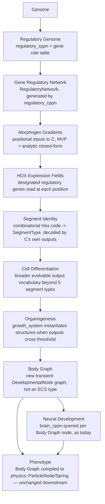
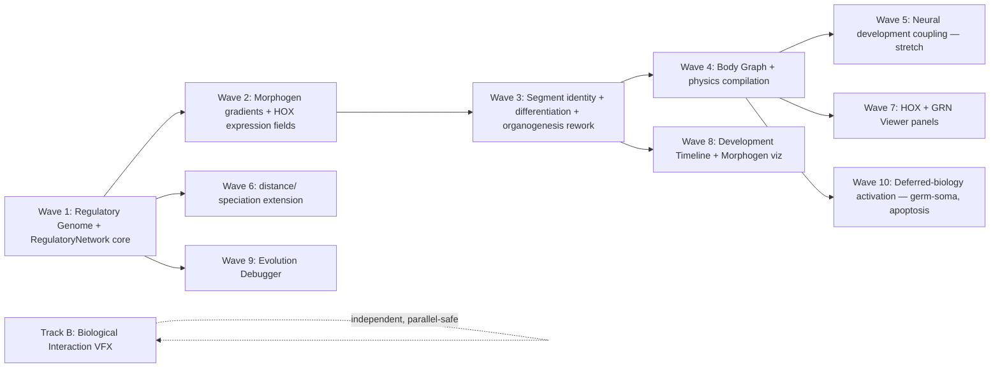

# Phylon — Phase 3 Roadmap

## Evo-Devo, Research Biology, and Scientific Instrumentation

**Document type:** Pre-implementation architecture design and roadmap (analysis only — no code changes made in producing this document).
**Sources reviewed before writing this** (per your instruction, in full): `IMPLEMENTATION_STATUS.md`, `UI_IMPLEMENTATION_STATUS.md`, `UI_PHASE2_ROADMAP.md`, `README.md`, `PHYLON_PROMPT_v2.md`. Every claim about current behavior below was additionally re-verified directly against source (`crates/genetics`, `crates/organisms`, `crates/evolution`, `crates/reproduction`, `crates/diffusion`) rather than taken from memory of prior sessions.
**Status:** Waiting for approval. Nothing here should be implemented until you approve a specific wave.

---

## 1. Why This Phase, and What It Is Not

`IMPLEMENTATION_STATUS.md` already closed the infrastructure question: Epics 1–15 are done or explicitly deferred, with a documented reason and priority for every deferral (§4/§6 of that document). `UI_PHASE2_ROADMAP.md` closed the workbench question: 18 milestones done, frozen, future UI work redirected to a Phase 3 doc. Neither document claims the *organisms* are done — quite the opposite. `IMPLEMENTATION_STATUS.md`'s own Epic 10 entry says multicellular systems are "~35% of full spec section," and DEF-002 through DEF-006 (germ-soma separation, vascular/neural specialization, metamorphosis, morphogen fields) are all filed under **Advanced Biology**, explicitly named as the next frontier, not forgotten work.

This phase is scoped narrowly: **replace the current template/lookup-based body-plan generation with a genuinely regulatory one**, and build the research instrumentation to observe it. It is not a UI phase (UI_PHASE2_ROADMAP.md stays frozen; any new panels here are satellite deliverables gated behind backend data existing) and it is not a return to Epic 1–15's infrastructure work (nothing here reopens a closed epic).

---

## 2. Current Architecture Audit (ground truth, not the original spec's intentions)

| Question | Current answer | Evidence |
|---|---|---|
| Does Hox currently regulate anything, or does it directly encode anatomy? | **Directly encodes.** `Genome.hox: Option<HoxSequence>` — when `Some`, `growth_system` reads `HoxGene.segment: SegmentType` and writes it straight onto `ParticleNode.segment_type`. There is no regulatory step in between. | `genetics/src/genome.rs:57-60` (doc: "the growth system reads the body plan directly from this sequence"), `organisms/src/systems.rs:44-46` |
| What happens when Hox is absent? | `morph_cppn` is queried, but only with a **1-D sequential index** (`segment_idx / max_segments`, `parent_type`) — not a true multi-dimensional positional substrate (HyperNEAT-style). | `organisms/src/systems.rs:53-58` |
| Is there any Gene Regulatory Network today? | **No.** A workspace-wide search for "regulatory/GRN/activator/repressor/expression" returns exactly one hit: diploid dominance resolution (`express_diploid`), which is allele-dominance logic, not a regulatory network. `genetics/src/lib.rs`'s own doc comment lists what's unimplemented and doesn't even mention GRNs — this is greenfield. | `genetics/src/genome.rs:111-140,450-472` |
| Is there morphogen/gradient infrastructure to build on? | `diffusion` crate exists (Laplacian PDE solver) but is scoped entirely to **environmental chemistry** (pheromones, hazard fields, gas exchange) — zero coupling to genetics or body-plan generation today. Reusable as infrastructure, not currently wired to development. | `diffusion/src/lib.rs:1`, wired only via `behavior`/`ecology` |
| Is the body already graph-like? | **Partially.** `physics::ParticleNode`/`Spring` are already a graph (nodes + edges with `node_a`/`node_b`) at the *physics* level. The gap is upstream: `morph_cppn`'s query is linear/sequential, not a branching specification. | confirmed via existing `physics` crate structure (already used this session for the Body Plan tree, Epic/Phase 1 M4) |
| Does brain topology depend on body-plan size? | **Yes, already.** Brain node count is `input_count + hidden_count + effectors.len() + 1` — one output node per muscle/fin effector produced during growth. Neural and morphological development are already coupled at this one point. | `organisms/src/systems.rs:96-101` |
| Does speciation account for Hox? | **No.** `Genome::distance` sums compatibility distance over `brain_cppn` and `morph_cppn` only; Hox never enters it. Reproduction's mate-compatibility check is even narrower (`brain_cppn` node count only). | `genetics/src/genome.rs:148-162`, `reproduction/src/lib.rs:236` |
| Is Hox itself ever mutated? | **No.** `Genome::mutate` mutates both CPPNs; there is no Hox mutation call anywhere. | `genetics/src/genome.rs:361-383` |

**Net finding:** the user's diagnosis is exactly right. Morphology today is a fork between "hardcoded lookup table" (Hox present) and "a CPPN queried too simply to be truly positional" (Hox absent). Neither path has anything resembling regulation, feedback, or positional information in the developmental-biology sense.

---

## 3. Central Architectural Decision — How the GRN Is Realized

Before laying out the 11-stage pipeline, one decision governs almost everything else, so it's presented first rather than buried in an ADR list.

**The Gene Regulatory Network is a third evolvable `Cppn` (`regulatory_cppn`), generating the weights of a small recurrent runtime network (`RegulatoryNetwork`) — not a new execution engine built from scratch.**

This mirrors a pattern the codebase already proves out twice: `brain_cppn` (evolvable, feedforward) generates the weights/biases of `Brain` (a recurrent CTRNN, iteratively simulated every tick). `RegulatoryNetwork` plays the same role `Brain` plays, generated by `regulatory_cppn` the same way `Brain` is generated by `brain_cppn`, iteratively simulated over a small fixed number of *developmental* steps (not simulation ticks) each time a body segment differentiates.

Why this and not a bespoke Boolean-network or ODE-based GRN engine:
- **Reuses everything already evolvable:** NEAT-style crossover, add-node/add-connection mutation, innovation tracking, self-adaptive per-locus mutation rate — all already exist for `Cppn` and need zero new code to apply to `regulatory_cppn`.
- **Preserves determinism trivially:** it's the same `Cppn::evaluate`/`Brain`-style iterate-to-convergence pattern already audited as deterministic; no new RNG source, no new floating-point-order hazard.
- **Activators/repressors/thresholds/feedback loops are not new concepts to invent** — they're exactly what a recurrent network with signed weights and sigmoid activation already expresses. `Neuromodulators`/Hebbian plasticity (Epic 8) already proved this style of small evolvable dynamical system works in this codebase.
- **Scientifically legitimate, not a shortcut:** CPPN/HyperNEAT-generated regulatory networks are an established ALife technique for exactly this kind of developmental modeling, not a simplification invented for this project.

This decision is what keeps the rest of this roadmap's implementation cost bounded — without it, "Gene Regulatory Network" would mean building a second, parallel evolvable-network infrastructure alongside the one that already exists for brains, doubling the surface area for no clear benefit.

---

## 4. The Evo-Devo Pipeline — Design

| Stage | What it is | Maps onto / replaces | New data structures |
|---|---|---|---|
| Genome | Unchanged concept, one new field | `Genome` gains `regulatory_cppn: Cppn`, alongside existing `brain_cppn`/`morph_cppn` | none new |
| Regulatory Genome | The evolvable specification of regulatory genes | New: a fixed-order **gene role table** (analogous to `brain_cppn`'s fixed input/output column convention already documented in `neural_viewer.rs::input_sense_name`) — some output slots are *designated* Hox genes, others are differentiation/effector genes | `RegulatoryGeneRole` enum (Hox, Differentiation, Effector) |
| Gene Regulatory Network | The runtime dynamical system | New: `RegulatoryNetwork`, generated by `regulatory_cppn` exactly as `Brain` is generated by `brain_cppn` | `RegulatoryNetwork` (nodes, signed weighted edges, sigmoid activation, iterated to convergence or a fixed step count) |
| Morphogen Gradients | Positional information fed into the GRN | New, but MVP is **analytic, not diffused**: closed-form functions of position (distance-from-head, normalized AP-axis position) — no GPU/PDE work required for the MVP. True diffused fields (DEF-006) stay a documented future upgrade, not required for this pipeline to function | none new for MVP (plain `f32` inputs) |
| HOX Expression Fields | Which Hox genes are "on" at a given position | Replaces the direct `HoxGene.segment` lookup — instead, the regulatory-gene-role table's Hox-designated outputs, evaluated at this position, form a **combinatorial code** | none new — a `Vec<f32>` slice of `RegulatoryNetwork`'s output |
| Segment Identity | Position → anatomical category | Replaces `systems.rs:207-213`'s literal `SegmentType` match — becomes a small, *fixed but evolvable-in-effect* decode of the Hox code, since the code itself is shaped by evolution | `SegmentType` enum unchanged in shape, changed in how it's produced |
| Cell Differentiation | Broader-than-5-types output vocabulary | New evolvable output genes (via `Cppn`'s existing add-node mutation) beyond today's fixed Head/Torso/Muscle/Tail/Fin — e.g., future Vascular/Ganglion outputs (DEF-003) slot in here with no core-pipeline change | extends `SegmentType` (additive, not breaking, if new variants are added carefully — see §7 migration note) |
| Organogenesis | Threshold crossing → physical structure | This *is* today's `growth_system`, changed to read `RegulatoryNetwork` output instead of `Hox.genes`/`morph_cppn` directly | none new — same `growth_system`, new input source |
| Body Graph | Intermediate developmental representation | **New.** A plain, transient graph (`DevelopmentalNode { role, position_in_lineage, parent }`) built during growth, *compiled* into `physics::ParticleNode`/`Spring` exactly as today — physics/rendering/behavior crates need zero changes | `DevelopmentalNode`, `DevelopmentalGraph` (both `organisms`-crate-internal, never touch `physics`/ECS directly) |
| Neural Development | Brain wiring | **Unchanged mechanism** (`brain_cppn` queried per node/connection pair) — the one coupling point (`effectors.len()` driving output count) is preserved as-is in this phase; deeper coupling (regulatory-gated neural centralization, DEF-003) is an explicit stretch goal, not required | none new for the required scope |
| Phenotype | Final organism | Body Graph compiled to physics + Brain — identical shape to today's spawned organism from every other crate's perspective | none new |

**Load-bearing design property:** every crate *outside* `genetics` and `organisms` — `physics`, `rendering`, `behavior`, `evolution` (except `distance`), `analytics` — needs **zero changes** for the core pipeline to work, because the Body Graph is compiled down to the exact same `ParticleNode`/`Spring` shape those crates already consume. This bounds the blast radius considerably relative to what "replace the developmental pipeline" could have implied.

---

## 5. Architectural Decision Records

### ADR-P3-01: GRN realized as a third evolvable CPPN, not a new engine
Covered in full in §3. **Consequence:** `Genome` gains a field, `GENOME_SCHEMA_VERSION` bumps (breaking, see §7). **Alternative rejected:** a bespoke Boolean/ODE regulatory-network engine — rejected for doubling evolvable-network infrastructure with no determinism or evolvability benefit over reusing `Cppn`.

### ADR-P3-02: Hox becomes a combinatorial expression code, never a direct lookup
**Decision:** `HoxGene.segment: SegmentType` direct-write is removed. Segment identity is decoded from the regulatory network's Hox-designated output genes, evaluated at a position. **Reason:** this is the user's explicit, non-negotiable requirement, and it's also what makes Hox mutable and evolvable for the first time — today's Hox is never mutated at all (§2 finding), a real, quiet gap this closes as a side effect. **Consequence:** `HoxSequence`/`HoxGene` as currently shaped are retired; the *name* "Hox" moves to mean "the designated subset of regulatory genes read positionally," matching real developmental biology's usage. **Migration:** no automatic path from old `HoxSequence` data — see §7.

### ADR-P3-03: Morphogens are analytic/closed-form for the MVP, diffused fields stay a future upgrade
**Decision:** positional inputs to the GRN (distance-from-head, normalized AP position) are computed directly, not via a PDE solve. **Reason:** `growth_system` operates per-organism, sequentially, over bounded developmental ticks — a full GPU diffusion field per organism (or per-organism-local field) is a large, currently-unjustified GPU architecture addition (this is exactly DEF-006, already filed as "High difficulty, would require a new GPU field layer"). An analytic gradient is scientifically legitimate (real early-embryo morphogen gradients, e.g. Bicoid in *Drosophila*, are close to exponential decay from a localized source — a closed form is not a simplification for its own sake, it's a reasonable first model). **Future trigger:** the same one DEF-006 already names — a concrete need for *environmentally-coupled* or *inter-organism* developmental signaling that a closed-form per-organism gradient can't express.

### ADR-P3-04: Body Graph is transient and organisms-crate-internal, never an ECS type
**Decision:** `DevelopmentalGraph` is a plain Rust data structure used only during `growth_system`'s execution, compiled to `physics::ParticleNode`/`Spring` and then discarded — it is never a `bevy_ecs::Component`/`Resource`. **Reason:** keeps this phase's blast radius inside `genetics`+`organisms`; every other crate keeps working against the same physics representation it already consumes. **Alternative rejected:** persisting the developmental graph as an ECS resource for later inspection — rejected for *this* phase (it would help the Development Timeline panel, §8, but adds ECS surface area prematurely); revisit if the Development Timeline milestone needs it, as its own small, separate decision at that time.

### ADR-P3-05: Determinism preservation
**Decision:** `RegulatoryNetwork` iteration uses the same seeded `common::SimRng`-free evaluation style `Cppn::evaluate` already uses (pure function of inputs + weights, no live randomness during evaluation — only genome-level mutation draws from `SimRng`, exactly as today). **Reason:** non-negotiable project-wide constraint (bit-exact reproducibility, `README.md`'s own stated architecture goal). **Verification requirement:** every new milestone below must include a same-seed-same-output test, matching the standing pattern from Phase 1/2's own verification discipline.

### ADR-P3-06: Schema version bump, no migration path
**Decision:** `GENOME_SCHEMA_VERSION` bumps from 3 to 4. No automatic migration from pre-Phase-3 `.phylon` saves or `data/experiments/*/manifest.ron` — consistent with the project's already-established, repeatedly-applied policy (ADR-010 in `IMPLEMENTATION_STATUS.md`: "bump and document the break; do not build a migration path," since this is a research tool without saved-run continuity requirements yet). **Consequence:** stated plainly in §7, not softened.

---

## 6. Dependency Graph (implementation order, not just conceptual)

Waves 1→4 are strictly sequential (each is a real prerequisite, not just a suggested order — Wave 3 cannot start meaningfully without Wave 2's positional inputs existing, etc.). Wave 5 is a stretch goal, gated behind Wave 4 but not required for the pipeline to be complete and useful. Waves 7–9 (research tooling) are gated behind the backend wave whose data they visualize — building a GRN Viewer before `RegulatoryNetwork` exists would mean visualizing nothing real. Wave 10 (deferred-biology activation) is gated behind Wave 4, per §7 below. Track B (Biological Interaction Visualization) is genuinely independent — it visualizes existing simulation state (predation, photosynthesis, disease, reproduction, death), not anything new from Waves 1–10, and can proceed at any time without waiting on this roadmap's other work.

---

## 7. Remaining Deferred Biology — Reassessed Against This Architecture

Per your instruction, not activated blindly — each is checked against whether Waves 1–4 actually unlock it cheaply, or whether it remains its own separate cost regardless.

| Item | Original filing | Reassessment | Recommendation |
|---|---|---|---|
| DEF-002 — Germ-soma separation, developmental apoptosis | High difficulty, "Advanced Biology" | **Now cheap.** Germ-soma = one more binary output gene at an early differentiation branch. Apoptosis = a differentiation output whose effect is "remove this node before organogenesis," a small `growth_system` branch. Both are additive uses of Wave 3's broadened output vocabulary. | **Activate — Wave 10, low incremental cost once Wave 4 lands.** |
| DEF-003 — Vascular/muscle/neural specialization | High difficulty | **Partially cheaper.** Vascular = a new differentiation output type (cheap, Wave 10). Full neural centralization (ganglion topology genuinely shaped by regulatory state) is Wave 5's territory — still a real stretch, not free. | **Activate the differentiation-output part (Wave 10); keep full neural centralization as the Wave 5 stretch goal, not promised in this phase.** |
| DEF-004 — Metamorphosis/larval forms | Low priority, high difficulty | **Still genuinely hard.** Needs a life-stage trigger system (re-evaluating the regulatory network later in life with different — e.g., a "maturity" — inputs) that doesn't exist in any form today. The GRN architecture makes this *conceivable* for the first time, but it is not a byproduct of Waves 1–4. | **Stay deferred — reasonable Wave 10+ stretch, not a default inclusion.** |
| DEF-005 — Horizontal gene transfer, plasmid transfer, encystment | Low priority | **Orthogonal.** About genome *exchange* mechanisms between organisms, not development. Nothing in this roadmap touches it either way. | **Stay deferred, unrelated to Phase 3.** |
| DEF-006 — True diffusible morphogen-gradient fields | High difficulty, GPU work | **Confirmed still deferred, now with a specific trigger condition** (ADR-P3-03): a concrete need for environmental/inter-organism developmental coupling the analytic MVP can't express. | **Stay deferred**, explicit future trigger now documented rather than open-ended. |
| DEF-007 — Alliance/coalition dynamics | Speculative | **Orthogonal.** Social behavior, not development. | **Stay deferred, unrelated to Phase 3.** |
| DEF-022 — Speciation representative refresh | Low priority | **Touched incidentally**: Wave 6 already has to open `Genome::distance` to add the `regulatory_cppn` term. Refreshing representatives is a natural, cheap addition to make in the same milestone, not a separate initiative. | **Opportunistic fix inside Wave 6, not its own wave.** |

---

## 8. Research Instrumentation — Panel Designs

Each follows the UI architecture `UI_PHASE2_ROADMAP.md` already established and froze — no new UI architecture is introduced; these are new panels/tabs using the existing dock-panel or Sidebar-tab pattern (per which fits: an "always relevant to one organism" panel is a Sidebar tab, like Lineage Explorer; a "compare/browse across organisms or runs" panel is a top-level dock panel, like Research Dashboard).

| Panel | Fit | Gated behind | Shows |
|---|---|---|---|
| **HOX Visualizer** | New Sidebar tab (organism-scoped, like Lineage) | Wave 3 | Per-position Hox combinatorial code, resulting segment identity, body preview; clicking a segment shows active genes/regulatory inputs/produced organs/mutation history (the last item reuses Lineage Explorer's ancestry data, already built in Phase 2 M2/M3) |
| **Gene Regulatory Network Viewer** | New Sidebar tab or dock panel (undecided — recommend Sidebar tab, organism-scoped, consistent with HOX Visualizer) | Wave 1 | Graph layout of `RegulatoryNetwork` (nodes/edges, activator vs. repressor edge coloring, live expression levels), time playback over developmental steps, hover inspection, mutation-vs-parent comparison (reuses Recent Selections' comparison instinct from Phase 2 M13) |
| **Development Timeline** | Extends the HOX Visualizer/GRN Viewer rather than a wholly separate panel — a shared timeline scrubber component both can use | Wave 3 (needs organogenesis events to exist) | Step through development stage-by-stage; per ADR-P3-04, this is the concrete trigger for reconsidering whether the Body Graph needs to be retained (not just compiled-and-discarded) for a given organism, at least optionally, for research replay of its own development |
| **Morphogen Visualization** | Overlay on the HOX Visualizer/body preview, not a separate dock panel | Wave 2 | Heatmap of the analytic gradient functions (AAV-axis position, distance-from-head) — genuinely simple to render since they're closed-form, not fields requiring a texture readback |
| **Evolution Debugger** | New dock panel (cross-organism/cross-run, like Research Dashboard) | Wave 1 (mutation diff needs `regulatory_cppn` to exist) | Mutation diff, parent-vs-offspring comparison, development-failure inspector (an organism whose organogenesis produced zero effectors, say), phenotype/GRN/Hox/segment comparison, development event log |
| **Biological Interaction Visualization** | Not a panel — a viewport rendering layer (Track B, independent) | Nothing in Waves 1–10 | Predation (red outline, bite flash, ATP transfer text), photosynthesis (green energy flow), respiration (gas exchange indicators), disease (infection halo), communication (pheromone/signal pulses — some already exist as vision-cone-style overlays and would be extended, not invented), reproduction (budding/mating animation), death (corpse transition). **Constraint carried over from your prompt, restated as a hard requirement:** every effect must correspond to real simulation state already computable from existing components — no purely decorative effect gets added. |

---

## 9. Milestone Roadmap

| # | Milestone | Depends on | Complexity | Breaking? |
|---|---|---|---|---|
| M1 | ~~`Genome.regulatory_cppn` field + `RegulatoryGeneRole` table + `RegulatoryNetwork` runtime struct (generated, evaluated, not yet wired to growth)~~ | none | Medium-High | Yes (schema v3→4) — **Done** |
| M2 | ~~Crossover/mutation for `regulatory_cppn` (reuse `Cppn`'s existing machinery)~~ | M1 | Low | No (additive to M1's break) — **Done** |
| M3 | ~~Analytic morphogen gradient functions (AP position, distance-from-head) as `RegulatoryNetwork` inputs~~ | M1 | Low | No — **Done** |
| M4 | Hox-designated output genes decoded into `SegmentType`, replacing direct `HoxGene.segment` lookup in `growth_system` | M1, M3 | High | Yes (removes old Hox direct-read path) |
| M5 | Broadened differentiation output vocabulary (beyond 5 fixed types), evolvable via `Cppn` add-node | M4 | Medium | Additive |
| M6 | `DevelopmentalGraph`/`DevelopmentalNode` intermediate representation + compilation to `physics::ParticleNode`/`Spring` | M4, M5 | Medium-High | No (physics-facing shape unchanged) |
| M7 | `Genome::distance` extended with `regulatory_cppn` term + speciation representative-refresh (DEF-022) | M1 | Low | No (distance value changes, not the type) |
| M8 | Germ-soma separation + developmental apoptosis (DEF-002) | M5, M6 | Low-Medium | No |
| M9 | Vascular differentiation output type (part of DEF-003) | M5 | Low | No |
| M10 | HOX Visualizer + Morphogen Visualization panels | M4 (HOX), M3 (Morphogen) | Medium | No |
| M11 | GRN Viewer panel (graph layout, time playback, mutation comparison) | M1, M2 | Medium-High | No |
| M12 | Evolution Debugger panel | M1, M7 | Medium | No |
| M13 | Development Timeline (shared scrubber component) | M6, M10, M11 | Medium | No |
| M14 (stretch) | Neural development coupling — regulatory-gated neural centralization | M6 | High | Possibly (Brain wiring assumptions) |
| M15 (stretch) | Metamorphosis/life-stage re-differentiation (DEF-004) | M6, M8 | High | No |
| — | Track B: Biological Interaction Visualization (predation/photosynthesis/etc. VFX) | none — independent | Medium, spread across several small milestones | No |

**Recommended order:** M1 → M2 → M3 → M4 → M5 → M6 (the core pipeline, strictly sequential) → M7 (opportunistic, can slot in anytime after M1) → M10/M11 (instrumentation, as soon as their backend dependency lands) → M8/M9 (cheap deferred-biology activation) → M12/M13 → M14/M15 as explicit stretch goals, not committed scope. Track B can run in parallel with any of the above, at any time, by whoever has bandwidth for it — it has no dependency on this roadmap's sequencing.

---

## 10. Breaking Changes & Migration Strategy

- **`GENOME_SCHEMA_VERSION` 3 → 4** (M1). No migration path — matches the project's standing, twice-precedented policy. Every pre-Phase-3 `.phylon` save and `data/experiments/*/manifest.ron`-referenced binary state becomes unloadable. State this to any user before landing M1; it is not a silent break.
- **`HoxSequence`/`HoxGene` as currently shaped are retired** (M4). Their *name* is repurposed for the designated-output-gene subset of `RegulatoryNetwork`. Anything reading the old struct directly (only `growth_system` and the Genetics sidebar tab's "Hox genes" row) needs updating in the same milestone.
- **`SegmentType` gains variants** (M5) — additive if done as a proper enum extension with exhaustive-match sites updated (`growth_system`'s stiffness lookup, `render`'s color mapping if any exists) rather than a breaking reorder. Verify no code assumes exactly 5 variants via magic numbers before this milestone; audit as the milestone's first step, not an afterthought.
- **`Genome::distance` output changes** (M7) — not a type break, but every existing species' compatibility threshold effectively shifts once a third CPPN's distance is summed in. Recommend: after M7 lands, run a comparison against a fixed test population to confirm species counts don't wildly diverge from pre-M7 behavior, and retune `compatibility_threshold` if they do — a calibration step, not a code risk.

No other crate (`physics`, `rendering`, `behavior`, `analytics`, `ui`) requires breaking changes for the core pipeline (M1–M7). This is the direct payoff of ADR-P3-04 (Body Graph stays internal, compiles to the unchanged physics shape).

---

## 11. Risk Assessment

| Risk | Where | Mitigation |
|---|---|---|
| `RegulatoryNetwork` iteration doesn't converge (oscillates or diverges) for some evolved topologies | M1 | Fixed step count (not "iterate until convergence"), matching a bounded, deterministic, testable evaluation — same shape as `Cppn::evaluate`'s existing bounded cost |
| Broadening `SegmentType` breaks an exhaustive match somewhere not yet found | M5 | Grep for every `match segment_type`/`match SegmentType` site *before* adding variants, as the milestone's first step; `cargo build` will also catch non-exhaustive matches at compile time — but only if every site actually matches on the enum rather than a raw `u32`, which `ParticleNode.segment_type: u32` currently is (a real, separate small risk: some sites may compare raw `u32` values, not the enum, and those won't get compiler help) |
| Speciation behavior shifts unexpectedly after M7 | M7 | Explicit calibration step named in §10 |
| Development Timeline's need for a retained Body Graph reopens ADR-P3-04's "stays transient" decision | M13 | Treat as its own small decision at that time, not a reason to preemptively over-build M6 |
| Scope creep: Waves 8–9 (deferred-biology activation) get implemented as bigger than "cheap" once real code is written | M8/M9 | Re-verify against source immediately before starting each, same discipline as every prior phase — if a "cheap" item turns out not to be, stop and report before continuing, exactly as ADR-001 (Phase 2) demonstrated is the right response |
| This is a much larger initiative than any single Phase 1/2 wave | Whole roadmap | Explicitly sized in §9's dependency chain — M1–M6 alone is comparable to several Phase 2 waves combined; treat each milestone with the same one-at-a-time, stop-and-verify discipline, not a Phase-2-style multi-milestone bundle, unless you explicitly request bundling once implementation begins |

---

## 12. Verification Plan (per milestone, once approved)

Every milestone: `cargo build --workspace --all-targets`, `cargo clippy --workspace --all-targets -- -D warnings`, `cargo fmt --all -- --check`, `cargo test --workspace`, plus:

| Milestone class | Additional verification |
|---|---|
| M1–M2 (RegulatoryNetwork/CPPN) | Same-seed-same-output determinism test (ADR-P3-05); a round-trip crossover/mutation test mirroring `Cppn`'s existing test suite |
| M3–M4 (morphogens, Hox decode) | A fixture genome with a known, hand-computed expected segment sequence, asserting the decode produces it |
| M5–M6 (differentiation, Body Graph) | A full spawn-to-phenotype integration test asserting the compiled `ParticleNode`/`Spring` set matches expectations for a fixture genome; a performance benchmark (new, since none of Epics 1–15's benchmarks cover this path — DEBT-013 from `IMPLEMENTATION_STATUS.md` already flagged this class of gap) |
| M7 (distance/speciation) | Regression test comparing species counts on a fixed population before/after, per §10's calibration note |
| M8–M9 (deferred biology) | Unit tests per new behavior (apoptosis actually removes a node; germ-soma actually produces two distinguishable lineages) |
| M10–M13 (panels) | No new backend tests; manual verification against a running simulation is required (per this session's own established honesty standard — several earlier UI milestones explicitly flagged when a live visual check wasn't possible; the same standard applies here) |
| Track B (VFX) | Manual visual verification is the *primary* verification — "every effect must correspond to real simulation state" is a claim that can only actually be checked by watching it happen, not by a unit test |

---

## 13. Executive Summary

**What changes:** the developmental pipeline gains a genuine regulatory layer (a third evolvable CPPN generating a recurrent `RegulatoryNetwork`), positional information (analytic morphogen gradients), and a decoupled intermediate Body Graph representation — replacing today's fork between "hardcoded Hox lookup" and "under-powered sequential CPPN query."

**What doesn't change:** `physics`, `rendering`, `behavior`, `analytics` crates, the UI architecture (frozen per Phase 2), and the core determinism/ECS/composition-root conventions established across every prior phase.

**What's genuinely new infrastructure:** `RegulatoryNetwork` (M1) and `DevelopmentalGraph` (M6) — everything else reuses `Cppn`'s existing evolvable-graph machinery.

**What's breaking:** `GENOME_SCHEMA_VERSION` 3→4, no migration, consistent with the project's already-twice-applied policy. `SegmentType`'s exhaustiveness needs a pre-milestone audit, not just a post-hoc compile check.

**What's now cheap that wasn't:** germ-soma separation and developmental apoptosis (DEF-002), and the differentiation-output half of vascular/neural specialization (DEF-003) — both become low-cost extensions of Wave 3/4's broadened output vocabulary rather than the "High difficulty" items they were filed as before this architecture existed.

**What stays deferred, and why:** HGT/plasmid transfer (DEF-005) and alliance/coalition dynamics (DEF-007) are orthogonal to development, not touched by this roadmap either way. True diffused morphogen fields (DEF-006) and metamorphosis (DEF-004) remain genuinely hard, each with a specific, now-documented future trigger rather than an open-ended "someday."

**What should happen first:** M1 (the `RegulatoryNetwork` core) — everything else, including all six research panels, is gated behind it existing.

**Awaiting approval before implementation**, per your instruction — this document is analysis only; no files outside this one were modified in producing it.

Phase 3 architecture and roadmap complete.
Waiting for review before any implementation begins.

---

## Phase 3 Execution Log

**Roadmap approved.** Running log of Phase 3 milestones, each independently re-verified against source and fully build/clippy/fmt/test-verified before being marked done — same discipline as Phase 1/2's execution logs.

| Milestone | Outcome | Verification |
| --- | --- | --- |
| M1 — `regulatory_cppn` field + `RegulatoryGeneRole` table + `RegulatoryNetwork` runtime struct | Re-read `genome.rs`/`cppn.rs`/`brain/src/lib.rs` before touching anything, confirming §2/§3's audit still held (it did — no drift between roadmap and repository). Added `Genome.regulatory_cppn: Cppn` (+ `DiploidAlleles.regulatory_cppn`, `new_diploid`'s signature extended to 3-tuples, `expressed_regulatory_cppn()`), bumped `GENOME_SCHEMA_VERSION` 3→4. New `crates/genetics/src/regulatory.rs`: `RegulatoryGeneRole` (Hox/Differentiation/Effector), `REGULATORY_GENE_ROLES` (a fixed 6-gene table: 3 Hox + 2 Differentiation + 1 Effector), `RegulatoryGeneNode`/`RegulatoryEdge`, and `RegulatoryNetwork` with `generate` (queries `regulatory_cppn` per-node and per-node-pair, exactly mirroring how `organisms::systems` already queries `brain_cppn`), `step` (one synchronous developmental update — computed from a frozen snapshot of the previous step's states, so it's order-independent regardless of node storage order), and `develop` (a fixed step count, never "iterate to convergence," per the roadmap's own risk note). **Deliberately not done** (per the "never combine milestones" rule): `regulatory_cppn` is not yet crossed over or mutated (M2), has no positional/morphogen inputs wired in (M3), and is not read by `growth_system` for segment identity (M4) — `Genome::crossover`/`mutate` carry the field over unchanged, with an explicit code comment at each site stating this is temporary and naming the milestone that changes it. `RegulatoryNetwork` is deliberately not a `bevy_ecs::Component` and not `Serialize`d yet (see its doc comment) — it's a `genetics`-crate-internal, freshly-generated-and-discarded computation for now, consistent with ADR-P3-04's "Body Graph stays transient" reasoning applied one milestone early to this related question. | `cargo build --workspace --all-targets` clean; `cargo clippy --workspace --all-targets -- -D warnings` clean; `cargo fmt --all -- --check` clean (one auto-fmt pass, applied and reverified); `cargo test --workspace` — all passing, 0 failed; `RUSTDOCFLAGS="-D warnings" cargo doc -p genetics -p evolution --no-deps --document-private-items` clean. No other crate needed changes beyond `genetics/src/{genome.rs,regulatory.rs,lib.rs}` and two test call sites (`evolution/src/lib.rs`, `genome.rs`'s own tests) that used `new_diploid`'s old 2-tuple signature — confirmed via a full-workspace grep for every `Genome` construction site *before* editing, exactly as the roadmap's own audit method required. |

**No deviation from the roadmap found or needed for M1** — implementation matched §4/§9's design exactly, no new ADR required beyond the ones already recorded in §5.

**Risks/technical debt introduced by this milestone:** none beyond what §11 already named for M1 (fixed step count risk, documented). The temporary "crossover/mutate carry `regulatory_cppn` over unchanged" state is not itself new debt — it's the explicitly planned, one-milestone-wide gap between M1 and M2, closed by the very next milestone.

| M2 — Crossover/mutation for `regulatory_cppn` | Re-read M1's temporary "carried over unchanged" code before touching it, confirming it was exactly as left (it was). Closed the gap: `Genome::crossover` now calls `self.regulatory_cppn.crossover(&other.regulatory_cppn, rng)` (and the diploid second allele's equivalent), reusing `Cppn::crossover` unchanged — no new crossover logic was needed, only wiring the existing method in, exactly as §9 anticipated. `mutate_cppn_pair` (private helper) renamed to `mutate_cppn_trio` and extended with a third parameter; `regulatory_cppn` mutates under the *same* pass gate as `brain_cppn`/`morph_cppn` at the same rates (5% add-node, 10% add-connection, per-connection jitter) — appended after the existing two rather than interleaved, to disturb their existing same-seed mutation draw sequence as little as possible (not a strict requirement post-schema-bump, but a reasonable no-cost precaution). Replaced M1's two placeholder tests (which asserted the now-superseded "unchanged" behavior) with tests confirming the real crossover/mutation behavior, plus one new test verifying the diploid second-allele path specifically (`new_diploid`'s 3-tuple signature and `mutate_cppn_trio`'s per-allele call together). One doc-link warning surfaced by `cargo doc` (a `[`mutate_cppn_trio`]` markdown link to a private item, the same `rustdoc::private_intra_doc_links` class of issue fixed several times earlier in this project) — fixed by dropping the link brackets, same resolution as every prior occurrence. | `cargo build --workspace --all-targets` clean; `cargo clippy --workspace --all-targets -- -D warnings` clean; `cargo fmt --all -- --check` clean (no diffs); `cargo test --workspace` — all passing, 0 failed (genetics: 27→28 net, after replacing 2 tests with 3); `RUSTDOCFLAGS="-D warnings" cargo doc -p genetics -p evolution --no-deps --document-private-items` clean after the one fix above. No crate outside `genetics` needed changes. |

**No deviation from the roadmap found or needed for M2** — implementation matched §9's design exactly ("reuse `Cppn`'s existing machinery," which is precisely what happened). No new ADR required.

**Risks/technical debt introduced by this milestone:** none. The one thing worth naming explicitly: `regulatory_cppn`'s mutation rates (5%/10%) are hardcoded equal to `brain_cppn`/`morph_cppn`'s, not independently tuned — a reasonable default, not yet a considered decision, and not a problem this milestone needed to solve (nothing in §9 asked for separate tuning).

| M3 — Analytic morphogen gradient functions | Re-verified §4/§9's scope before writing anything: M3 is functions only (positional inputs to the GRN), not wiring into `growth_system` — that stays M4's job. New `crates/genetics/src/morphogen.rs`: `ap_position(segment_index, total_segments)` (normalized 0.0 head → 1.0 tail, with a degenerate single/zero-segment case defined as `0.0`), `distance_from_head_gradient` (exponential decay from the head, the closed-form analog of a real morphogen source named directly in ADR-P3-03's own Bicoid example), and `external_inputs_for_position` which builds the per-gene `Vec<f32>` that `RegulatoryNetwork::step`/`develop`'s existing `external_inputs` parameter (already present since M1, unused until now) expects. For this milestone every gene receives the same combined signal — deciding which gene reads which *specific* morphogen channel is explicitly left to M4's Hox-decode work, not this milestone's. Added `pub mod morphogen` + re-exports to `genetics/src/lib.rs`. Six new tests covering monotonicity, the degenerate single-segment case, decay direction, per-gene input length, determinism for a repeated position, and (using a real `RegulatoryNetwork::generate` + `develop` round trip) that two different body positions produce two different developed network states. | `cargo build --workspace --all-targets` clean; `cargo clippy --workspace --all-targets -- -D warnings` clean; `cargo fmt --all -- --check` clean (one auto-fmt pass on a wrapped line, reverified); `cargo test --workspace` all passing, 0 failed; `RUSTDOCFLAGS="-D warnings" cargo doc -p genetics --no-deps --document-private-items` clean. No crate outside `genetics` needed changes — `organisms::growth_system` is untouched, consistent with M3 not being a breaking milestone. |

**No deviation from the roadmap found or needed for M3** — implementation matched §4/§9's design exactly ("none new for MVP (plain `f32` inputs)"). No new ADR required; this milestone is a direct, unmodified application of ADR-P3-03.

**Risks/technical debt introduced by this milestone:** none. `DECAY_RATE = 3.0` is a reasonable, documented default rather than a tuned/evolved parameter — acceptable since nothing in §9 asked for it to be evolvable, and it can be revisited if M4's fixture-genome tests reveal it produces unhelpfully flat or unhelpfully sharp gradients in practice.

**Remaining work:** M4 (Hox-designated output genes decoded into `SegmentType`, replacing the direct `HoxGene.segment` lookup in `growth_system`) is next, pending your review of this report. Per §11's risk table, M4 is High complexity and breaking — its own audit (grepping every `match segment_type`/`HoxSequence` read site) should happen before implementation starts, not assumed from this document.
