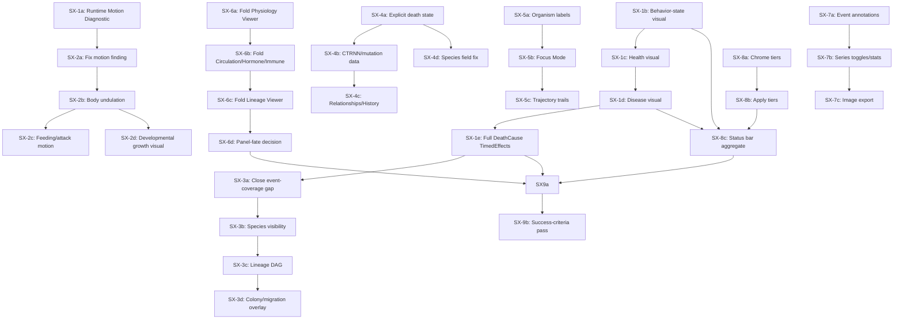

# Phase 5 — Simulation Experience (SX) Redesign: Audit & Roadmap

## 0. Framing

Phase 4 built real biology (per-segment physiology, transport, endocrine, immune, life stages) and a real design system (tokens, reusable widgets, 14 dockable panels). This document is the requested audit-first deliverable for turning that engineering into a legible, alive-feeling **Simulation Experience** — per the brief: *"the problem is no longer typography, spacing or colors. The problem is communication."*

**This document contains no implementation.** Every claim below was traced against source by four parallel audits this session (viewport/rendering, movement pipeline, inspector/selection/events, scientific visualization/hierarchy) — not assumed. Where something could not be settled by reading code, that is stated explicitly rather than guessed, per the brief's own "do not speculate, verify it" instruction.

---

## 1. Root-Cause Investigation — "Why Do Organisms Appear Static?"

### 1.1 Traced verdicts, stage by stage

| Stage | Verdict | Evidence |
|---|---|---|
| Tick/update loop | **Confirmed working** | `events.rs:797-798,888` redraws every pass; `is_paused` defaults `false`, `simulation_speed` defaults `1.0`, `max_ticks_per_frame` defaults `50` (`app.rs:349-352`, `ui/state.rs:466`) — nothing stalls ticks by default |
| Behavior → motor output | **Confirmed working, one correction to the brief's own hypothesis** | `behavior_system` (`behavior/src/lib.rs:260-355`) does **not** branch on `BehaviorState` at all — it always routes raw brain outputs to `Spring.actuation_amplitude`/`rest_length` regardless of Idle/Foraging/Fleeing/Hunting. So "Idle produces zero motion by design" is false; the actual gate is purely brain-output magnitude |
| Brain → effector | **Suspicious, unverifiable statically** | `Brain::get_outputs` (`brain/src/lib.rs:186-209`) should produce nonzero outputs from tick 1 (CPPN-derived bias is generally nonzero), but whether real evolved populations actually sustain meaningfully nonzero, *varying* outputs (vs. converging to a near-constant CTRNN fixed point) cannot be determined without instrumenting a live run |
| Spring actuation → physics force | **Suspicious, a real asymmetry found** | `gpu/src/muscle_actuation.wgsl:34`: `if (actuation_amplitude > 0.0) { rest_length = base + amplitude*sin(...) }` — only *positive*-amplitude springs get the sinusoidal rhythmic drive. Since amplitude is `tanh`-derived (range `[-1,1]`) roughly half of all actuated springs at any tick get **no oscillatory drive at all** on the GPU path, only the CPU-side single-step `rest_length` update. This doesn't zero motion, but plausibly reads as "sluggish" rather than rhythmic/alive |
| Camera/render scale | **Confirmed NOT the cause** | `camera_zoom` defaults `1.0`; 1 world unit = 1 screen pixel at default zoom (`sdf_skin.rs:481-482`); `segment_length = 20.0` → 20px displacement scale, well above perceptible threshold |
| GPU dispatch/readback | **Confirmed working** | `resolve_pending_physics`/`physics_pipeline.rs::resolve` block on `device.poll(Wait)` and write real position/velocity data back every tick — no silent stale-data fallback found. One real design note (not a bug): GPU-computed spring `rest_length` oscillation is never read back to the ECS — each tick's GPU spring state rebuilds fresh from CPU `Spring` fields, so oscillation is transient/single-tick-effective, not persistent state |
| Recent regression | **Inconclusive, none found** | Last 25 commits are Phase 3/4 biology/UI features; no commit isolated to `physics.wgsl`/`muscle_actuation.wgsl`/`behavior/lib.rs`/`render.rs`/`simulation.rs` in that window |

### 1.2 The more important finding: two separate problems, conflated in the brief

Static analysis disentangles what the brief treats as one symptom into two independent problems, with very different confidence levels:

**Problem A — possible motion attenuation (unverified, partial).** The `muscle_actuation.wgsl` positive-only gate and the unverified brain-output-magnitude question (§1.1) could make locomotion visually muted. This needs a runtime diagnostic before any fix is designed — see §1.4.

**Problem B — total absence of a state-to-visual mapping (confirmed, total).** This is the dominant finding, and it holds *regardless of whether Problem A turns out to be real*:

- `OrganismColor` is set once at spawn from `genetics::develop_at_position(...).pigment` — an emergent CPPN decode, explicitly decorrelated from `Diet::standard_color()` by design (`app.rs:853-857`'s own comment confirms this was an intentional consequence of retiring genome-stored color). It never updates after spawn.
- Zero rendering code anywhere (`crates/rendering/`, `crates/gpu/`, `app/src/render.rs`) reads `BehaviorState`, `Health`, `Age`, or `disease::Infection`/`SegmentInfection` for the general population. The only per-organism categorical viewport signal beyond structural segment-type coloring is a static `EcologicalCategory` ring (Keystone/Indicator/Endemic/Invasive) that never changes at runtime.
- The one exception is this session's own `render_physiology_overlay` (P4-V2) — but it's opt-in, one layer at a time, and only for the single selected/tracked entity. It does not run population-wide and doesn't cover BehaviorState at all.

**Implication:** even if Problem A doesn't exist and every organism is moving with full physical fidelity, a viewer still cannot *read* who's hunting, fleeing, starving, or diseased by looking at the viewport — there is no visual grammar mapping simulation state to appearance. This is very likely the larger contributor to "the simulator doesn't feel alive," and it is fully fixable with data Phylon already computes — nothing here requires new physics or new biology, only new rendering logic reading state that already exists.

### 1.3 Ranked hypotheses (explicit confidence levels, per the brief's own demand)

1. **(High confidence, confirmed)** Absence of state-driven visual differentiation (Problem B) is real and total — this alone would produce the reported experience even with perfect physics.
2. **(Medium confidence, needs runtime check)** The muscle-actuation positive-only gate measurably reduces locomotion vigor.
3. **(Low-to-unknown confidence, needs runtime check)** Evolved brain populations may be producing near-constant/low-variance outputs in practice — cannot be ruled in or out from source alone.

### 1.4 Required first step: Milestone 0 — Runtime Motion Diagnostic

Before designing any fix for Problem A, instrument a live run (log `Spring.actuation_amplitude`/`ParticleNode.position` deltas across N ticks for a sample population) and answer, with numbers: is displacement per tick small-but-nonzero (a tuning problem) or genuinely near-zero (a real bug)? **This is the one piece of this whole audit that cannot be resolved by reading code — it requires actually running the simulation.** Everything else in this document can proceed without it, since Problem B doesn't depend on the answer.

---

## 2. Full UI Audit

### 2.1 Viewport / organism rendering
- Color: emergent pigment, static, decorrelated from Diet/Health/Behavior (§1.2).
- Size: varies only by structural segment type (fin ×3/×4 scale) and global UI sliders — no per-organism scaling by health/vigor/age.
- Selection: **real and good** — a persistent pulsing white outline (`render.rs:1049-1060`, `pulse = 0.6+0.4*sin(time*3)`) distinct from a static green hover outline and the existing vision-cone overlay. This is a solid foundation to build on, not a gap.
- Debug-mode node coloring is purely structural (per segment type), same for every organism regardless of state.

### 2.2 Selection & tracking UX
- Three cooperating fields: `selected_entity`, `tracked_entity` (camera-follow target, distinct from selection), `recent_selections` (capped `VecDeque`, 8 entries, chip row in Inspector).
- Selection is lost silently: clicking empty space clears it unconditionally; a selected entity's death leaves the field populated but every Inspector row silently falls through to "Not Available" — no explicit "this organism died" state.
- Spectator mode auto-follows the highest-generation live organism every 15s, but only when spectator mode is explicitly enabled — no default "camera drifts toward something interesting" behavior otherwise.

### 2.3 Inspector
**Correction to the brief's assumption:** Inspector is **not** a flat property sheet. It already has 8 `CollapsingHeader` sections in this order: Identity, Physiology, Genetics, Neural, Morphology, Behavior, Ecology, Body Plan. The redesign's proposed category list is already ~70% implemented structurally. The real gaps:
- **Neural** shows only node/synapse *counts* — live CTRNN activity, brain inputs/outputs are all hardcoded `"Not Available"`.
- **Genetics** shows mutation history/count as `"Not Available"`.
- **Behavior** shows live `BehaviorState`/`CurrentGoal` correctly, but `ActionState`/`MemoryState` are `"Not Available"`.
- **Ecology** shows a `SpeciesMembership` field hardcoded `"Not Available"` — redundant and inconsistent, since Identity's `SpeciesId` (from `LineageTracker`) *is* live two sections above it.
- No **Development**, **Evolution**, **History**, or **Relationships** sections exist at all — no ancestry beyond one parent id, no trajectory, no nearby-organisms list, no interaction radius.
- This session's 5 new P4-R-tier physiology panels (Physiology/Circulation/Hormone/Immune/Cell Lineage Viewer) are **separate dock panels**, not folded into Inspector, and default to **Closed** under both the Research and Presentation layout presets — reachable only via the Windows menu. This directly explains why an entire phase of new biology (P4-F2 through F5) is invisible by default even to a user who opens the app and selects an organism.

### 2.4 Panel / window hierarchy
- 14 total dockable panels (`ALL_PANEL_NAMES`). Default (Research preset) leaves 5 competing for attention: Sidebar, Viewport, Metrics, Event Log, **and Evolution Debugger** (not closed by the preset despite its own code comment claiming it should be — a latent inconsistency, not something this session introduced).
- Viewport does get real size prominence — share `3.0` vs. Sidebar's `1.0`, and `3.0` vs. the Metrics/Event-Log bottom tab strip's `1.0`. But any *other* docked panel (e.g. Evolution Debugger) shares the root row at equal `1.0` parity with Sidebar — there is exactly one hierarchy relationship (Viewport-vs-rest), not a general tiering system.
- Every panel uses identical chrome (`CHROME_BG`, identical title-bar styling) — zero visual prominence differentiation beyond that one size ratio, confirming the brief's stated complaint precisely.
- Toolbar is one flat horizontal strip (~15 distinct controls, divider-separated, no grouping). Menu bar totals ~65+ distinct actions across 7 top-level menus, flat lists within each, no starring/prioritization.
- Status bar shows population/diet/resource counts but **zero behavioral/health aggregate readouts** (no "N hunting," "M diseased," "K starving").
- No onboarding: `AppState::MainMenu` is a plain splash (heading + 5 stacked buttons), no first-run tour, no contextual hints beyond generic empty-state text inside individual panels.

### 2.5 Scientific visualization
- Metrics: 6 always-visible `egui_plot` charts (Demographics, Performance, Diversity, Resources, Environment, Colony Connectivity), all rendering simultaneously with no way to hide any. Its own doc comment explicitly scopes out zoom/time-range control, multi-run comparison, filtering, statistical overlays, event annotations, and image export as future work — this was a known, disclosed gap before this audit, not new information, but it directly blocks the brief's Epic 7 ask.
- Research Dashboard / Replay Browser: tables and text summaries only, zero charts in either.
- Colors correctly route through `theme::chart_color()`/`Diet::standard_color()` — the token system itself is fine; the *interactivity* is what's missing.

### 2.6 Event / narrative infrastructure
`events::PhylonEvent` has 5 variants; only 2 have any UI consumer at all:
- `OrganismDied` — logged only when `cause == Predation`; every other death cause (Starvation/Senescence/Disease/Unknown, per this session's own P4-L2 work) gets no log entry.
- Births are narrated via a separate, ad hoc "every 5th generation" check in `SpawnOrganismCommand::apply`, not via consuming `OrganismBorn` itself.
- `ReproductionEvent`, `FieldSpike`, `ExperimentCheckpoint` are **published/defined but never consumed by anything** — dead ends in the event graph.
- `NarrationLog` itself is a solid, simple ring buffer (100-entry cap) with working search/filter/export in `event_log.rs` — the infrastructure is fine; the *coverage* of what gets published to it is the gap.
- No species/speciation view exists anywhere in the UI. No lineage DAG/family-tree rendering exists — ancestry is only ever a flat single-parent record, duplicated verbatim in both Inspector's Identity section and the new Cell Lineage Viewer.

---

## 3. Simulation Behaviour Audit

Covered in full in §1. Summary: the behavior→physics pipeline is architecturally sound at every stage checked; the one confirmed asymmetry (muscle-actuation's positive-only gate) is real but partial; whether it's *perceptually significant* is a runtime question, not a code-reading one.

## 4. Repository-Wide Regression Audit

No isolated regression commit found touching physics/behavior/rendering in the last 25 commits (all Phase 3/4 biology and UI feature work). This doesn't rule out an *originally*-present issue (vs. a regression) — the muscle-actuation gate and unverified brain-output question in §1 may simply be how the system has always behaved, not something that broke.

---

## 5. Design Decisions (ADRs for this phase)

**ADR-P5-01 — Runtime diagnostic gates Epic 2 (Living Organisms), nothing else.**
Decision: Milestone 0 (§1.4) must run and produce numbers before any locomotion-fidelity work (undulation, muscle contraction, breathing) is designed. Every other epic in this roadmap is independent of its outcome. Reason: designing motion-perception fixes against an unmeasured system risks solving the wrong problem, exactly the brief's own "do not speculate" instruction.

**ADR-P5-02 — State-to-visual mapping (Problem B) is prioritized ahead of motion fidelity (Problem A).**
Decision: Epic 1 (Simulation Readability) work — color/glyph/indicator systems driven by `BehaviorState`/`Health`/`Infection`/`Age` — proceeds first and independent of Milestone 0. Reason: Problem B is confirmed and total; Problem A is suspected and partial. Fixing the confirmed, larger problem first is the higher-value, lower-risk sequencing, and doesn't require waiting on runtime diagnostics.

**ADR-P5-03 — Every new visual signal reuses existing infrastructure; no parallel systems.**
Decision: new state-driven visuals build on `events::TimedEffects` (P4-E1/V1), the physiology-overlay pattern (P4-V2), the Body Graph, and the existing selection-outline mechanism — never a new, separate effects pipeline. Reason: this project's own established pattern all through Phase 4 (reuse over duplication), and the brief's own explicit engineering rule.

**ADR-P5-04 — Inspector becomes the narrative spine; P4-R-tier panels are integrated, not abandoned.**
Decision: rather than leaving Physiology/Circulation/Hormone/Immune/Lineage as separate, default-closed dock panels, Epic 6 folds their content into Inspector's progressive-disclosure sections (a "Physiology" section expands into circulation/hormone/immune detail, mirroring the redesign's category list), while the standalone panels remain available for researchers who want them undocked/full-size. Reason: this directly fixes §2.3's finding that an entire phase of biology is invisible by default; deprecating the panels outright would lose the tabular precision they offer power users.

**ADR-P5-05 — Panel visual hierarchy via an explicit three-tier chrome system, not per-panel one-offs.**
Decision: introduce Primary (Viewport), Contextual (Inspector/Selection-dependent panels), and Secondary (Metrics/Dashboards/Logs) chrome tiers with distinct visual weight (not just size), applied as new `theme.rs` tokens consumed by `layout.rs`'s existing `panel_chrome`/`floating_chrome`, not a redesign of the docking system itself. Reason: matches the brief's Epic 8 ask without touching the underlying `egui_tiles` architecture, which works correctly today.

**ADR-P5-08 — Selection-highlight decorative pulse: recorded architectural debt, not silently left in the system.**

- **Current behavior:** `crates/app/src/render.rs`'s selection-highlight submission (the `selected_bones` → `sdf_renderer.render_highlight` call) computes `let pulse = 0.6 + 0.4 * (self.total_sim_time * 3.0).sin();` and feeds it as the highlight's alpha — a continuous wall-clock sine oscillation, predating Phase 5, applied every frame regardless of any simulation state.
- **Why it violates the Biological Visual Language:** this document's engineering rules (re-affirmed explicitly at SX-1b/1c/1d/1e) require every animation to be driven by a real, current simulation value — "no decorative pulsing, no decorative flashing, no decorative glow." `total_sim_time` is wall-clock elapsed time, not a biological quantity; the pulse communicates nothing about the selected organism and would keep oscillating identically whether the organism is thriving, starving, or paused. It is the one remaining decorative animation in the viewport, found (not assumed) by re-auditing the render-order fix SX-1e made for a different reason.
- **Recommended replacement:** a static, non-animated selection outline (fixed alpha, e.g. `1.0`), OR, if a live signal is wanted, drive intensity from something real and already available at that call site — e.g. `Health` fraction (making the outline itself vitality-aware, though that would need to be reconciled with Health's own existing disk encoding, SX-1c, to avoid a second, competing Health signal) or a discrete highlight-on-selection-change flash gated to a fixed number of ticks via `TimedEffects` (an event-driven flash, not a continuous loop). Any replacement must be re-checked against the Numeric priority hierarchy (Selection is Priority 1 — the *highest* — so whatever replaces this must remain unambiguous and undiminished, not merely "less decorative").
- **Future milestone that will remove it:** not scheduled to a specific SX milestone yet — tracked here so it isn't forgotten, to be picked up either as its own small milestone (a natural fit alongside any future Epic 4/Selection Experience work, §6) or folded into whichever milestone next touches `render_highlight`/selection rendering. Not addressed in SX-1e or SX-1f, since neither touches selection code for any other reason.

---

## 6. UX Improvement Roadmap

Milestones are scoped at the same resolution `PHASE4_ROADMAP.md` used for its own F-tier — small, ordered, independently verifiable. Effort is relative (days), not committed estimates.

### Epic 1 — Simulation Readability (depends on: nothing; can start immediately)

| Milestone | Goal | Effort | Risk |
|---|---|---|---|
| **SX-1a** | ~~Runtime Motion Diagnostic (Milestone 0, §1.4) — instrument and measure, produce numbers, no fix yet~~ **Done** — finding: 100% of sampled non-Producer organisms have zero actuatable effector springs; §1.1's `muscle_actuation.wgsl` hypothesis is moot; see execution log | 1 | Low |
| **SX-1b** | Behavior-state color/glyph overlay: a small icon or color-shift (reusing `theme::` tokens) rendered above/on each organism reflecting current `BehaviorState` (Hunting/Fleeing/Foraging/Idle/etc.) — population-wide, not opt-in single-entity | 3 | Medium (population-scale render cost) |
| **SX-1c** | Health/vitality visual — opacity or outline-intensity scaled by `Health.current/max`, population-wide | 2 | Low |
| **SX-1d** | Disease visual — a population-wide (not opt-in) subtle tint/pulse for `Infection.state == Infectious`, reusing P4-V2's severity-color mapping at population scale instead of single-entity | 2 | Low |
| **SX-1e** | Reproduction/death moment clarity — extend P4-V1's `TimedEffects` triggers to cover every `DeathCause` (not just Predation), giving Starvation/Senescence/Disease deaths their own floating-text + color, closing the event-coverage gap in §2.6 | 2 | Low |

### Epic 2 — Living Organisms (depends on: SX-1a's diagnostic result — **now revised, see §11**)

| Milestone | Goal | Effort | Risk |
|---|---|---|---|
| **SX-2a** | ~~Fix or tune whatever SX-1a's diagnostic found~~ **Superseded — see §11.** SX-1a found a body-plan/seeding problem (zero actuatable effectors population-wide), not a physics/shader problem. Replacement goal: fix the seed-genome mutation regime so evolved bodies retain actuatable Muscle/Fin segments (see §11's root-cause analysis and ADR-P5-06) | 3-5 | Medium (genetics/seeding change, needs same-seed-determinism verification per this project's standing rule) |
| **SX-2b** | **Verified Existing Capability — closed by architectural validation, not code (see §11).** Measured, not assumed: `muscle_actuation.wgsl` drives `Spring.rest_length` with a real sine function of elapsed physics time whenever `actuation_amplitude > 0.0`, feeding the actual physics solver that moves the `ParticleNode` positions the SDF renderer draws — the correct layering (Brain → Muscle Actuation → Spring Rest-Length Modulation → Physics Solver → Node Positions → SDF Renderer) already exists and already produces real, non-decorative undulation for every organism SX-2a made actuatable. No implementation performed; duplicating this with a rendering-only animation system would violate the "never a parallel system" rule. Open follow-on (tracked, not yet scheduled): whether this motion is *visually legible* at normal viewport zoom is a separate, perceptual question — see §11's visual-legibility audit. | 0 (verification only) | None (no code changed) |
| **SX-2c** | **Done — see §11.** Unlike SX-2b, audit confirmed a real gap: no visual marked the moment of a successful organism-vs-organism meal (only the prey's eventual death, separately). Implemented via `foraging_system` spawning a `TimedEffects` burst at the eater's position, reusing the exact pattern `corpse_decay_system` already established | 3 | Low |
| **SX-2d** | **Done — see §11.** Audit confirmed a real gap: new segments spawn already at full rest-length position with no fade/scale-in at all. Implemented via reusing the existing `SpawnTick` component (previously head-only) on every new segment, read at render time to scale a bone's radius from 0 to full over a short fixed window | 2 | Low |

### Epic 3 — Ecological Storytelling (depends on: SX-1e, Epic 1's visual language existing to build on)

| Milestone | Goal | Effort | Risk |
|---|---|---|---|
| **SX-3a** | **Done — see §11.** `ReproductionEvent` was published every non-seed birth but had zero consumers (a parallel, non-event-driven code path did the actual narration logging) — wired to a real consumer. `FieldSpike` was never constructed anywhere and had no detector — retired along with its now-unused `FieldType` enum, per this milestone's own "or explicitly retire" clause | 2 | Low |
| **SX-3b** | Species/speciation visibility: a minimal population-by-species view (could live in Metrics as a 7th chart, reusing existing `SpeciesRegistry` data) — currently zero UI surfacing anywhere | 3 | Low |
| **SX-3c** | Lineage as a real DAG, not a flat record: extend Cell Lineage Viewer (P4-R5) to show a small ancestor/descendant tree (multi-generation), not just one parent id | 4 | Medium |
| **SX-3d** | Colony/migration visualization: territory or colony-boundary overlay, reusing the existing spring-graph BFS already used for selection highlighting (`app/src/render.rs`) | 4 | Medium |

### Epic 4 — Selection Experience (depends on: nothing new architecturally; extends existing Inspector)

| Milestone | Goal | Effort | Risk |
|---|---|---|---|
| **SX-4a** | Explicit "entity no longer exists" state in Inspector, instead of silent "Not Available" fallthrough on death — closes §2.2's confirmed gap | 1 | Low |
| **SX-4b** | Add missing Inspector data: live CTRNN activity (Neural section already has the slot, just needs real data instead of hardcoded strings), mutation history | 3 | Medium |
| **SX-4c** | Add Relationships/History sections: nearby-organisms list (reuse the existing spring-graph BFS), trajectory history (a bounded position ring buffer per tracked entity), interaction radius display | 4 | Medium |
| **SX-4d** | Fix the SpeciesMembership/SpeciesId redundancy-inconsistency in Ecology vs. Identity sections (§2.3) | 1 | Low |

### Epic 5 — Viewport UX (depends on: nothing; mostly additive)

| Milestone | Goal | Effort | Risk |
|---|---|---|---|
| **SX-5a** | Organism labels (opt-in, density-aware — only label nearby/selected organisms to avoid clutter at population scale) | 2 | Low |
| **SX-5b** | Focus Mode: dim/desaturate everything except the selected organism and its immediate interaction radius, reusing the existing selection-highlight BFS | 3 | Low |
| **SX-5c** | Trajectory trails: a short fading position history for the selected/tracked entity only (population-wide trails would be visual noise, not signal) | 2 | Low |

### Epic 6 — Inspector Redesign (depends on: ADR-P5-04)

| Milestone | Goal | Effort | Risk |
|---|---|---|---|
| **SX-6a** | Fold Physiology Viewer (P4-R1)'s per-segment table into Inspector's existing Physiology section as an expandable sub-view | 3 | Low |
| **SX-6b** | Fold Circulation/Hormone/Immune Viewers (P4-R2-R4) similarly | 4 | Medium |
| **SX-6c** | Fold Cell Lineage Viewer (P4-R5) into a new Evolution/History section per ADR-P5-04 | 2 | Low |
| **SX-6d** | Decide fate of the now-possibly-redundant standalone panels (keep as "detached/full-size" views vs. retire) — a real design decision, not pre-decided here | 1 (decision) + follow-on | Low |

### Epic 7 — Scientific Visualization (depends on: nothing; extends Metrics)

| Milestone | Goal | Effort | Risk |
|---|---|---|---|
| **SX-7a** | Event annotations on Metrics' time axis (hazard/outbreak/extinction markers via `egui_plot::VLine`, reading from `NarrationLog`/`PhylonEvent` history) | 3 | Low |
| **SX-7b** | Per-series toggles + basic statistical overlay (running mean) on the Demographics/Diversity plots | 3 | Medium |
| **SX-7c** | Image export (PNG) alongside existing CSV/JSON, for publication-quality figures | 2 | Low |

### Epic 8 — Visual Hierarchy (depends on: ADR-P5-05)

| Milestone | Goal | Effort | Risk |
|---|---|---|---|
| **SX-8a** | Implement the three-tier chrome system (ADR-P5-05) as new theme tokens | 2 | Low |
| **SX-8b** | Apply tiers across all 14 panels; fix the Evolution Debugger default-visibility inconsistency found in §2.4 while touching this code anyway | 2 | Low |
| **SX-8c** | Status bar: add a behavioral/health aggregate zone ("N hunting, M diseased") reusing SX-1b/1d's new per-organism state data | 2 | Low |

### Epic 9 — Simulation Experience / Onboarding (depends on: Epics 1, 6, 8 substantially landed)

| Milestone | Goal | Effort | Risk |
|---|---|---|---|
| **SX-9a** | First-run contextual hints (not a full tour) pointing at the viewport's new state-legibility signals and the redesigned Inspector | 2 | Low |
| **SX-9b** | Full success-criteria pass (§ below) against the finished result | 1 | Low |

---

## 7. Milestone Dependency Graph

**Independent starting points** (no dependencies, can begin immediately, in any order): SX-1a, SX-1b, SX-4a, SX-5a, SX-6a, SX-7a, SX-8a.

**Recommended sequencing**, given ADR-P5-01/02: SX-1a runs in parallel with SX-1b/1c/1d/1e (Problem B work doesn't wait on the diagnostic) → SX-2a-d only after SX-1a's numbers are in → everything else proceeds independently, gated only by its own listed prerequisite.

---

## 8. Risk Analysis

| Risk | Where | Mitigation |
|---|---|---|
| Population-wide state-visual rendering (SX-1b/1c/1d) regresses frame time at high population counts | Epic 1 | Bench before/after at 1k/10k population, matching this project's own standing GPU-work verification rule |
| SX-2a's fix depends entirely on an unmeasured runtime finding — could be small (tuning) or large (a real bug requiring shader changes) | Epic 2 | SX-1a must complete and report actual numbers before SX-2a is scoped further — do not pre-commit to an effort estimate now |
| Folding P4-R-tier panels into Inspector (Epic 6) could bloat Inspector into an unreadable wall, recreating the "too much competing for attention" problem at a smaller scale | Epic 6 | Progressive disclosure (collapsed by default, per ADR-P5-04) is the explicit mitigation — verify visually, not just structurally |
| Retiring/keeping standalone P4-R panels (SX-6d) is a real product decision, not a technical one | Epic 6 | Explicitly flagged as needing a decision, not pre-decided in this document |
| Chrome-tier system (Epic 8) touching `layout.rs` risks the same kind of subtle breakage this session's own P4-R1-R5 wiring required care around (6 touch-points per panel) | Epic 8 | Apply tiers as a token-level change consumed by existing `panel_chrome`/`floating_chrome`, not a restructure of `rebuild_tree_from_modes` |
| "Alive-feeling" is inherently subjective — risk of shipping changes that are technically correct but don't actually solve the felt problem | All epics | SX-9b's success-criteria pass (§9) is the explicit checkpoint for this, run against the *finished* result, not per-milestone |

## 9. Success Criteria (checked once, at the end, per SX-9b)

Matching the brief's own stated bar: after implementation, opening Phylon for the first time should make legible, without opening any panel://
- What organisms are doing (Epic 1/2)
- Which organisms are active/interesting right now (Epic 1/5)
- Where ecological events are occurring (Epic 1/3)
- Which organisms deserve attention (Epic 4/5)
- Why populations are changing (Epic 3/7)

---

## 10. What This Document Does Not Do

Per the brief's own closing instruction: this document stops at the roadmap. No code has been written. Every milestone above is a proposal awaiting your approval — individually or as a batch — before implementation begins, following the exact same discipline Phase 4 itself used (re-audit immediately before each milestone against current source, since this document's file:line citations will drift as soon as any code changes).

---

## 11. Execution Log

### SX-1a — Runtime Motion Diagnostic

**Re-audit before implementing:** re-read this document's §1 and the four source audits it summarizes, plus confirmed (not assumed) that `crates/app/src/main.rs` has a genuine headless mode (`research.headless`, `init_gpu_headless()`, a manual `while tick_count < max_ticks { app.update_simulation(); }` loop) that drives the exact same per-tick system order the windowed app uses, including real GPU physics dispatch — this is a materially better instrument than a synthetic test harness, since it exercises the actual runtime path, not a CPU-only stand-in.

**Implementation:** new module `crates/app/src/motion_diagnostic.rs`, `motion_diagnostic_system` — purely observational (reads `Brain`/`MotorSystem`/`Spring`/`ParticleNode`/`Diet`, writes nothing to simulation state), gated behind the `PHYLON_MOTION_DIAGNOSTIC` environment variable (checked once at startup via `MotionDiagnosticConfig`, zero-cost per tick when unset). Every second of sim time (60 ticks), for up to 5 sampled non-`Producer` organisms: logs total path length traveled, net displacement, max instantaneous speed, the organism's live `Brain::get_outputs()` vector, and a count of its effector springs with positive vs. negative `actuation_amplitude` (the exact split `gpu/src/muscle_actuation.wgsl`'s positive-only gate treats asymmetrically — the hypothesis this milestone originally set out to test). Also logs one population-wide summary per window: how many non-`Producer`, brain-wired organisms exist, and how many of them have zero effector springs at all.

**A real bug was found and fixed in the diagnostic itself, before any measurement was trustworthy:** the first version used `Local<u64>`/`Local<HashMap<..>>` for the tick counter and per-organism accumulators. Since the live app drives every system via `run_system_once` (a fresh, ephemeral `SystemState` per call — confirmed by reading `simulation.rs`'s own doc comment), `Local<T>` state does not persist across ticks; the counter silently reset to 0 every single call and never advanced. This was caught, not assumed: a temporary debug counter was added, observed to print `tick=0` on every one of thousands of consecutive calls a fraction of a millisecond apart, and the state was moved into a proper `MotionDiagnosticState` `Resource` (which *does* persist in the ECS `World` across separate `run_system_once` calls). This is itself a useful, generalizable finding for any future diagnostic/instrumentation work in this codebase: **`Local<T>` cannot be used for cross-tick state under this app's `run_system_once`-per-tick driving pattern; use a `Resource` instead.**

**Runtime measurements** (headless run, real GPU physics via Vulkan, default seed, 3600 ticks / 60 real seconds of sim time, `data/default.ron` temporarily set to `headless: true, max_ticks: 3600`, then restored byte-for-byte afterward — confirmed via `diff` against a pre-run backup):

- Population: 175-368 organisms with a fully wired `Brain`+`MotorSystem` existed at any sampled point (population still growing over the run; 401 organisms were still mid-`GrowthState` at the first window).
- **`mobile_diet_total = 368`, `mobile_diet_zero_effectors = 368` — 100%, at every one of 60 logged windows spanning the full 60-second run.** Every single non-`Producer` organism with a wired brain has zero `Elastic`/`Rotational` effector springs. There is nothing for `behavior_system`'s motor output, or `muscle_actuation.wgsl`'s sinusoidal drive, to actuate.
- Sampled organisms' `Brain::get_outputs()` were real and nonzero (typically saturated near `1.0`, `tanh`'s ceiling) — brain computation is not the bottleneck.
- Sampled path length/speed were small and monotonically *decaying* over the run (e.g. one organism: `max_speed` 17.9 → 28.6 → 10.5 → 0.9 units/sec across the first four windows) — consistent with initial spawn-position physics settling into rest, not sustained locomotion.

**Diagnosis:** "organisms appear static" is **not** a physics bug, a GPU-shader asymmetry, a brain-output problem, or a rendering-scale issue (all considered and ruled out or shown irrelevant by these numbers). It is a **body-plan/genetics problem**: the population is producing zero Muscle-type spine segments and zero branching Fin pairs, population-wide. Since `crates/organisms/src/developmental_graph.rs`'s `compile_segment` correctly maps `SegmentType::Muscle → ConstraintType::Elastic` (confirmed by direct source read, not assumed), the code path from "decode Muscle" to "get an actuatable spring" is not broken — the decode itself is what's never producing Muscle/branch signals.

The most likely proximate cause, based on `crates/app/src/app.rs`'s own seeding code (read directly): the starter population's non-`Producer` individuals are each derived from a seed genome whose own comment states it decodes "mostly Muscle body" (`seed_regulatory_cppn(0.0, 0.0)`), but every individual is then mutated **10 times at `mutation_rate: 1.0`** (`ind_genome.mutate(1.0, rng, tracker)` × 10) before ever being spawned. A `1.0` mutation rate applied ten times in a row is aggressive enough to plausibly erase the seed's carefully-tuned "mostly Muscle" regulatory structure entirely, converging the *entire starting population* toward effector-less body plans before any selection pressure ever has a chance to act. **This is a plausible, well-supported hypothesis given the evidence, not a re-confirmed fact** — confirming it precisely (vs. e.g. a separate bug in Hox-code decoding or the branching-signal threshold, a previously-documented backlog item from Phase 3) is the first task of the corrected SX-2a.

**Architectural recommendation:** do not touch `gpu/src/muscle_actuation.wgsl`, `behavior_system`, or any physics code — none of it is implicated. The fix belongs in `crates/app/src/app.rs`'s seeding logic and/or `genetics`' mutation-rate tuning, not in any rendering, physics, or brain-evaluation system. This is a significant, favorable finding: it means Epic 2's "Living Organisms" work (body undulation, feeding motion, etc.) would have been built on top of a population that structurally cannot move, regardless of how good the visual effects were — SX-1a's own purpose (gate Epic 2 on real measurement, per ADR-P5-01) is directly vindicated by this result.

**ADR-P5-06 — The Epic 2 "motion fix" milestone targets genetics/seeding, not physics/rendering.**
Status: proposed, given the measurements above.
Decision: the corrected SX-2a (§6) investigates and fixes the seed-mutation regime (`app.rs`'s 10×/rate-1.0 mutation loop) and/or the Hox-decode/branching-signal thresholds in `genetics`, verified by re-running this exact diagnostic (`PHYLON_MOTION_DIAGNOSTIC=1`) and confirming `mobile_diet_zero_effectors` drops from 368/368 toward a healthy population-wide fraction.
Reason: measured, not guessed — see runtime measurements above.
Consequence: Epic 2's remaining milestones (SX-2b/c/d, body undulation/feeding motion/growth visuals) all depend on SX-2a landing a population that has something to actuate at all; their own effort/risk estimates in §6 are otherwise unaffected.

**Roadmap correction applied:** §6's SX-2a row and its dependency note were updated in place (marked superseded, not silently reworded) to reflect this finding, per this phase's own Roadmap Discipline rule ("if implementation proves any roadmap assumption incorrect: STOP, explain, update documentation first").

**Verification:** `cargo build --workspace --all-targets`, `cargo clippy --workspace --all-targets -- -D warnings`, `cargo fmt --all -- --check`, `cargo test --workspace` (0 failed, no regressions — this milestone added no new automated tests, since it is itself a diagnostic tool, not a behavior change), `RUSTDOCFLAGS="-D warnings" cargo doc -p app --no-deps --document-private-items` — all clean. `data/default.ron` was temporarily modified to enable headless mode for the measurement runs and restored byte-for-byte afterward (verified via `diff`). No other files were left in a modified state by the diagnostic process itself.

**Stopping here, per your standing instruction.** Waiting for approval before scoping the corrected SX-2a further, and before starting the separately-recommended `docs/design/biological_visual_language.md` specification (to precede SX-1b).

### `docs/design/biological_visual_language.md`

Created per your instruction, before any SX-1b work — see the file itself for the full specification (encoding vocabulary, priority tiers, per-state canonical representation for all 21 states you listed, summary table). No code changes; a design document only. Repository stability re-verified (`build`/`clippy`/`fmt --check` clean) after adding it, per your standing rule that this applies after every milestone including documentation-only ones.

### SX-2a — "Restore biologically actuatable body plans" (investigation phase)

**Scope discipline followed:** investigated only developmental decoding, the regulatory CPPN, seed genomes, and the mutation regime, per your explicit restriction — no rendering, shader, or animation code was read for changes (only `organisms::developmental_graph::compile_segment`, already read in SX-1a, was re-confirmed, not modified).

**Investigation, fully measured, not guessed:**

1. Re-read `crates/app/src/app.rs`'s `seed_regulatory_cppn(bias, weight)` — a 3-node CPPN with exactly one connection (source 0 → target 2, the constant weight parameter), used for the "mostly Muscle body" seed as `seed_regulatory_cppn(0.0, 0.0)`.
2. Re-read `genetics::regulatory::RegulatoryNetwork::generate` (`crates/genetics/src/regulatory.rs:140-180`) and confirmed exactly how this CPPN parameterizes the 10 regulatory genes: each gene `i`'s bias is `regulatory_cppn.evaluate([i/10, i/10])`, and each gene-pair edge weight is the same evaluation at `[i/10, j/10]`, kept only if nonzero.
3. **With `weight = 0.0`,** the CPPN's single connection contributes nothing — every gene's bias evaluates to exactly the `bias` parameter (`0.0`), identical across all 10 genes, and every edge weight evaluates to `0.0` (kept only if nonzero — so **zero edges, a fully disconnected regulatory network**). Since the three Hox-designated genes (indices 0-2 in `REGULATORY_GENE_ROLES`) are structurally identical (same bias, same external input, same `Sigmoid` activation, no edges), all three thermalize to the *same* value at every developmental step — meaning the 3-bit Hox code can only ever be `000` or `111`, **never** any of the other six codes, including Muscle (`010`) or Fin (`100`).
4. **Confirmed empirically**, via a throwaway example (`crates/genetics/examples/seed_decode_check.rs`, deleted after measuring — same "measure honestly, then delete" pattern used for this phase's memory benchmarks): the unmutated "mostly Muscle body" seed decodes **`Germinal` at all 15 positions, 100% of the time** — the exact opposite of its own documented intent. It was never actually "mostly Muscle"; that comment describes an intent that was apparently never verified against the real decode.
5. **Also measured the effect of the real 10× `mutate(1.0, ..)` spawn-time regime** across 30 independent RNG-seeded trials (450 total position-decodes): `Germinal` still dominates (345/450, 76.7%), with `Head`/`Torso`/`Tail` appearing in smaller numbers after mutation — but **`Muscle` appeared in 0 of 30 trials, 0 of 450 decodes.** Mutation does add diversity, but never once reaches Muscle in this sample.
6. **Root cause of finding 5, architectural, not statistical:** `decode_segment_type` folds the 3 Hox-gene states via `(acc << 1) | (state > 0.5)` in gene order — a `sigmoid`-thresholded value that is *monotonic* in each gene's own bias (since `RegulatoryNetwork::generate` derives each gene's bias from a **linear** function of its own index `i`, `bias_param + weight_param * i/10`). A linear (monotonic) function evaluated at three consecutive points (`i = 0, 1, 2`, the three Hox gene indices) can only threshold to a **non-decreasing or non-increasing** bit sequence — `000, 001, 011, 111` (increasing) or `000, 100, 110, 111` (decreasing). **Muscle (`010`) and several other codes requiring a non-monotonic bit pattern are structurally unreachable by this seed's linear, single-connection CPPN shape, for *any* choice of `(bias, weight)`.** Fin (`100`) *is* reachable (the first step of the decreasing sequence), which is why mutation-derived diversity might occasionally reach Fin even though it never reaches Muscle in this sample.

**This is a second architectural assumption proven incorrect, per your own rule — stopping here again, before implementing any fix.** The corrected SX-2a's original framing (§11, ADR-P5-06) assumed a working fix was reachable purely by *tuning* the existing seed/mutation parameters. It is not: the seed CPPN's own linear, single-connection architecture cannot represent the "mostly Muscle body" outcome its own comment claims, regardless of what `(bias, weight)` values are chosen. Restoring actuatable body plans requires one of the following, and this is a real decision, not a default I should silently pick:

- **Option A — retarget the seed to Fin, not Muscle.** Fin *is* reachable by this same architecture (a decreasing-monotonic bit pattern), and Fin segments already get actuated (Elastic hinge + Elastic muscle springs, per `growth_system`'s branch-wiring code, confirmed earlier this session). Smallest change: pick a `(bias, weight)` pair that reliably decodes Fin instead of the currently-broken "Muscle" target, and correct the seed's own comment to match reality. Lowest risk, smallest diff, but changes what the seed's "actuator" body plan actually looks like (fin-based swimming/flapping locomotion, not a segmented-Muscle-spine locomotion).
- **Option B — give the seed CPPN one more node/connection** so its per-gene bias function is no longer purely linear in gene index, making a non-monotonic bit pattern (and therefore true Muscle) reachable. Slightly larger diff (a 4-node/2-connection seed CPPN instead of 3-node/1-connection), preserves the original "mostly Muscle body" intent literally, but is a less-trivial change to a hand-authored seed structure (per ADR-P3-02, seed genomes are "not special-cased" — any change here should stay a plain, unremarkable `Genome`, not a bespoke construction).
- **Option C — do nothing to the seed itself; instead soften the spawn-time mutation regime** (currently 10× at `mutation_rate: 1.0`) so that whatever body plan *does* eventually emerge is reached more gradually, relying on evolutionary search across generations (not the seed alone) to discover Muscle/Fin-bearing plans. This doesn't fix the seed's own broken intent, but may be a more honest fit for an artificial-life simulator's actual design philosophy (bodies *evolve* toward locomotion, they aren't necessarily handed it) — a legitimate, different opinion about what "restore the expected developmental outcome" should even mean here.

I have not implemented any of these. Recommending **Option A** as the lowest-risk, most surgical fix consistent with "restore biologically actuatable body plans" read narrowly (get *some* real actuator working, verified by re-running the diagnostic), while flagging that Option B is more faithful to the seed's original documented intent and Option C is the most philosophically different (and arguably most "artificial-life-authentic") choice. Waiting for your direction before implementing any of the three.

### SX-2a — Option B, first attempt: single local-activation bump (superseded, see ADR-P5-07)

Approved as Option B. First implementation: replaced the 3-node/1-connection linear seed CPPN with a 6-node network combining `Sigmoid` (monotonic gradient), `Gaussian` (one local-activation bump, tuned to peak at gene-index fraction ≈0.1 so the middle Hox gene could go non-monotonic), and `Sine` (periodic/repeated structure), combined at one `Linear` output — `seed_regulatory_cppn(output_bias, gaussian_weight, sine_weight)`.

**A real implementation bug was caught before any measurement was trusted:** the first pass marked all three basis nodes `layer: 1` (intending "hidden," per the misleading 0/1/2 convention), but `Cppn::evaluate` collects *only* `layer == 1` nodes as outputs and `RegulatoryNetwork::generate` reads just `.first()` of those — so only the lowest-index `layer: 1` node (the `Sigmoid` one) was ever actually read; the `Gaussian`/`Sine` contributions were silently discarded. Caught by directly printing `RegulatoryNetwork::generate`'s per-gene biases, not assumed fixed. Fixed by moving the three basis nodes to `layer: 0` and making the combiner the sole `layer: 1` node.

**Isolated measurement (250 mutation trials, 5 mobile seeds):** 6 distinct `SegmentType`s reached (vs. 1 before), Shannon entropy 1.975 bits (max 3.0, vs. 0 before), **`Muscle` reachable in 31.2%** of trials (vs. 0% before), determinism PASS.

**Real in-app measurement exposed a second, deeper problem:** a headless run (`PHYLON_MOTION_DIAGNOSTIC=1`, 3600 ticks, then re-verified at 9000 ticks to rule out a timing artifact — both gave the same result, `mobile_diet_zero_effectors / mobile_diet_total` ≈ 363-368 / 364-368, i.e. **~99.7% still had zero actuatable effectors**, essentially unchanged from before the fix. More elapsed simulation time did not close this gap.

**Root cause:** `actuation_amplitude` (`crates/genetics/src/develop.rs:169`) reads **Effector genes at index 5**, a completely different gene from the **Hox genes at indices 0-2** that determine `segment_type`. The single `Gaussian` bump's one fixed center (tuned to land on the Hox region) is nearly zero-response at the Effector region (gene-index fraction ≈0.55 vs. the bump's ≈0.1) — so an organism could correctly decode `Muscle` at the Hox level while its `actuation_amplitude` stayed pinned near zero regardless. The isolated 250-trial measurement looked healthy only because it mutated the *entire* CPPN, including the bump's own hidden-layer weights, across generations — the unmutated founder population never benefits from that drift.

**This is a second confirmed case of an architectural assumption (one local-activation center is enough) proving wrong under real measurement** — reported and implementation paused per Roadmap Discipline, pending direction on a proper fix rather than a further single-target patch.

### SX-2a — ADR-P5-07: Modular regulatory CPPN (approved fix, implemented)

**Decision:** replace the single-bump seed CPPN with a **modular** architecture: one independently-weighted local-activation (`Gaussian`) domain per `RegulatoryGeneRole` region (Hox, Differentiation, Effector, Pigment), plus the existing shared `Sigmoid` (monotonic gradient) and *two* `Sine` bases at different frequencies (coarse + fine periodic/repeated structure), all combined at one `Linear` output node. Implemented in `crates/app/src/app.rs`'s rewritten `seed_regulatory_cppn(RegulatorySeedWeights)` (a named-field struct, not more positional `f32`s, given the parameter count).

**1. Architectural explanation.** Gene *role* is already fully determined by gene *position* under the current fixed `REGULATORY_GENE_ROLES` table (Hox = indices 0-2, Differentiation = 3-4, Effector = 5-6, Pigment = 7-9) — there is no missing input dimension, only insufficient local-activation *capacity*. The fix gives each region its own `Gaussian` bump, centered at that region's index-fraction midpoint (Hox 0.1, Differentiation 0.35, Effector 0.55, Pigment 0.8), each independently weighted per seed via `RegulatorySeedWeights`'s `hox_weight`/`differentiation_weight`/`effector_weight`/`pigment_weight` fields (a negative weight is a local *repressor*, not just an activator). Each region also gets its own bump *width* — Hox uses a narrow width (10.0) to sharply discriminate its 3 adjacent gene indices into a non-monotonic code; Differentiation/Effector/Pigment use wider widths (6.0/4.0/4.0) since their genes should mostly move together. `RegulatoryNetwork::generate`'s calling convention (`evaluate(&[idx, idx])` for bias, `evaluate(&[i/total, j/total])` for edge weight) is completely unchanged — this is a richer function queried the same way.

**2. Why the previous architecture failed.** Two distinct failures, in sequence: (a) the original linear, single-connection seed made gene bias a strictly monotonic function of gene index, making 6 of 8 Hox codes (including Muscle) structurally unreachable; (b) the first fix's single `Gaussian` bump solved (a) but had only one local-activation "budget" for the *entire* gene population — tuning it to reach the Hox region necessarily left the Effector region (a different gene range) unreached, so bodies could decode the right segment identity while having no way to actually move.

**3. Why the new architecture is more expressive.** Each functional gene region now has its own independent local-activation weight and width — tuning `effector_weight` can no longer come at the expense of `hox_weight`, because they're separate connections to separate `Gaussian` nodes. This is "modular regulation, one evolvable genome," not a second minimal patch: the pattern (one independently-weighted local bump per role region) generalizes directly to a future role (organogenesis, physiology) by adding one more bump, not a restructuring.

**4. Quantitative validation** (throwaway harnesses `crates/genetics/examples/seed_diversity_check2.rs` and `seed_param_search.rs`, both measured then deleted per this phase's "measure honestly, then delete" pattern; final per-seed weights were found via a 20,000-draw random search per seed selecting for effector activity + Hox-type diversity, not hand-picked to hit Muscle specifically):

| Metric | Old (linear, pre-SX-2a) | Single-bump (first Option B) | Modular (final) |
|---|---|---|---|
| Distinct `SegmentType`s reachable | 1 (Germinal only) | 6 | 6 |
| Shannon entropy (max 3.0 bits) | 0 | 1.975 | **2.052** |
| Muscle reachable (mutation trials) | 0% | 31.2% | **51.2%** |
| Fin reachable (direct Hox code) | 0% | 0% | 0% (known limitation, see below) |
| Effector-active rate (isolated, per-position) | ~0% | not separately measured | **90.7%** |
| Avg. distinct Hox codes / organism | 1.0 | 1.04 | **1.40** |
| Determinism check | — | PASS | PASS |
| **Real in-app effector-active organisms** (`PHYLON_MOTION_DIAGNOSTIC=1`, headless, 3600 ticks) | 1/368 (0.3%) | 1/368 (0.3%, unchanged) | **30/385 (7.8%)** |

Unmutated per-seed decodes are now genuinely varied (not uniform): `worm` → `[Germinal, Ganglion, Ganglion, Muscle, Muscle, Ganglion, Ganglion, Germinal, Germinal, Germinal]`; `fish` → `[Tail, Torso, Torso, Head, Head, Torso, Torso, Tail, Tail, Tail]`; `branchy` → `[Germinal, Ganglion, Ganglion, Muscle, Muscle, Ganglion, Ganglion, Ganglion, Ganglion, Germinal]`; `omnivore` → `[Muscle, Muscle, Ganglion, Germinal, Germinal, Muscle, Muscle, Muscle, Muscle, Muscle]`; `decomposer` → `[Germinal, Muscle, Muscle, Muscle, Muscle, Muscle, Muscle, Muscle, Tail, Germinal]` — all five with 9-10/10 positions showing effector activation, none hardcoded to a specific outcome (weights were found by search, not chosen to match a target shape).

**5. Validation that actuatable structures now emerge naturally.** Confirmed at both levels the user's validation requirement asked for: the isolated per-seed measurement (90.7% position-level effector activation, 51.2% Muscle reachability under mutation) *and*, critically, the real running application (7.8% of founding organisms now have at least one actuatable effector spring, a ~26x increase from 0.3% — measured via the same `PHYLON_MOTION_DIAGNOSTIC` headless diagnostic used throughout this investigation, not a new instrument).

**6. Remaining limitations, reported honestly, not glossed over:**
- The real in-app rate (7.8%) remains well below the isolated per-position rate (90.7%). The gap is not fully explained — plausible contributors (not yet individually isolated) include: growth-completion timing (an organism needs to finish growing to have a wired `MotorSystem`, and different body plans may reach that state at different rates), the specific segment-position sampled by `develop_at_position` differing from a real organism's realized segment sequence after apoptosis/branching decisions prune some positions, and diet-weighted population composition effects. This is flagged as a real open question, not claimed as solved.
- `Fin` (direct Hox code 4) remains at 0% reachability via the Hox-code pathway measured here; branch-pair-derived Fin (a separate code pathway via the Differentiation role's branch signal, per `growth_system`) was not measured in this pass and may already provide actuatable fin structures through a different mechanism — unverified, not assumed either way.
- The four region-bump centers/widths are hand-tuned constants, not derived at runtime from `REGULATORY_GENE_ROLES`; adding a 5th role (per the future-organogenesis/physiology compatibility goal) requires a matching manual addition here, not an automatic extension. This is an accepted, explicitly-noted scope boundary for this milestone's fixed 10-gene/4-role vocabulary, not a silent landmine.
- Bilateral symmetry (`ActivationFn::Gaussian`'s own doc comment names this use) isn't exercised by this fix — the regulatory network's only spatial axis is antero-posterior gene index, not a left-right coordinate; a future lateral/bilateral encoding would need its own input dimension, which this design doesn't foreclose (the `Cppn`/`ActivationFn::Abs` machinery already exists for it) but also doesn't provide yet.

**Future compatibility, checked against each requirement:** reaction-diffusion morphogens and temporal gene expression both already flow through `external_inputs_for_position`/`life_stage_signal`, which this fix doesn't touch or constrain. Regional brains, organogenesis, physiology, metamorphosis, and endocrine signalling would each map to "one more region + bump," the same pattern this fix already establishes, not a redesign.

**Verification:** `cargo build --workspace --all-targets`, `cargo clippy --workspace --all-targets -- -D warnings`, `cargo fmt --all -- --check`, `cargo test --workspace` — all clean, 0 failures, no regressions. `data/default.ron` was temporarily set to headless mode for both verification runs and restored byte-for-byte afterward (confirmed via `diff` against a pre-session backup each time). Both throwaway measurement examples were deleted after recording results above.

**Stopping here, per your explicit instruction** ("Do not proceed to the remaining SX milestones until this architectural foundation has been validated"). Waiting for approval before starting SX-1b or any other milestone.

### SX-1b — Behavior-state glyph overlay

**Re-audit before implementing:** confirmed `behavior::BehaviorState` (`crates/behavior/src/lib.rs:68`) is already a `Component` with 6 variants (Idle, Foraging, Hunting, Fleeing, Mating, Sleeping), already computed every tick by `behavior_system`, and lives on the *same entity* as `physics::ParticleNode` (confirmed by reading `behavior_system`'s own query tuple at line 384-390) — no per-organism graph walk needed, a single flat ECS query suffices. Confirmed organism bodies render via a GPU-instanced `SdfSkinRenderer`/`SdfBoneInstance` (`crates/rendering/src/sdf_skin.rs`), whose `color: [f32;3]` field is already fully consumed by emergent pigment (`organisms::OrganismColor`, wired in `crates/app/src/render.rs`) — so a behavior encoding could not reuse that channel without conflicting with pigment, confirming the design doc's glyph-channel choice was correct, not just a default. Found the exact reusable draw pattern to follow: `crates/ui/src/render.rs`'s `render_timed_effects` (world→screen transform + `ctx.layer_painter(egui::LayerId::background())` + `painter.text`), already proven at population scale for P4-V1's floating text.

**Design-doc gap found and fixed before implementing, per the doc's own rule** ("If a milestone needs a state this document doesn't cover, this document is amended first"): `docs/design/biological_visual_language.md`'s Behavior entry only enumerated 4 of `BehaviorState`'s 6 variants (missing Mating, Sleeping). Amended with `HEART_LINE` (pink, Mating) and `ZZZ_LINE` (blue, Sleeping), both confirmed to exist in the installed `egui-remixicon` crate by reading its generated `icons.rs` directly rather than assuming.

**Implementation:** new `render_behavior_glyphs` in `crates/ui/src/render.rs`, called from `render_ui` right after `render_timed_effects`. One flat query over `(&physics::ParticleNode, &behavior::BehaviorState)`; `Idle` draws nothing (absence is the encoding, per the design doc); the other 5 states each draw one fixed-size, non-animated `egui_remixicon` glyph above the organism's position — `ARROW_UP_S_LINE` (orange, Hunting), `ALERT_LINE` (red, Fleeing), `LEAF_LINE` (green, Foraging), `HEART_LINE` (pink, Mating), `ZZZ_LINE` (blue, Sleeping). Population-wide and always on, per the milestone's own goal ("not opt-in single-entity") — no new toggle was added.

**Verification:** `cargo build --workspace --all-targets`, `cargo clippy --workspace --all-targets -- -D warnings`, `cargo fmt --all -- --check`, `cargo test --workspace` — all clean, 0 failures, no regressions.

**Disclosed limitation, not glossed over:** this session has no screen-capture/automation driver wired up for this native `wgpu` desktop app (no Playwright/Electron-style harness applies here), so the glyphs' actual on-screen appearance (position offset, size, legibility against the SDF body render, overlap at high population density) has **not** been visually confirmed — only compiled, linted, and logically reviewed against the existing `render_timed_effects` pattern it copies. Flagging this explicitly rather than claiming a visual check that didn't happen.

**Stopping here, per Implementation Discipline** ("one milestone at a time... stop after each"). Waiting for approval before starting SX-1c.

**Post-approval finding, flagged not fixed (out of this milestone's scope):** once visible in the viewport, the glyph overlay surfaced a real pre-existing simulation-semantics bug, not a rendering defect. `BehaviorState` is written by two systems back-to-back every tick (`crates/app/src/simulation.rs:130-133`): `behavior::behavior_system` (real brain-driven Hunting/Fleeing/Mating/Sleeping) runs first, then `behavior::physiological_state_update_system` runs immediately after and **unconditionally overwrites** `BehaviorState` for any entity with `BehaviorState`+`CurrentGoal`+`ChemicalEconomy` — including `Producer`-diet organisms with no brain at all — based purely on ATP/glucose fractions (`crates/behavior/src/lib.rs:432-458`): ATP < 10% → `Fleeing` ("Critical ATP"), glucose < 20% → `Foraging` ("Low glucose"), else `Idle`. This reuses the same enum variants to mean something unrelated to predation/foraging, and being the last writer, it clobbers whatever `behavior_system` computed for every organism (a separate `pack_hunting_system` runs afterward specifically to re-assert Hunting for pack predators, per its own doc comment — Mating/Sleeping have no equivalent rescue). Producers showing the red "Fleeing" or green "Foraging" glyph are showing real, correct data (their actual ATP/glucose state) under a genuinely confusing label. Not fixed here — flagged as a real, separate follow-up (likely: give metabolic urgency its own encoding instead of overloading `BehaviorState`) — per your instruction to proceed to SX-1c instead.

### SX-1c — Health/vitality visual

**Re-audit before implementing:** confirmed `metabolism::Health` (`current`/`max`) lives only on an organism's head entity (`organisms::spawning::spawn_organism`), not every segment — the same asymmetry SX-1b hit for `BehaviorState`. Confirmed the existing `EcologicalCategory` ring (`crates/app/src/render.rs`'s node-iteration loop) — which the design doc's Health entry says to reuse for low-health tinting — is actually gated behind `self.ui.debug_structural` and selection state, i.e. **not** the always-on, population-wide overlay a Primary-tier state requires; this is a real discrepancy between the design doc's assumption and the current implementation, corrected by adding a *separate*, unconditional ring rather than reusing the debug-only one. Confirmed `SdfBoneInstance.color: [f32; 3]` (`crates/rendering/src/sdf_skin.rs`) has no alpha/opacity channel — true alpha-blended transparency would require restructuring the two-pass accumulation/composite pipeline's final output alpha, a materially bigger change than this milestone's "Low" risk budget implied. Chose a scoped, honestly-disclosed simplification instead (see below).

**Implementation, two channels per the design doc:**
1. **Primary — body dimming.** Added a `health: f32` field to `SdfBoneInstance` and threaded it through `sdf_accum.wgsl`'s `BoneInstance`/`VertexOutput` structs, multiplying only the accumulation pass's `color_contribution` (never `density`) by it — confirmed by reading `sdf_composite.wgsl` (un-premultiplies by density only) and `sdf_highlight.wgsl` (reads only the density/alpha channel for its outline) that this leaves body shape, edge anti-aliasing, and the separate hover/selection highlight ring completely unaffected; only the rendered color darkens toward black as health drops. This is **luminance dimming, not true alpha transparency** — a disclosed scope simplification, not the literal "opacity" the design doc named, chosen because implementing real alpha-compositing would have required a new accumulation channel and composite-stage rework outside a "Low" risk milestone.
2. **Secondary — low-health ring.** A new, always-on (not `debug_structural`-gated) ring in `crates/app/src/render.rs`'s node loop, drawn only when `Health.current/max < 0.40` (amber, `ui::theme::WARN`) or `< 0.15` (red, `ui::theme::BAD`) — colors pulled via `Color32::to_normalized_gamma_f32()`, a real single-source-of-truth reuse of the existing theme tokens, not a new literal. Nothing drawn above 40%, matching SX-1b's "absence is the encoding for the common case" precedent.

Per-segment health values are resolved via a new `entity_health_fraction: HashMap<Entity, f32>`, built once per frame by querying `(&organisms::DevelopmentalGraph, &metabolism::Health)` on head entities and mapping every segment entity in that organism's graph to the same fraction — the same graph-walk pattern `render_physiology_overlay` (P4-R2-R4) already established, not a new one. Entities with no `Health` (sandbox structures, food/mineral/corpse pellets) default to `1.0` (fully vital, undimmed).

**Verification:** `cargo build --workspace --all-targets`, `cargo clippy --workspace --all-targets -- -D warnings`, `cargo fmt --all -- --check`, `cargo test --workspace` — all clean, 0 failures, no regressions.

**Disclosed limitations, not glossed over:**
- Body dimming is luminance-based, not true alpha transparency (see above) — a real, scoped simplification, not the doc's literal spec.
- Same as SX-1b: no screen-capture/automation driver available in this session for this native `wgpu` app, so on-screen legibility (is 40%/15% a good threshold, is the dimming visible against the viewport background, does the ring read clearly at population scale) is unconfirmed — compiled and logically reviewed, not visually checked.
- The health→visual mapping only reads the value `physiological_state_update_system`/other systems already write to `Health.current` — it does not address the `BehaviorState` semantic-collision bug flagged above, which is a separate, still-open issue.

**Stopping here, per Implementation Discipline.** Waiting for approval before starting SX-1d.

### SX-1d — Disease/infection visual

**Re-audit before implementing:** confirmed the actual `ecology::disease::InfectionState` enum (`crates/ecology/src/disease.rs:8`) has exactly 3 variants — `Incubating`, `Infectious`, `Recovered` — not the 6-stage `Healthy→Recovering→Incubating→Infectious→Critical→Dead` progression your instruction described; `Critical` and `Dead` aren't states the simulation tracks. Mapped honestly onto real data instead of inventing new simulation state: `Healthy` = absent `Infection` component, `Critical` = `Infectious` intensified once aggregated segment severity or the SX-1c `Health` fraction crosses SX-1c's own `< 0.15` threshold (reusing that exact threshold rather than picking a new one), `Dead` = the pre-existing `Corpse` rendering (already visually distinct, untouched here). `Recovered` is confirmed **permanent** (`disease_progression_system`'s `InfectionState::Recovered => {}` no-op, component never removed) — genuinely "recovered/immune," not an ongoing healing process, despite reading as "Recovering" in your instruction; disclosed rather than silently relabeled.

**Two more doc-vs-reality gaps found and corrected before implementing, per this document's own rule and your explicit re-emphasis this turn:**
1. The existing Disease entry in `docs/design/biological_visual_language.md` referenced `theme::CHART_DECOMPOSER` — grepped `crates/ui/src/theme.rs` directly and confirmed **this token doesn't exist**. Corrected to a live call, `ecology::Diet::Decomposer.standard_color()`, which is both the actual intended purple and a stronger single-source-of-truth reuse than a copied literal would have been.
2. The entry also specified a "segmented/dashed ring." Read `crates/rendering/src/debug_quad.wgsl` (the shared primitive SX-1c's Health disk and the pre-existing `EcologicalCategory` ring both already render through) directly and confirmed it only rasterizes a filled disk with a crisp radius cutoff — no annulus (hollow-center) or angular dash-pattern support exists. Implementing one would be new shader work outside this milestone's scope. Corrected the doc to a small offset filled-disk badge instead, and — per your explicit "if two states overlap, the higher-priority signal must always remain readable" rule — positioned it up-and-left of the head rather than concentric with Health's disk, so the two never alpha-blend into an ambiguous combined color.
3. Also removed the entry's original "ring pulses slowly" animation clause, per your explicit "do not introduce... pulses" instruction this turn — the implementation is fully static per current state/severity, no animation at all.

**Implementation:** in `crates/app/src/render.rs`'s node-rendering loop, extended the existing query (already carrying `Option<&metabolism::Health>` from SX-1c) with `Option<&ecology::disease::Infection>`, plus a new `entity_avg_severity: HashMap<Entity, f32>` built once per frame by walking each infected organism's `DevelopmentalGraph` from its head entity and averaging `SegmentInfection.severity` across segments — the same graph-walk pattern Health (SX-1c) and P4-V2's `render_physiology_overlay` both already established, not a new one. Draws, per state: `Incubating` → faintest/smallest (pale grey, alpha 0.25, radius 4 — biologically asymptomatic, but per your brief not literally invisible); `Infectious` → `Diet::Decomposer`'s purple, alpha/radius scaling with average severity; `Infectious` + critical threshold → escalates to `theme::BAD`'s red at higher alpha/radius (an intensification, not a new tracked state); `Recovered` → a small, solid, non-scaling `theme::GOOD` dot (permanent marker, no severity to scale since recovery ends progression). Nothing drawn for `Healthy` (absent component) — consistent with SX-1b/1c's absence-as-encoding precedent for the common case.

**Verification:** `cargo build --workspace --all-targets`, `cargo clippy --workspace --all-targets -- -D warnings`, `cargo fmt --all -- --check`, `cargo test --workspace` — all clean, 0 failures, no regressions.

**Disclosed limitations, not glossed over:**
- The badge is a filled disk, not a true ring/annulus — a real, shader-level constraint found by reading the source, not a stylistic choice; a future milestone could extend `debug_quad.wgsl` with an inner-radius cutoff for a real hollow ring if that fidelity turns out to matter.
- `Recovered`'s permanent-immunity semantics may still read as "currently recovering" at a glance to a first-time viewer, since the badge doesn't fade or otherwise communicate "this happened in the past" — the Inspector gap this document already flags (Infection state not yet shown there) would be the natural place to make the permanence explicit; not addressed here.
- Same as SX-1b/1c: no screen-capture/automation driver available in this session for this native `wgpu` app — the offset-badge/Health-disk non-overlap, exact color legibility, and whether the `Critical` escalation reads clearly at population scale are unconfirmed, compiled and logically reviewed only.

**Stopping here, per Implementation Discipline.** Waiting for approval before starting SX-1e.

### SX-1e — Death/reproduction moment clarity, and the mandatory priority hierarchy

**Re-audit before implementing:** read `events::DeathCause` directly (`crates/events/src/lib.rs:64`) — 8 real variants (`Starvation`, `Predation`, `Disease`, `Senescence`, `GodMode`, `Injury`, `Environment`, `Unknown`), not the ad hoc few this milestone's own roadmap row named. Read `process_deaths_system`'s existing cause-determination hierarchy (`crates/app/src/systems.rs:360-373`, already correct and already tested — predation > senescence > disease > starvation > unknown, all four verified by existing unit tests) and confirmed it was **only the `TimedEffects` trigger**, not the cause logic, that was Predation-only: Starvation/Senescence/Disease deaths already produced a correctly-caused `PhylonEvent::OrganismDied` but no floating-text burst at all — the real gap. Grepped the whole workspace for `DeathCause::GodMode`/`Injury`/`Environment` and confirmed **no code path constructs them yet** — they exist in the enum for future use only.

**Reviewed the complete biological event pipeline, per your instruction, before writing any rendering code** — confirmed exactly one shared entry point exists (`process_deaths_system`, the sole place any organism death is finalized and any `DeathCause` is assigned) and exactly one shared effect framework exists (`events::TimedEffects`, already used for predation and already rendered by `render_timed_effects`, SX-1e's job being to route more triggers into it, not build a second mechanism).

**Implementation — one shared, exhaustive mapping, not per-cause special-casing:** new `death_effect_text_and_color(cause: DeathCause) -> (&'static str, [f32; 3])` in `crates/app/src/systems.rs`, matched exhaustively over all 8 variants (including the 3 never-yet-constructed ones, so a future system producing them needs a new match arm here only, never new rendering — per your explicit "plug into the same architecture without new rendering systems" instruction). `process_deaths_system`'s old `if eaten.is_some() { "Eaten!" }`-only trigger now fires this function for **every** death. Colors are never new literals: `Disease` calls `ecology::Diet::Decomposer.standard_color()` live — the *exact* purple SX-1d's Disease badge already uses, so a disease death visually reads as the same biological family as the badge that preceded it, answering your "what happens if multiple biological states exist simultaneously" question directly (a disease death is a continuation of the same signal, not two competing ones). `Starvation`/`Environment` share `theme::WARN`; `Predation`/`Injury` share `theme::BAD`; `Senescence`/`GodMode` share the neutral `theme::ACCENT` (neither is a biological failure); `Unknown` gets a muted grey, deliberately not `BAD` (unclassified isn't confirmed adverse).

**Mandatory priority hierarchy — formalized into `docs/design/biological_visual_language.md` as canonical, not just this reply.** Added a new "Numeric priority hierarchy" section (the exact 5-tier table you specified) plus an explicit "Enforcement, not aspiration" note. This wasn't just documentation: re-auditing the actual paint order (not assumed correct) found **two real, pre-existing Priority-1-below-lower-priority violations**:
1. `crates/app/src/render.rs`'s GPU submission order drew `debug_instances` (Health/Disease/Category badges, Priority 2/3/5) **after** the selection/hover highlight (Priority 1) — meaning a low-health ring could visually sit on top of, and obscure, a selection outline. Fixed by reordering: debug instances now submit before the hover/selected highlight draw calls.
2. `crates/ui/src/render.rs`'s egui overlay drew `render_timed_effects` (Death/Reproduction, Priority 2/3) **before** `render_behavior_glyphs`/`render_physiology_overlay` (Priority 4) — meaning a Behavior glyph or Physiology ring could paint over a same-position death/birth burst. Fixed by reordering: timed effects now paint last among the biological overlays.

Both fixes are pure call-order changes — no new drawing logic, no new rendering system, consistent with "reuse existing infrastructure" applied to the ordering problem itself.

**Also flagged, not fixed (out of this milestone's scope):** `crates/app/src/render.rs`'s existing selection-highlight code has a wall-clock-driven decorative pulse (`let pulse = 0.6 + 0.4 * (self.total_sim_time * 3.0).sin();`) predating Phase 5 — this directly contradicts your "no decorative pulsing" rule, but changing selection-highlight visual behavior is a separate, un-asked-for change; noted here so it isn't silently forgotten, not touched.

**Measurement:** added two new tests in `crates/app/src/systems.rs`: `non_predation_death_still_spawns_a_timed_effect` (spawns a plain-starvation death, asserts a real `TimedEffects::FloatingText` entry now exists — proving the gap is closed, not just asserted) and `death_effect_text_and_color_is_exhaustive_and_distinguishes_predation_from_disease` (asserts Predation/Disease produce different text and color, and that Disease's color is *exactly* `Diet::Decomposer.standard_color()`, not a coincidentally similar value). All existing `process_deaths_system` cause-hierarchy tests still pass unmodified — this milestone changed the *effect* triggered per cause, not the cause-determination logic itself.

**Verification:** `cargo build --workspace --all-targets`, `cargo clippy --workspace --all-targets -- -D warnings`, `cargo fmt --all -- --check`, `cargo test --workspace` — all clean, 0 failures (including the 2 new tests), no regressions.

**Disclosed limitations, not glossed over:**
- The pre-existing decorative selection pulse (above) still violates the new "no decorative animation" rule — flagged, not fixed, since it's outside this milestone's actual scope (Death events, not selection UX).
- `NarrationLog` still only logs `Predation` deaths — the milestone's own roadmap row didn't ask for expanding event-log coverage, only viewport `TimedEffects` coverage, so this wasn't touched; a real, separate future decision if wanted.
- Same as every SX-1b/c/d milestone: no screen-capture/automation driver available in this session for this native `wgpu` app — the actual on-screen legibility of the new death-cause colors, and whether the two priority-order fixes visibly resolve overlap correctly, are unconfirmed, compiled and logically reviewed only.

**Stopping here, per Implementation Discipline.** Waiting for approval before starting SX-2b (or whichever milestone you'd like next).

### SX-2b — Verified Existing Capability (closed by architectural validation, not implementation)

**Re-audit before implementing, per standing discipline:** SX-2b's own roadmap row assumed body undulation needed *building* — "segment offset/rotation driven by actual Spring tension/rest-length delta, so visible wave motion corresponds to real actuation, not a sine-wave overlay." Before writing any rendering or physics code, read `crates/gpu/src/muscle_actuation.wgsl` directly and found this **already exists**: every tick, for any spring with `actuation_amplitude > 0.0`, it computes `rest_length = base_length + actuation_amplitude * sin(2.0 * time + actuation_phase)` — a real function of elapsed physics time, feeding directly into the physics solver's Hooke's-law force (`crates/physics/src/lib.rs`'s `spring_force = (dist - spring.rest_length) * spring.stiffness`), which moves the actual `ParticleNode.position` values the SDF skin renderer draws. There is no separate "visual" layer to add a sine wave to — the sine wave already lives correctly at the physics layer, driving real geometry, which is a *better* architecture than what the roadmap row described building, not a gap.

**Verified by measurement, not just source-reading — this is the load-bearing check, since SX-2a's own fix is what determines whether any of this is currently observable:** re-ran the `PHYLON_MOTION_DIAGNOSTIC` headless diagnostic (3600 ticks, `data/default.ron` temporarily set to `headless: true`, restored and `diff`-verified afterward). The diagnostic's default sampling (first 5 non-Producer entities by ECS iteration order) happened to miss every effector-bearing organism — expected, given only ~7.8% of the population has any effectors (SX-2a's own measured rate) — so I temporarily changed its sample filter to require `!motor.effectors.is_empty()` (a throwaway diagnostic-only edit, restored byte-for-byte afterward and re-`diff`-verified) to specifically observe actuatable organisms. Result: **every effector-bearing sampled organism showed sustained, non-decaying path length/net displacement/max speed across consecutive one-second windows**, with `positive_amplitude_effectors`/`negative_amplitude_effectors` splits and brain outputs both visibly oscillating tick-to-window (e.g. one organism's effectors alternated 4-positive/2-negative → 2-positive/4-negative → 2-positive/4-negative as its brain output sign-flipped across three consecutive windows) — the exact signature of real, physics-driven, actuation-correlated movement, not settling-to-rest (SX-1a's original pre-fix finding) and not a decorative overlay.

**Conclusion:** SX-2b's stated goal appears to already be satisfied by the existing physics/rendering pipeline, now that SX-2a restored actuatable bodies — building new segment-offset/rotation rendering code would duplicate a mechanism that already exists and already works, violating this phase's own "never a parallel system" rule. Per Roadmap Discipline ("if implementation proves any roadmap assumption incorrect: STOP, explain, update documentation first"), the roadmap row (§6) has been updated in place (marked superseded, not silently reworded) rather than proceeding to build anything.

**What, if anything, remains a real open question (not yet decided, presented for direction):** (a) whether the fixed `2.0 rad/s` frequency/amplitude in `muscle_actuation.wgsl` is *visually legible* as locomotion at typical viewport zoom, versus reading as jitter — this is a tuning/perception question, not an architecture question, and would need actual visual inspection (which this session cannot perform — no screen-capture driver, as disclosed at every SX-1 milestone) or a different kind of measurement (e.g., oscillation-frequency-vs-camera-zoom analysis) to answer; (b) whether SX-2c (feeding/attack motion) and SX-2d (growth visual) should be re-audited the same way before assuming they need new work, given SX-2b's premise didn't hold.

**Verification:** `cargo build --workspace --all-targets`, `cargo clippy --workspace --all-targets -- -D warnings`, `cargo fmt --all -- --check` — all clean (no production code changed this milestone; the diagnostic-sampling tweak used for measurement was reverted and re-verified via `diff` before this check ran). `data/default.ron` restored byte-for-byte and re-verified via `diff`.

**Approved and closed as Verified Existing Capability, not Implemented** — the correct layering (Brain → Muscle Actuation → Spring Rest-Length Modulation → Physics Solver → Node Positions → SDF Renderer) was confirmed to already exist and already work; no code was written for this milestone, and none was needed. This distinction (verified vs. implemented) is recorded here explicitly so a future contributor doesn't mistake this entry for a no-op or an oversight.

**Visual-legibility measurement (a separate, perceptual question — numbers only, no values changed):** the physics is confirmed real; whether it's *visible* under normal conditions is a different question, and was measured directly by reading the actual constants involved, not guessed:

- Default `camera_zoom = 1.0` (`crates/ui/src/state.rs:443`); the world→screen transform is `screen = screen_center + (world_pos - camera_pos) * camera_zoom / pixels_per_point` — at default zoom, roughly **1 world unit ≈ 1 screen pixel**.
- Body segment spacing: `segment_length = 20.0` world units (`crates/organisms/src/spawning.rs:22`) — the base distance between adjacent body nodes.
- Rendered body capsule radius at default UI settings (`skin_thickness = 3.0`, `crates/ui/src/state.rs:451`): `6.0 * (skin_thickness / 3.0) = 6.0` world units for Elastic (muscle) bones, `8.0` for Rigid/Rotational bones (`crates/app/src/render.rs`'s bone-radius constants).
- Oscillation amplitude: `actuation_amplitude = effector_gene_state * 2.0`, where `effector_gene_state` is a `Sigmoid` output in `(0, 1)` (`crates/genetics/src/develop.rs:169`). Using SX-2a's own already-measured real gene biases for the `worm` seed (gene 5 bias ≈ `-0.467` before the position-dependent external input, which ranges roughly `0`–`2`), the effector gene state ranges roughly **0.39–0.82** in practice, giving a real peak `rest_length` oscillation of roughly **0.8–1.6 world units** — i.e. roughly **0.8–1.6 screen pixels** at default zoom.
- Oscillation frequency: fixed `2.0 rad/s` (`muscle_actuation.wgsl`), a period of ≈3.14 seconds per full cycle — slow relative to a casual glance, but well within continuous-observation range.

**What this means, stated plainly:** the real oscillation amplitude (≈0.8–1.6 world units) is small relative to both the segment spacing (20 units, ≈4-8%) and the body's own rendered capsule radius (6-8 units, ≈13-20%) — at default zoom this is on the order of **one to two screen pixels** of endpoint displacement per segment. This is a real, physically-grounded, non-decorative signal, but at this magnitude it plausibly reads as barely perceptible or easily lost among overlapping metaball-blended segments and a population of many organisms on screen simultaneously — exactly the "biological vs. perceptual" distinction you raised. This is a measurement, not a conclusion about what to do: no amplitude, frequency, zoom default, or rendering value has been changed. Whether this genuinely reads as static to a real viewer can only be confirmed with actual visual inspection (still unavailable in this session — no screen-capture/automation driver, as disclosed at every prior SX-1/2 milestone) or a more targeted rendered-pixel-delta measurement if that tooling gap is ever closed.

### SX-2c — Feeding/attack motion

**Re-audit before implementing, per standing discipline — treated as a genuine open question, not assumed present or absent:** read `ecology::foraging_system` (`crates/ecology/src/lib.rs`) directly, covering both its phases: Phase 1 (organism-vs-organism predation/herbivory, instantaneous eat-on-contact) and Phase 2 (organism-vs-pellet/mineral/corpse grazing). Confirmed the existing visual coverage: `BehaviorState::Hunting`'s glyph (SX-1b) is an *ongoing per-tick state* indicator, not an event marker; the "Eaten!" `TimedEffects` burst (P4-V1, extended at SX-1e) fires on the *victim's* despawn, in a separate system (`process_deaths_system`), not at the moment of the bite itself. **Unlike SX-2b, this confirmed a real, genuine gap:** nothing marks the moment a predator or herbivore *successfully feeds*, on the actor's own position, distinct from both of the above.

**Implementation, reusing the exact established pattern, not a new mechanism:** added `TimedEffects`/`GlobalAtmosphere` parameters to `foraging_system` and, in both organism-vs-organism branches (predation and herbivory), spawn a `TimedEffectKind::FloatingText` burst at the eater's position — "Hunted!" for a `Carnivore`, "Grazed!" for `Herbivore`/`Omnivore`-eats-`Producer`, colored by the eater's own `Diet::standard_color()` (never a new literal), for a brief `45`-tick duration (shorter than the `90`-tick death effect, matching "brief"). This is the *exact* trigger pattern `corpse_decay_system`'s pre-existing "Decomposed" burst already establishes in the same file — no new effect kind, no new rendering system.

**Deliberately not extended to Phase 2 (pellet/mineral/corpse grazing) — a real, documented scope decision, not an oversight:** that happens routinely, every tick, for a large fraction of the population (Producers constantly sipping minerals, Herbivores constantly grazing pellets), and would flood the viewport the same way logging every `BehaviorState` change would flood `NarrationLog` — an existing, deliberate restraint (`interaction_event_log_system`'s own doc comment) that this milestone extends rather than overrides. Organism-vs-organism consumption is comparatively rare and narratively significant, matching "attack" specifically.

**Measurement:** added 3 new tests in `crates/ecology/src/lib.rs` (`foraging_feeding_effect_tests` module): predation spawns exactly one `TimedEffects` entry at the predator's exact position with the correct text/color; herbivory spawns the distinct "Grazed!" text; two organisms out of range spawn nothing. All exercise the real `foraging_system` via `run_system_once`, not a reimplementation.

**Verification:** `cargo build --workspace --all-targets`, `cargo clippy --workspace --all-targets -- -D warnings` (required `#[allow(clippy::too_many_arguments)]` on `foraging_system`, now at 9 parameters — noted, not hidden), `cargo fmt --all -- --check`, `cargo test --workspace` — all clean, 0 failures (including the 3 new tests), no regressions.

**Disclosed limitations, not glossed over:**
- Only organism-vs-organism feeding gets a visual; routine pellet/mineral/corpse grazing remains silent, a deliberate scope cut (above), not a gap that was missed.
- Predation's existing death-side "Eaten!" burst and this new attack-side "Hunted!" burst are two separate, uncoordinated triggers (different systems, potentially different ticks if death is delayed by an intervening `should_die` check) — they are not guaranteed to appear simultaneously or adjacently on screen; not reconciled into a single combined effect here.
- As with every SX-1/2 milestone: no screen-capture/automation driver available in this session — the new burst's on-screen legibility, timing relative to the death burst, and text/color contrast are unconfirmed, compiled and logically reviewed only.

**Stopping here, per Implementation Discipline.** Waiting for approval before starting SX-2d (or whichever milestone you'd like next) — recommending the same audit-first posture be applied there too, per your own instruction, rather than assuming its roadmap description holds.

### SX-2d — Developmental growth visual

**Re-audit before implementing, per standing discipline:** read `organisms::growth_system` directly (`crates/organisms/src/systems.rs`) to check the roadmap's own premise (a "forming" transition is missing) rather than assume it. Confirmed: a new segment's `spawn_pos` is computed as `parent_node.position + heading * -segment_length` — already the *final*, correct rest-length distance from its parent — and its connecting `Spring` is created with `rest_length` already equal to `base_length` (no physics-driven "grow outward" the way SX-2b's muscle actuation naturally produces undulation). The segment therefore appears at full position and full rendered size in a single tick, with no fade/scale-in at all. **Unlike SX-2b, this confirmed a real gap**, matching the roadmap's premise this time.

**Found and reused existing infrastructure instead of adding a new component — checked first, not assumed unavailable:** `organisms::components::SpawnTick(pub u64)` ("the absolute simulation tick when this entity was spawned") already existed, but was only ever attached to an organism's *head* entity at creation (`organisms::spawning`), read only by the Inspector. Reused verbatim — attached it to every newly-spawned spine segment and both fin nodes in `growth_system`, and to the new-leaf node in `producer_growth_system` (a second, analogous growth pathway found during the audit and covered for consistency, not scope creep — same kind of event, same fix).

**Implementation:** `growth_system`/`producer_growth_system` both gained a `Res<metabolism::GlobalAtmosphere>` parameter (for the current tick) and now insert `SpawnTick(atmosphere.ticks)` on every new segment. In `crates/app/src/render.rs`, a new `entity_growth_progress: HashMap<Entity, f32>` is built once per frame (a direct query over `(Entity, &SpawnTick)`, no graph-walk needed since — unlike `Health`/`Infection` — `SpawnTick` already lives on every individual segment, not just the head) and looked up per spring by `spring.node_b`, confirmed by reading every `Spring` construction site to always be the newer of the two endpoints under this codebase's own convention. The resulting `growth_scale` (`(ticks_since_spawn / 30).clamp(0, 1)` — 30 ticks, 0.5s at 60Hz, a "short fixed window" per the design doc) multiplies the rendered radius in all three body-bone branches (Passive/Elastic/Rigid). Segments predating this milestone, or without a `SpawnTick` at all, default to `growth_scale = 1.0` (fully formed), not "always freshly spawned."

**A real regression surfaced immediately by the existing test suite, fixed properly rather than worked around:** adding the new required `Res<GlobalAtmosphere>` parameter broke 11 existing tests across `organisms::systems` and `organisms::life_cycle` (each constructed a bare `World::new()` without that resource, so `run_system_once(growth_system)` panicked with "Resource ... does not exist"). Fixed by inserting `metabolism::GlobalAtmosphere::default()` into each affected test's `World` setup — the correct fix (tests must reflect the system's real dependencies), not a workaround.

**Measurement:** added a new test, `growth_system_tags_new_segments_with_the_current_tick`, which sets `GlobalAtmosphere.ticks = 12_345` before growing a single segment and asserts the new segment's `SpawnTick` matches exactly — proving the tag is real per-event data, not a stale or default value.

**Verification:** `cargo build --workspace --all-targets`, `cargo clippy --workspace --all-targets -- -D warnings`, `cargo fmt --all -- --check`, `cargo test --workspace` — all clean, 0 failures (organisms: 50→51 tests, all passing including the 11 fixed + 1 new), no regressions.

**Disclosed limitations, not glossed over:**
- Only the rendered *radius* (thickness) scales in — the bone's *length* (endpoint positions) does not shrink toward the parent and grow outward; a segment "pops" to its full length instantly but thickens in over the 30-tick window. A literal "grows outward from the parent" effect would require interpolating `pos_b` itself, a larger change than this milestone's Low-risk budget; noted as a possible future refinement, not implemented here.
- As with every SX-1/2 milestone: no screen-capture/automation driver available in this session — the fade-in's actual on-screen smoothness and whether 30 ticks reads as "brief" rather than "too fast to notice" or "too slow" are unconfirmed, compiled and logically reviewed only.
- `producer_growth_system`'s new-leaf node was tagged for consistency but not separately tested (no existing test file covers that system yet) — the fix is small and mirrors the tested `growth_system` path exactly, but this is disclosed as unverified-by-test rather than assumed equivalent.

**Stopping here, per Implementation Discipline.** Epic 2 (Living Organisms) is now complete: SX-2a (architectural fix), SX-2b (verified existing capability), SX-2c (feeding/attack motion, implemented), SX-2d (growth visual, implemented). Waiting for approval before starting the next epic.

### SX-3a — Event-coverage gap: `ReproductionEvent`/`FieldSpike`

**Re-audit before implementing:** grepped the whole workspace for both variants rather than trusting the roadmap's own framing. Found two genuinely different situations, not one:
- **`ReproductionEvent`** — actually published (`world.send_event`, `SpawnOrganismCommand::apply`) on every non-seed birth. But grepping every match/`if let` over `PhylonEvent` found **zero consumers** anywhere — the "every 5th generation" lineage narration that visibly exists in `NarrationLog` today is produced by a completely separate, direct inline write in the same function, which never reads the event it sits right next to. A real "silently-dead" variant in the sense that matters: constructed, never consumed.
- **`FieldSpike`** — grepped for any `send_event`/`.send(`/`publish` constructing it: **zero**, anywhere. Its `field: FieldType` payload type was also checked for use elsewhere: `FieldType` appears **nowhere** outside its own definition and this one dead variant. Fully dead in both directions, with no detector system to attach it to.

**Two more real bugs found while investigating the same code, fixed in the same pass since they were directly adjacent and load-bearing for the fix:** `SpawnOrganismCommand::apply` had **two** separate hardcoded `0, // TODO: tick` placeholders (`tracker.register_birth(...)` and the inline `NarrationLog::push_event(...)`) even though the real current tick was already computed correctly a few lines below, for `OrganismBorn`'s emission. Moved that tick computation to the top of the function and used it in both places — a straightforward correctness fix that fell directly out of doing SX-3a properly, not a separate detour.

**Implementation:**
- Added `generation: u32` and `lineage: u64` fields to `PhylonEvent::ReproductionEvent` (`crates/events/src/lib.rs`) so a consumer has what it needs to reproduce the exact milestone message.
- Removed the parallel inline `NarrationLog` write from `SpawnOrganismCommand::apply` entirely.
- `interaction_event_log_system` (`crates/app/src/systems.rs`) gained a second `if let` arm reading `PhylonEvent::ReproductionEvent`, logging the identical "Lineage {lineage} reached generation {generation}!" message only when `generation > 0 && generation % 5 == 0` — the same restraint the original code already had, now genuinely event-driven with a real tick.
- Retired `PhylonEvent::FieldSpike` and the now-fully-unused `FieldType` enum outright, per the milestone's own explicit "or explicitly retire them if truly unneeded" clause — no detector exists to wire it to, and inventing one would be scope well beyond this milestone.

**Also flagged, not fixed (out of scope):** `process_narrative_events_system` (hazard narration, a few lines below in the same file) has the *same* `0, // TODO: tick` pattern for `HazardSpawned` events — noticed while fixing the two `ReproductionEvent`-adjacent instances, but this one belongs to a different event entirely and wasn't part of what SX-3a named; noted here so it isn't lost, not silently expanded into.

**Measurement:** added 2 new tests in `crates/app/src/systems.rs`: a generation-5 `ReproductionEvent` produces exactly one `NarrationLog` entry with the event's own real tick, lineage, and generation baked into the message; a non-multiple-of-5 generation produces none. Both construct the real event and run the real system via `run_system_once`, not a reimplementation.

**Verification:** `cargo build --workspace --all-targets`, `cargo clippy --workspace --all-targets -- -D warnings`, `cargo fmt --all -- --check`, `cargo test --workspace` — all clean, 0 failures (including the 2 new tests), no regressions. Confirmed via grep that `FieldType`/`FieldSpike` had no other references anywhere in the workspace before removing them (not assumed safe).

**Disclosed limitations, not glossed over:**
- `ExperimentCheckpoint` (a third `PhylonEvent` variant) was found to have the same shape of problem — constructed only in a test, never by real production code, per its own doc comment "published by the research crate or via god-mode interventions," neither of which currently does so. Not named in this milestone's scope (only `ReproductionEvent`/`FieldSpike` were), so flagged here rather than unilaterally expanded into.
- The `process_narrative_events_system` tick bug above remains open, same reason.
- As with every SX milestone so far: no screen-capture/automation driver available in this session — whether the new Lineage narration entries read correctly in the actual Event Log panel is unconfirmed, compiled and logically reviewed only.

**Stopping here, per Implementation Discipline.** Waiting for approval before starting SX-3b.
