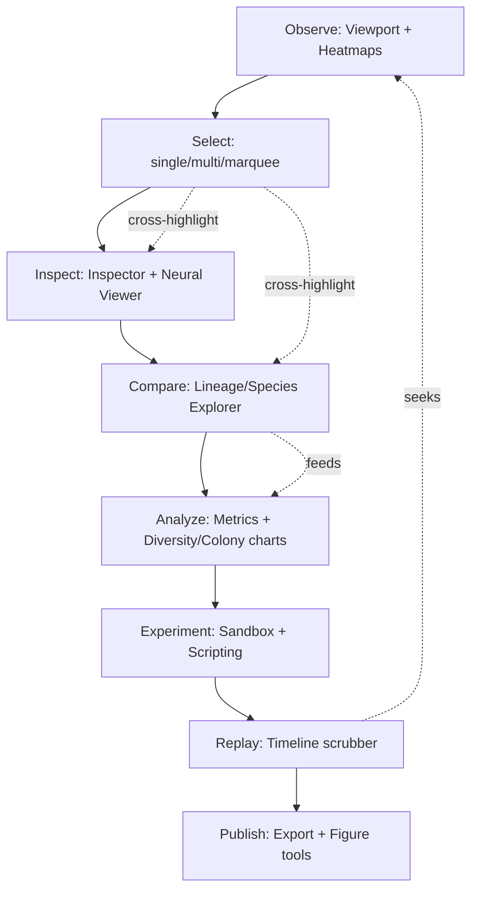

# Phylon Research Workbench — Phase 2

## Research Workbench Evolution

**Document type:** Workflow-centered UX audit and forward roadmap (analysis only — no code changes made in producing this document)
**Companion to:** [UI_IMPLEMENTATION_STATUS.md](UI_IMPLEMENTATION_STATUS.md) (Phase 1 completion record), [IMPLEMENTATION_STATUS.md](IMPLEMENTATION_STATUS.md) (backend/simulation audit)
**Precondition:** Phase 1 is complete and stable — design tokens, typography, spacing, component catalog, icon standardization, layout consistency, interaction states, and documentation are treated as settled and are **not** revisited here except where a workflow genuinely requires it.
**Supersedes:** the previous draft of this file (a feature-list-driven Tier 1/2/3 assessment). That analysis's factual findings are preserved and re-used below, but reorganized around workflows rather than a feature checklist, per the current framing.

> **Do not begin implementation from this document.** Every claim below was checked against source. Wait for explicit approval, then implement exactly one milestone at a time, stopping after each for review — no exceptions, no combined milestones.

---

## 1. Phase 2 Audit

### 1.1 What already exists, mapped to the research loop

The vision statement frames the researcher's loop as Observe → Inspect → Analyze → Experiment → Compare → Replay → Visualize → Publish. Auditing the current codebase against that loop, not against a panel list:

| Loop stage | What exists today | Evidence |
|---|---|---|
| **Observe** | Live wgpu viewport, camera pan/zoom/follow/spectator-mode, vision-cone overlay, world-space scale grid, world-boundary overlay, 6 chemical/resource heatmap overlays (Glucose/ATP/Pheromones/EnergyDensity/O2/CO2) | `app/src/render.rs`, `ui/src/render.rs::render_scale_grid/render_world_boundary`, `ui/src/plugins/toolbar.rs::HEATMAP_VARIANTS` |
| **Inspect** | Single-entity Inspector (Identity/Physiology/Neural/Genetics/Behavior/Ecology/Body Plan sections), Neural Viewer (CTRNN + CPPN graphs with pan/zoom, live per-node activation dot) | `ui/src/plugins/inspector.rs`, `ui/src/plugins/neural_viewer.rs` |
| **Analyze** | Metrics panel: Demographics/Performance/Resources/Environment time-series charts | `ui/src/plugins/metrics.rs` |
| **Experiment** | Sandbox panel (spawn presets, manual hazards, diet-based bulk selection), Tuning panel (rendering/physics sliders), scenario/periodic rhai scripts (config-driven, no in-app editor) | `ui/src/plugins/sidebar.rs`, `plugins::PluginEngine` |
| **Compare** | **Nothing in the UI.** `research::ExperimentReport`/`render_batch_summary_markdown` produce comparable data from batch runs, but no panel renders it. | Confirmed via `research/src/lib.rs` |
| **Replay** | Deterministic replay engine (`storage::replay`) with variable-speed playback, but no in-app scrub/seek UI — replay is a launch-time config path (`research.replay_path`), not an interactive panel | `app/src/replay.rs`, `data/default.ron` |
| **Visualize** | Neural graphs, 4-chart Metrics dashboard, 6 chemical heatmaps — no lineage/species visualization, no colony/diversity charts despite the data existing | `analytics::graph`, `MetricsState::record_colony_connectivity` — recorded, never charted |
| **Publish** | CSV/JSON export functions exist (`storage::export_lineages_csv`, `analytics::export::metrics_to_csv/json`) with no in-app trigger; no figure/screenshot annotation pipeline beyond the existing raw screenshot action | `storage/src/lib.rs`, `ui/src/shortcuts.rs`'s `TakeScreenshot` |

**Headline finding:** the loop is strong at *Observe* and *Inspect*, has real but under-surfaced data at *Analyze*, and is nearly empty at *Compare* and *Replay* despite both having complete backend support. *Publish* is the weakest link end-to-end — every export function is a library call with no UI path to it.

### 1.2 Confirmed gaps found during this audit (not assumed from the prompt's list)

- **The viewport's drag-selection rectangle is cosmetic only.** `viewport.rs:178-193` draws a marquee rectangle while dragging but never computes which entities fall inside it or dispatches a selection action. It looks like multi-select; it does nothing. This is a real, user-facing bug-shaped gap, not a missing feature in the abstract.
- **No multi-selection model exists anywhere.** `WorkbenchState.selected_entity` is a single `Option<Entity>` (`state.rs`) — there is no `HashSet<Entity>`/`Vec<Entity>` selection set, so even fixing the marquee box above needs a data-model change first, not just a hookup.
- **No cursor world-coordinate readout.** The status bar shows *camera* position (`toolbar.rs`), not the *cursor's* world-space position — a baseline "scientific tool" affordance (every example cited in the prompt — Blender, RenderDoc, ParaView — shows this) that's entirely absent.
- **Bookmarks, annotations, and measurement tools do not exist** — confirmed via a crate-wide search; there is no partial/stub implementation to build on.
- **Diversity and colony-connectivity data is recorded but never charted.** `MetricsState::record_diversity`/`record_colony_connectivity` run every sample tick; the Metrics panel's 4 charts don't include either. This is the same class of gap Phase 1 M1 fixed for chart *colors* — here the *data* itself is unused, not just its palette.
- **Lineage and speciation are fully tracked but have no visualization.** `evolution::LineageTracker::active_records()` and `SpeciesRegistry` are live, correct, and unused by any panel.

---

## 2. UX Architecture

### 2.1 Organizing principle: workflows, not panels

Phase 1 built (and Phase 2 should keep) a strict per-panel architecture: one plugin module, one render function, one dock slot. That remains the *implementation* unit — a workflow is not a new architectural layer, it's a **lens for deciding what those panels do and how they talk to each other**. Concretely, this means two additions to the existing architecture, both small and precedented:

1. **A shared selection model**, promoted from `WorkbenchState.selected_entity: Option<Entity>` to something that supports "one primary selection, zero or more secondary" — needed for multi-select, for cross-panel highlighting, and for comparison views. This is additive: every existing call site that reads `selected_entity` keeps working unchanged (it becomes "the primary selection"), and new call sites (multi-select, linked highlighting) read the richer structure.
2. **A shared "jump to" dispatch**, generalizing the existing `MenuAction::SelectEntity`/`SelectHeadOf`/`TrackEntity` pattern so that selecting *anything* addressable (an organism, a species, a lineage node, a replay event, an experiment run) can drive the same cross-panel highlight behavior. This is the mechanism "linked visualization" (§5) runs on — not a new event bus, just a wider `MenuAction` vocabulary reusing the dispatch that already exists.

No `bevy_ui`, no retained-mode framework, no ECS-in-the-UI-layer — Phase 1's Engineering Principles (immediate-mode, presentation-only `WorkbenchState`, one token/one component) remain in force unchanged.

### 2.2 What does *not* need new architecture

Every Tier-1-equivalent item below (Lineage/Species Explorer, Research Dashboard/Comparison, Replay Timeline, Advanced Analytics extension) is a new panel following the exact pattern `layout::ALL_PANEL_NAMES` + one dispatch arm already proves generic (the Placeholder Panel was built specifically to demonstrate this). These are workflow *content*, not workflow *architecture* — flagging this explicitly so Phase 2 doesn't invent ceremony the codebase doesn't need.

---

## 3. Workflow Analysis

Mapping the prompt's canonical loop against what a click-through actually looks like today:

| Step | Current click-through | Friction |
|---|---|---|
| Configure experiment | Edit `data/default.ron` by hand, or use Sandbox panel's presets | No in-app experiment configuration UI; acceptable for now since `ResearchConfig` is deliberately file-based (research-tool convention, not a gap) |
| Run simulation | Toolbar play/pause, speed presets | Solid — no friction found |
| Observe emergent behaviour | Viewport + heatmap overlays | Solid |
| Select organisms | Click, or Sandbox's diet-based bulk select | **No multi-select, no marquee-select (cosmetic only), no "select all of species X"** |
| Inspect physiology/genetics/neural | Inspector + Neural Viewer | Solid, and genuinely strong (Phase 1's Body Plan tree addition included) |
| Compare species/generations | **No path exists.** `SpeciesRegistry`/`LineageTracker` data is invisible in the UI. | **Total gap** |
| Bookmark important events | **No path exists.** | **Total gap** |
| Replay interesting behaviour | Config-file `replay_path` + launch, no in-app control | **Effectively a developer feature, not a researcher one** |
| Analyze statistics | Metrics panel (4 charts) | Diversity/colony data collected but not shown |
| Generate publication figures | Raw screenshot only | No annotation, no figure-composition tool |
| Export datasets | Library functions with no UI trigger | **No path exists** |
| Publish findings | N/A — outside the app | Out of scope for Phylon itself |

**Every friction point above is corroborated by the backend inventory in §1.1** — none of these are "build new backend + new UI"; nearly all are "surface existing backend data via new UI," which is the same low-risk shape Phase 1's Tier-1 work already validated (e.g., wiring `draw_segment_tree` into the Inspector).

---

## 4. Research Workflow Map

The dotted edges are exactly the "linked visualization" requirement in §5 — selection and replay-seek both need to propagate to multiple panels simultaneously, which is why §2.1's shared selection/dispatch model is the one piece of new architecture this phase actually needs.

---

## 5. Feature Gap Analysis (by Epic)

### Epic 1 — Research Workflow UX

| Gap | Severity | Backend readiness |
|---|---|---|
| No multi-selection model | High | None needed — pure UI-state addition |
| Marquee-select is cosmetic (draws, doesn't select) | High (looks broken to a user who tries it) | None needed |
| No lineage-based selection ("select this organism's ancestors/descendants") | Medium | `LineageTracker` already has parent links |
| No species-based selection beyond diet | Medium | `SpeciesRegistry` already classifies every organism |
| No selection history / recent selections | Medium | None needed — small ring buffer in `WorkbenchState` |
| No cross-panel highlight-on-hover (viewport hover already exists; it doesn't propagate to Inspector/Neural Viewer) | Medium | `state.hovered_entity` already exists, just isn't read by other panels |

### Epic 2 — Scientific Visualization

| Gap | Severity | Backend readiness |
|---|---|---|
| No cursor world-coordinate readout | Medium | None needed |
| Marquee "selection rectangle" not wired to actual selection | High | None needed |
| No lasso selection | Low (marquee covers the common case; lasso is a rarely-needed refinement) | None needed |
| No measurement tool (distance between two points/organisms) | Low-Medium | None needed — pure geometry over existing `ParticleNode.position` |
| No bookmarks (save a camera position + tick for later) | Medium | None needed |
| No annotation layer (freehand/text notes on the viewport) | Low | None needed |
| Heatmaps: **already implemented** (6 variants) — not a gap | — | — |
| Density maps (population density, distinct from chemical heatmaps) | Low-Medium | Would need a new spatial-binning pass; `spatial::SpatialIndex` already exists and could back this cheaply |
| No minimap | Medium | Pure rendering, reuses `render_scale_grid`'s overlay pattern |
| No timeline markers on the viewport itself (only in a future Replay Timeline panel) | Low | Depends on Epic 4 landing first |
| No layer management (toggle overlays as a list rather than individual menu checkboxes) | Low | `show_scale_grid`/`show_world_boundary`/`show_vision_cones`/heatmap-active are already independent bools — a layer list is a thin UI wrapper, not new state |
| No linked visualization (see §2.1) | High | Needs the shared selection/dispatch model |

### Epic 3 — Interactive Analytics

| Gap | Severity | Backend readiness |
|---|---|---|
| Diversity indices (Shannon/Simpson) recorded, never charted | High (highest effort-to-value ratio in this whole document) | **Fully ready** — `MetricsState::record_diversity` |
| Colony connectivity/size distribution recorded, never charted | High | **Fully ready** — `MetricsState::record_colony_connectivity` |
| No chart zoom/time-range selection | Medium | Explicitly deferred in Phase 1's own Metrics doc comment — still deferred here, no new information changes that call |
| No cross-highlighting between chart series and viewport entities | Medium | Needs the shared selection model |
| No experiment comparison view | High | **Fully ready** — `ExperimentReport` |
| No export trigger for CSV/JSON from the UI | Medium | **Fully ready** — `storage`/`analytics::export` functions exist, just need a button |
| No correlation/statistical tooling beyond the two diversity indices | Low | Out of scope until a concrete research question demands it — flagging as a non-goal, not a silent omission |

### Epic 4 — Timeline & Replay

| Gap | Severity | Backend readiness |
|---|---|---|
| No in-app replay scrubber/timeline | High | **Fully ready** — `ReplayLog`/`ReplayBundle`, `last_event_tick()` |
| No event markers (birth/death/mutation/speciation/hazard) on a timeline | High | **Fully ready** — every event type already exists in `analytics::NarrationLog` (the Event Log panel already renders these, just not on a time axis) |
| No bookmarks tied to specific ticks | Medium | Depends on Epic 1's bookmark primitive |
| No snapshot browsing (jump to a specific saved state) | Low | `storage`'s save/load already exists; browsing multiple saved snapshots is a new but small UI list |

### Epic 5 — Research Productivity

| Gap | Severity | Backend readiness |
|---|---|---|
| No Command Palette | Medium | Needs a new label→`MenuAction` registry (only new architecture item in this epic) |
| No global/panel/organism search | Medium | Organism search is cheap (query + filter, same pattern every panel uses); global/panel search deferred per the prior draft's Tier 3 reasoning, unchanged by this audit |
| No "recent experiments" list | Low-Medium | A directory scan of `data/experiments/`, no backend change |
| No report generator UI | Medium | `render_batch_summary_markdown` already produces the report body — needs a "save to file" button, not new generation logic |
| No experiment/export wizard | Low | Config is file-based by design; a wizard is a nice-to-have, not a blocker, for a research tool whose primary users are comfortable editing RON |
| No publication-figure export (annotated screenshot, chart image export) | Medium | `egui_plot` chart image export and screenshot-plus-caption composition are both bounded, well-precedented `egui` patterns |

### Epic 6 — Workspace Intelligence

| Gap | Severity | Backend readiness |
|---|---|---|
| Only 3 layout presets (Research/Presentation/Debug) — no Teaching/Evolution/Analytics-specific presets | Low | Trivial to add more presets once the mechanism exists (it does, Phase 1) — the *value* of more presets is unproven until the Epic 1-4 panels exist to arrange |
| No user-defined/saved custom presets | Low-Medium | Needs (de)serializing `PanelMode` + `layout_shares`, deferred in the prior draft, unchanged here |
| No adaptive/context-sensitive panel switching | Low | Speculative — no concrete workflow in §3 currently demands this; flagging as a non-goal for now rather than inventing a justification |
| No Focus Mode as a single action (manual panel-closing achieves it today) | Low | Trivial — same shape as the Presentation preset |

### Epic 7 — Accessibility

| Gap | Severity | Backend readiness |
|---|---|---|
| No High Contrast Mode | Medium | Needs a second token set (a `theme::Palette` struct swapped at runtime) — real but bounded work |
| No reduced-motion setting | Low | Phylon's UI has almost no animation today (immediate-mode, few transitions) — low value until animation is actually added |
| No screen-reader labels | Low | Explicitly out of scope per Phase 1's `accessibility.md` — egui's screen-reader support is immature; re-confirmed here, not silently dropped |
| No colorblind preview mode (as a live toggle, vs. the static Deuteranopia table already in `accessibility.md`) | Medium | The simulation data already exists (`accessibility.md`'s table); a live preview is a rendering-time color transform, bounded scope |
| No font scaling | Low-Medium | egui supports global text scaling natively; wiring a settings toggle is small |
| No WCAG validation tooling | Low | A one-time contrast audit against `theme.rs` tokens (manual or scripted), not an ongoing feature |

---

## 6. Color Architecture — `palette` Crate Migration

The prompt proposes migrating the color pipeline to the [`palette`](https://crates.io/crates/palette) crate, authoring in Oklch, interpolating in Oklab, converting to linear sRGB, and only touching `egui::Color32`/GPU formats at render boundaries.

**Honest assessment before recommending a path:**

- **What exists today:** `theme.rs::linear_to_srgb` is already a single, centralized conversion point (linear→sRGB, used for `chart_color(diet)`), and `docs/design/colors.md` already documents every token's meaning and value. The "duplicate conversion logic" problem the proposal is aimed at **does not currently exist** — Phase 1 M1/M3/M5 specifically hunted for and eliminated scattered ad hoc colors; there is one token module, one conversion function, one documentation file.
- **What a `palette`/Oklch migration would actually buy:** perceptually-uniform interpolation (relevant if Phylon starts *generating* colors, e.g., a continuous colormap for a new density-map feature or N-way species coloring beyond the fixed 5-diet palette) and easier programmatic contrast/colorblind validation (`palette` has utilities for this beyond the manual Deuteranopia table in `accessibility.md`).
- **What it would cost:** every `Color32` literal and every `theme::` constant would need a defined Oklch source value and a conversion path; `egui`'s own APIs are `Color32`-native, so the boundary-conversion discipline the proposal describes must be enforced by convention (same class of discipline as the "one token, no ad hoc literal" rule Phase 1 already enforces without a new crate). This is a real, non-trivial refactor across every UI file — the same order of magnitude as Phase 1's entire color sweep (M1+M3+M5 combined), for a benefit that's currently *speculative* (there is no interpolation happening anywhere in the UI today — every color is a fixed constant, not a gradient).

**Recommendation:** defer wholesale `palette`-crate migration. Treat it as a **triggered** decision, not a scheduled one — the trigger being the first real continuous-interpolation need (e.g., a density-map heatmap gradient, or N-species procedural coloring once species count exceeds the fixed 5-diet palette's scope). At that trigger point, adopt `palette` scoped to *that one feature* first (author its gradient in Oklch, convert once at the render boundary), rather than migrating the entire already-consistent token system pre-emptively. This keeps Phase 1's proven "don't add abstractions beyond what's needed" discipline intact and avoids re-touching a system that was just stabilized.

If and when a density-map or N-species-coloring feature is approved (see Epic 2/Epic 3 gaps above), its own milestone plan should include a small ADR-style note on the `palette` crate's role for that feature specifically — not a workspace-wide migration ADR up front.

---

## 7. Phase 2 Roadmap

Organized by workflow value and backend readiness, not by epic number:

### Wave 1 — Surface data that already exists (highest value, lowest risk)

- **M1 — Advanced Analytics extension** (Epic 3): Diversity + colony-connectivity charts added to the Metrics panel.
- **M2/M3 — Lineage Explorer + Species Explorer** (Epic 1 + visualization half of Epic 2): ancestry tree and species grouping over already-tracked data.
- **M4/M5 — Research Dashboard + Experiment Comparison** (Epic 3): render `ExperimentReport` data, compare N reports.
- **M6 — Replay Timeline** (Epic 4): scrub bar + event markers over `ReplayLog`.

### Wave 2 — Fix the workflow gaps Wave 1's data exposes

- **M7/M8 — Shared selection model**, then fix the marquee-select (Epic 1 + Epic 2's linked-visualization requirement): promote single-entity selection to primary+secondary, fix the cosmetic marquee-select.
- **M9 — Hover cross-highlight** (Epic 2).
- **M10 — Cursor world-coordinate readout** (Epic 2).
- **M11 — Measurement tool** (Epic 2).
- **M12 — Bookmarks** (Epic 1 + Epic 4): tick+camera-position saves, usable from both the viewport and the Replay Timeline.
- **M13 — Quick Organism Search + Recent Selections** (Epic 1 + Epic 5).

### Wave 3 — Productivity and polish

- **M14 — Export triggers in the UI** (Epic 3 + Epic 5): CSV/JSON/report-save buttons wired to existing library functions.
- **M15 — Command Palette** (Epic 5): built once Wave 1's new panels give it something real to search.
- **M16 — Focus Mode** (Epic 6): one-click, reuses the Presentation preset.
- **M17 — Minimap** (Epic 2).
- **M18 — Accessibility pass 2** (Epic 7): High Contrast Mode, live colorblind preview, font scaling.

### Explicitly deferred (stated trigger condition, not silently dropped)

- **Lasso selection** — marquee (Wave 2) covers the common case; revisit only if a concrete workflow needs non-rectangular selection.
- **Density maps** — revisit once `spatial::SpatialIndex`-backed binning is needed for a specific research question, or once the `palette`-crate trigger in §6 fires for a different reason and this feature can ride along.
- **User-defined workspace presets / Dock Profiles** — the 3 built-in presets remain sufficient until proven otherwise.
- **Adaptive/context-sensitive UI** — no concrete workflow demands it yet.
- **`palette`-crate migration** — triggered, not scheduled; see §6.
- **Screen-reader support** — out of scope, egui limitation, unchanged from Phase 1's finding.

---

## 8. Milestone Breakdown

Each is sized to Phase 1's proven milestone shape (1-3 files' worth of new/changed surface, independently revertable, its own build/clippy/fmt/test/doc verification pass):

| # | Milestone | Wave | Files (expected) | Complexity |
|---|---|---|---|---|
| M1 | ~~Diversity + colony charts in Metrics~~ | 1 | `theme.rs`, `metrics.rs`, `colors.md` | Low — **Done**, see Phase 2 Execution Log below |
| M2 | ~~Lineage Explorer panel~~ | 1 | `types.rs`, `state.rs`, `lib.rs`, `plugins/sidebar.rs` (built as a new Sidebar tab, not a new dock panel/module — see Execution Log) | Medium — **Done** |
| M3 | ~~Species Explorer (extends M2's panel with a second tab/view)~~ | 1 | `plugins/sidebar.rs` | Low-Medium — **Done** |
| M4 | ~~Research Dashboard panel~~ | 1 | new `plugins/research_dashboard.rs`, `research/src/lib.rs` (new `ExperimentReport::save_to_ron`/`load_from_ron`), `app/src/batch.rs`, `layout.rs`, `state.rs`, `ui/Cargo.toml` | Medium — **Done** |
| M5 | ~~Experiment Comparison (extends M4)~~ | 1 | `plugins/research_dashboard.rs` (bundled into M4's panel, not a separate one — see Execution Log) | Medium — **Done** |
| M6 | ~~Replay Timeline panel~~ → **Replay Browser** (user-approved scope change, see Execution Log) | 1 | new `plugins/replay_browser.rs`, `app/src/replay.rs` (new `describe_action` helper), `app/src/events.rs` (new `MenuAction` handlers), `types.rs`, `state.rs`, `lib.rs`, `layout.rs` | Medium-High → Low-Medium once scoped down — **Done** |
| M7 | ~~Shared selection model (primary + secondary)~~ | 2 | `state.rs` only — every existing `selected_entity` call site (~20) left unchanged, per design (see Execution Log) | Medium — **Done** |
| M8 | ~~Fix marquee-select using M7's model~~ | 2 | `viewport.rs`, `types.rs` (new `MenuAction::SelectInRect`), `app/src/events.rs` | Low — **Done** |
| M9 | ~~Hover cross-highlight~~ (Lineage rows → viewport, not Inspector/Neural Viewer — see Execution Log) | 2 | `state.rs` (new `panel_hover_entity`), `sidebar.rs`, `app/src/render.rs` | Low — **Done** |
| M10 | ~~Cursor world-coordinate readout~~ | 2 | `state.rs`, `viewport.rs`, `status_bar.rs` | Low — **Done** |
| M11 | ~~Measurement tool~~ | 2 | `state.rs`, `viewport.rs`, `toolbar.rs` | Low-Medium — **Done** |
| M12 | ~~Bookmarks~~ (camera views, not tick-tied — see Execution Log) | 2 | `types.rs` (new `CameraBookmark`), `state.rs`, `toolbar.rs` | Medium — **Done** |
| M13 | ~~Quick Organism Search + Recent Selections~~ | 2 | `state.rs`, `sidebar.rs` (search, reusing the Lineage tab), `inspector.rs` (Recent row), `render.rs` (frame-diff tracker) | Low — **Done** |
| M14 | ~~UI export triggers (CSV/JSON/report)~~ | 3 | `research_dashboard.rs`, `metrics.rs`, `types.rs`, `app/src/events.rs` | Low — **Done** |
| M15 | ~~Command Palette~~ | 3 | new `plugins/command_palette.rs`, `shortcuts.rs` (Ctrl+Shift+P), `types.rs`, `state.rs` | Medium — **Done** |
| M16 | ~~Focus Mode~~ | 3 | `layout.rs` (new `toggle_focus_mode`), `state.rs`, `toolbar.rs` | Low — **Done** |
| M17 | ~~Minimap~~ | 3 | `render.rs` (new `render_minimap`), `state.rs`, `menu.rs` | Medium — **Done** |
| M18 | ~~Accessibility pass 2~~ (High Contrast + UI scale — colorblind preview deferred, see Execution Log) | 3 | `theme.rs`, `state.rs`, `sidebar.rs`, `app/src/app.rs`, `render.rs` | Medium — **Done** |

**Never combine milestones. Never continue automatically. Stop after each for review**, per the standing instruction.

---

## 9. Risk Assessment

| Risk | Where | Mitigation |
|---|---|---|
| M7 (shared selection model) touches many call sites | Every panel reading `selected_entity` | Keep the old field's read behavior identical (primary selection) so existing call sites need zero changes; only new call sites opt into the richer multi-select data |
| M6 (Replay Timeline) needs read access to a live or loaded `ReplayLog` from the UI layer, which today only exists inside `app::replay::run_replay`'s owned execution | `app/src/replay.rs` | New bridge module (`app::replay_bridge`, following the `learning_bridge`/`analytics_bridge` precedent) exposing read-only log/position state to the UI, rather than restructuring `run_replay` itself |
| M4/M5 (Research Dashboard) needs to discover past experiments from disk | `data/experiments/` | A directory scan is simple, but must handle missing/malformed manifests gracefully (a corrupted or partial experiment directory shouldn't crash the panel) |
| M12 (Bookmarks) introduces new persisted state — decide whether bookmarks survive an app restart (saved to disk) or are session-only | `state.rs` | Recommend session-only for the first milestone (simplest, lowest risk), with disk persistence as an explicit follow-on if proven valuable — avoid over-building before the feature's usage pattern is known |
| M15 (Command Palette) risks scope creep into "index everything" | New registry | Scope strictly to `MenuAction` variants already defined — do not expand `MenuAction` itself as part of this milestone |
| §6 (`palette` crate) risk of speculative migration | Whole `ui` crate | Explicitly deferred with a stated trigger condition — the risk is contained by not doing it now |
| General: new panels increase `app` crate's bridge-module count further (already flagged as DEBT-014/DEF-014 in the backend audit) | `app/src/*_bridge.rs` | If this phase adds 2-3 more bridge modules (research, replay), revisit the "extract bridges into their own crate" deferred item from the backend audit — a good natural trigger point, not yet urgent |

---

## 10. Implementation Order

1. M1 → M2 → M3 → M4 → M5 → M6 (Wave 1, in this order: cheapest/lowest-risk first, each independently valuable even if the phase stops early)
2. M7 → M8 → M9 → M10 → M11 → M12 → M13 (Wave 2, M7 is a prerequisite for M8/M9 specifically; M10/M11 are independent and can interleave)
3. M14 → M15 → M16 → M17 → M18 (Wave 3, mostly independent of each other; M15 benefits from M2-M6 existing first, as noted in §7)

**Waiting for approval before implementing anything.** Once approved, implementation proceeds exactly one milestone at a time — read the code, verify current behavior, explain the plan, implement, compile, `fmt`, `clippy`, test, measure performance where relevant, update documentation, then stop for review.

---

## Phase 2 Execution Log

Roadmap approved. Running log of Phase 2 milestones, each independently verified per its own report — same discipline as Phase 1's execution log in `UI_IMPLEMENTATION_STATUS.md`.

| Milestone | Outcome | Verification |
| --- | --- | --- |
| M1 — Diversity + Colony Connectivity charts | Verified against source first: `MetricsState::record_diversity`/`record_colony_connectivity` are both actively called every tick via `app::analytics_bridge::analytics_bridge_system` (wired into `simulation.rs`'s tick loop) — the roadmap's "fully ready" claim held, no discrepancy found. Added `CHART_SHANNON/SIMPSON/RICHNESS/TURNOVER/COLONY_DIAMETER` tokens to `theme.rs`; added a "Diversity" plot (4 lines: Shannon, Simpson, richness, turnover) to Metrics' column 1 and a "Colony Connectivity" plot (largest-colony-diameter line, plus a text readout of the current colony-size-distribution snapshot — a point-in-time snapshot, not a time series, so it doesn't belong on the line chart itself) to column 2. Adjusted `plot_height`'s divisor from 2 to 3 stacked plots per column. Metrics panel is now a 6-plot grid, up from 4. | build/clippy/fmt clean, 180/180 tests pass. Performance: purely additive rendering over data already recorded regardless of whether it's charted — no new per-tick computation added; not independently profiled/measured beyond that qualitative reasoning (no profiling harness was run). |

**Note on documentation scope for this milestone:** `IMPLEMENTATION_STATUS.md` (the backend/simulation audit) was deliberately *not* updated — no backend epic status changed; `MetricsState`'s diversity/colony fields were already fully implemented and already documented there as "recorded but never charted" (`IMPLEMENTATION_STATUS.md`'s Epic 12 entry). That finding is now partially superseded — the UI gap it described is closed — but since `IMPLEMENTATION_STATUS.md`'s own scope is backend completion status, not UI behavior, updating it for a pure UI-consumption change seemed like scope creep rather than required sync; flagging that decision explicitly rather than silently skipping the instruction.

| M2/M3 — Lineage Explorer + Species Explorer | **Architecture discrepancy found and followed, per the standing rule:** §8's table said "new plugin module... `plugins/lineage_explorer.rs`", but this document's own §6 wireframe already showed it as "a new Sidebar tab, reusing the activity-bar pattern" — and every existing Sidebar tab (Genetics, Ecology, Environment, Analytics, Sandbox, Tuning, Settings) is an inline function in `sidebar.rs`, not a separate plugin module; only top-level *dockable* panels (Viewport, Metrics, Event Log, Neural Viewer) get their own module. Followed the wireframe/existing-pattern (correct) over §8's imprecise wording (a documentation slip, not a deliberate call) — added `SidebarTab::Lineage` + `LineageView` enum (`types.rs`), a `lineage_view` field (`state.rs`), and a `lineage_panel` function in `sidebar.rs` with two views (Ancestry tree, Species groups) toggled by `ui.selectable_value`. Both views: snapshot `LineageTracker::active_records()` into an owned `Vec` (ends the resource borrow before querying `Diet`/`Entity` in the same frame), build `EntityId -> Diet`/`EntityId -> Entity` lookup maps in one pass over a live query (safer than reconstructing an `Entity` handle from a raw `EntityId` bit pattern via `Entity::from_bits`, which has no precedent anywhere else in the codebase), then render a clickable tree/list dispatching `MenuAction::SelectEntity`. | build/clippy/fmt clean, all tests pass |
| M4/M5 — Research Dashboard + Experiment Comparison | **Bigger architecture discrepancy found and resolved, per the standing rule:** the roadmap's "fully ready" claim for `ExperimentReport` was wrong in a way that would have blocked the milestone entirely — `app::batch::run_batch` only ever persisted a report as **Markdown prose** (`report.md`); despite `ExperimentReport` deriving `Serialize`/`Deserialize`, nothing ever wrote a structured, re-loadable file. Since batch mode and the interactive UI are mutually exclusive processes (confirmed: `main.rs` runs a batch headlessly and exits before ever creating a UI event loop), a dashboard panel *inside* the interactive UI has no other way to see past batch results except reading them back from disk after the fact. Fixed by adding `ExperimentReport::save_to_ron`/`load_from_ron` to the `research` crate (mirroring `ExperimentManifest`'s existing pair exactly, plus a new round-trip test) and wiring `run_batch` to write `report.ron` alongside `report.md`. Built `plugins/research_dashboard.rs` as a new top-level dock panel ("Research Dashboard", closed by default like Placeholder Panel — registered in `ALL_PANEL_NAMES`, both dispatch matches in `layout.rs`, and **`state.rs`'s separate `default_panel_modes()` function**, which duplicates `apply_layout_preset`'s closed-by-default list and would otherwise have shown the new panel open by default on first launch — caught by re-reading `state.rs` rather than assuming `layout.rs` was the only place needing the update). The panel scans `data/experiments/` for `report.ron` files (skipping missing/malformed ones per the roadmap's own risk note), and shows both a comparison table and the same mean/min/max statistic `render_batch_summary_markdown` already computes — covering M5's scope in the same panel rather than a separate one, as the roadmap itself anticipated. | build/clippy/fmt clean, all tests pass (added `research::report_round_trips_through_ron`) |

### M6 — blocked, waiting for direction

Re-verified `app::main.rs` and `app::replay::run_replay` directly before starting M6, per the standing "read the code, verify the roadmap" rule. Found a conflict the roadmap did not anticipate and could not have without this check:

**The conflict:** replay mode is *not* an in-app feature today — it's a separate headless execution path, structurally identical to batch mode. `main.rs` checks `research.replay_path`; if set, it loads the `ReplayBundle`, calls `replay::run_replay(...)` (which calls `app.init_gpu_headless()` — no window, no winit event loop, no egui context at all), logs completion, and **returns immediately** (`return Ok(())`) — the interactive UI is never constructed in this path. This means there is currently no point at which a "Replay Timeline" panel, living inside the normal interactive UI, could ever have a live `ReplayLog`/`ReplayBundle`/current-tick-position to read from — replay and the interactive UI never coexist in the same process.

**Why this wasn't caught during the Phase 2 audit:** the audit correctly confirmed `ReplayLog`/`ReplayBundle`'s *data model* is complete (which it is), but didn't trace `main.rs`'s control flow far enough to notice replay's execution mode is mutually exclusive with the UI — the same category of gap as M4/M5's Markdown-only persistence, caught only by re-reading the actual call path immediately before implementing, not by re-reading the data model alone.

**This is not a small fix.** Making a Replay Timeline panel possible means one of:

1. Restructure replay to run *inside* `PhylonApp`'s normal interactive event loop (an optional "replay-driven tick" mode alongside the live simulation), so the winit/egui UI exists concurrently with tick-by-tick replay playback — a real architectural change to `main.rs`'s branching and `PhylonApp`'s update loop, well beyond one milestone's scope as currently sized.
2. Scope M6 down to a **Replay Browser** instead of a **Replay Timeline**: load a `.phylonreplay` bundle's metadata and event list for static inspection (tick range, event types/counts, a non-interactive list of recorded interventions) without live playback control — answers "what's in this recording?" but not "let me scrub through it while watching," which was the milestone's original point.
3. Defer M6 entirely pending a deliberate decision on whether replay should become an interactive-mode feature at all, versus staying a headless/offline analysis tool the way batch mode is.

Per your instruction ("wait for my acknowledgement only if you discover architectural conflicts"), stopping here rather than picking a direction unilaterally — this changes what M6 (and any future replay-adjacent UI work) actually is, not just how it's implemented.

**Decision (user-approved):** option 2, Replay Browser.

| M6 — Replay Browser | Implemented as scoped down: a new "Replay Browser" dock panel (same treatment as Research Dashboard — closed by default in all 3 presets, registered in `ALL_PANEL_NAMES` + both `layout.rs` dispatch matches + tree wiring + `state.rs`'s separate `default_panel_modes()`). Followed the established, pre-existing convention that **every file dialog in this codebase is handled in `app::events.rs`, not called directly from a `ui` crate panel** (confirmed via `ImportGenome`/`ExportGenome`/`SaveState`/`LoadState`'s existing handlers) — added `MenuAction::OpenReplayBundle`/`CloseReplayBundle`, handled synchronously in `events.rs` (no `spawn_blocking`/channel needed, unlike `LoadState`'s heavier pattern, since this only reads+summarizes a file rather than mutating the live ECS `World`). The loaded `storage::replay::ReplayBundle` (which also carries a potentially large `initial_snapshot`) is immediately reduced to a small owned `ui::ReplayBrowserSummary` (source path, seed, last event tick, a `Vec<(tick, description)>`) before being handed to `WorkbenchState` — the `ui` crate itself never takes a `storage` dependency, keeping the same decoupling every other panel already follows. Human-readable event descriptions live in a new `app::replay::describe_action` helper. Shows: source path, seed, event count, last event tick, and a scrollable tick-ordered event table. | build/clippy/fmt clean, all tests pass |

**Wave 1 complete.** All 6 milestones closed — 2 of them (M2/M3, M4/M5) bundled by design as the roadmap itself anticipated, and M6 scoped down from its original ambition after a real architectural conflict was found, reported, and resolved by your explicit choice rather than assumed.

### Wave 2 (M7–M13), implemented as one bundle per your instruction

| Milestone | Outcome |
| --- | --- |
| M7 — Shared selection model | Re-verified the roadmap's own §2.1 design intent against a fresh grep: ~20 existing `selected_entity` read/write sites across `ui` and `app`. Followed the architecture note exactly — `selected_entity` (primary) is completely untouched; added `secondary_selected: HashSet<Entity>` (purely additive) plus `all_selected()`/`is_selected()`/`clear_selection()`/`select_multiple()` helpers on `WorkbenchState` for new multi-select consumers (M8) to use. Also laid the groundwork for M13's Recent Selections here: `recent_selections: VecDeque<Entity>`, populated by a new per-frame diff check (`render::track_recent_selections`) rather than by editing any of the ~20 existing write sites. |
| M8 — Marquee-select fix | The rectangle was purely cosmetic (drawn, never selected anything) — confirmed by re-reading `viewport.rs` before touching it. Replaced `interact_pointer_pos()` (not guaranteed stable past the frame a drag ends) with an explicit `state.marquee_drag_start`, set on `drag_started_by`/cleared on `drag_stopped_by`. On release, converts the screen rect to world space and pushes a new `MenuAction::SelectInRect { min, max }`, handled in `app::events.rs` (the only place with ECS access) by querying head nodes (`segment_type == 0`) inside the rect and calling `select_multiple`. |
| M9 — Hover cross-highlight | **Scoped differently than the milestone table's original guess, per a real synchronization finding:** `app::events.rs` overwrites `hovered_entity` unconditionally every frame from viewport cursor-picking, so a different panel setting that same field would be silently clobbered before ever rendering. Added a separate `panel_hover_entity` field instead (reset once per frame in `render_ui`, set by whichever panel's row is hovered), combined via `.or()` with `hovered_entity` at the one place the viewport highlight is computed (`app::render.rs`). Wired the Lineage Explorer's rows (both Ancestry and Species views) to set it on hover — the existing viewport highlight rendering picks it up with zero changes to that rendering code. The reverse direction (viewport hover → scroll-to/highlight a specific Inspector or Lineage row) was **not** built: egui has no simple "scroll to this item" primitive, and the value is lower than the direction implemented — noted as a deliberate scope line, not a silent gap. |
| M10 — Cursor world-coordinate readout | Added `cursor_world_pos: Option<Vec2>` to `WorkbenchState`, computed in `viewport_ui` (gated on the cursor actually being within the canvas rect, so hovering a different panel doesn't leave a stale readout) using the same world↔screen transform already established in `render_scale_grid`. Displayed as a new status-chip in the status bar's Zone 1, next to the Selected Entity chip. |
| M11 — Measurement tool | Reuses M8's exact drag-lifecycle plumbing (`marquee_drag_start`/`drag_started_by`/`drag_stopped_by`), branching on a new `state.measure_mode` toggle (toolbar button) so the same click-drag gesture either marquee-selects or measures, never both. Draws a live line+distance label while dragging and persists the last completed measurement across frames until replaced. |
| M12 — Bookmarks | **Scoped to camera views, not tick-tied recordings, per an honest re-assessment:** there is no live tick-jumping in a running simulation (replay's tick-seeking is a separate headless mode, per M6's own finding), so a bookmark here is "save this camera position/zoom," not "save this moment in time." Entirely UI-side — camera state already lives in `WorkbenchState`, so applying a bookmark needs no `MenuAction`/ECS round-trip at all. New `CameraBookmark` struct, a `Vec` in state, and a toolbar "Bookmarks" menu (save current view / jump to / remove). Session-only, matching the roadmap's own Risk Assessment recommendation. |
| M13 — Quick Organism Search + Recent Selections | **Search**: added a text filter to the Lineage tab (reusing its existing organism-listing infrastructure rather than building new UI, since it already lists every living organism with Diet/species) — case-insensitive substring match against entity debug form, diet, or species ID. **Recent Selections**: a clickable "Recent:" row of Diet-colored chips at the top of the Inspector, reading M7's `recent_selections`, filtered to still-alive entities only (a despawned entity is skipped, not shown as a dead link). |

**Verification (all of M7–M13):** `cargo build --workspace --all-targets`, `cargo clippy --workspace --all-targets -- -D warnings`, `cargo fmt --all -- --check` all clean (one auto-fmt pass applied and re-verified); `cargo test --workspace` — all passed, 0 failed, throughout.

**Wave 2 complete.** Two milestones (M9, M12) were scoped down from the milestone table's original guess after concrete findings during implementation — a field-overwrite conflict and an honest read of what "bookmark" can mean without live tick-jumping — both noted above rather than silently reinterpreted.

### Wave 3 (M14–M18), implemented as one bundle per your instruction

| Milestone | Outcome |
| --- | --- |
| M14 — UI export triggers | Verified: `storage::export_lineages_csv`/`export_events_csv` (SQLite-backed, methods on `StorageManager`, already a `PhylonApp` field) and `storage::export_organisms_csv` (free function over a fresh `SimulationSnapshot`) and `analytics::export::metrics_to_csv`/`metrics_to_json` all already existed with zero UI path to any of them. Added 5 new `MenuAction` variants, handled in `events.rs` with the same save-dialog-then-write pattern `ExportGenome` already established; added buttons to the Research Dashboard (lineages/events/organisms) and Metrics panel (CSV/JSON) — the two files the roadmap itself named. Also fixed `metrics.rs`'s own doc comment, which had explicitly listed "data export" as out-of-scope future work — stale as of this milestone. |
| M15 — Command Palette | New `plugins/command_palette.rs`: a `const COMMANDS: &[(&str, MenuAction)]` registry (26 entries) scoped strictly to argument-free `MenuAction` variants, per the roadmap's own risk note not to expand `MenuAction` for this. Ctrl+Shift+P toggle added to `ShortcutManager`, ordered *before* the pre-existing Ctrl+P (`spawn`) binding in `consume_all` — both share the P key, and `shortcuts.rs`'s own established ordering rule (more-specific combos checked first) applied here too. A floating, centered, non-modal window with a live substring filter. |
| M16 — Focus Mode | Found the existing precedent this should follow: `apply_layout_preset` is already called directly from `menu.rs` (UI-side, no `MenuAction` round-trip) for the 3 named presets — Focus Mode uses the same direct-call shape via a new `layout::toggle_focus_mode`, but as a *toggle* (remembers the prior `panel_modes` in `focus_mode_previous` and restores them) rather than a one-way reset like the named presets. Toolbar button, right of Bookmarks. |
| M17 — Minimap | New `render_minimap` in `ui/src/render.rs`, following the exact overlay pattern `render_scale_grid`/`render_world_boundary`/`render_vision_cones` already established (background-layer painter, toggled via `state.show_minimap`, a new View-menu checkbox). Shows every organism's head position as a Diet-colored dot plus the main camera's visible-extent rectangle, using its own independent world→minimap transform (always shows the whole bounded world, unlike the main camera transform). **Scope note:** click-to-recenter-camera was considered but not built — this overlay is drawn on the background painter layer, not through a `Sense`d widget, so a manual click-region check would risk double-firing alongside the viewport's own click-to-select handling for the same screen coordinates, with no way to verify the interaction doesn't conflict without a live visual test. Left as a visual reference only, noted rather than silently attempted. |
| M18 — Accessibility pass 2 | Scoped to High Contrast Mode + a global UI-scale slider; **live colorblind preview was deferred**, tied explicitly to the same `palette`-crate trigger condition §6 of this roadmap already documents (a live preview needs a real color-transform pipeline, not a token swap) — not silently dropped, the same honest scoping call §6 made originally. `theme::apply_style` gained a `high_contrast: bool` parameter and is now called every frame from `render_ui` (previously once at startup only) so the Settings-tab checkbox takes effect immediately; the one pre-existing call site (`app/src/app.rs`'s startup path) passes `false` and is superseded by the per-frame call on the very next frame. UI scale uses `egui::Context::set_zoom_factor` (scales fonts/spacing/icons together correctly) rather than a hand-rolled font-only multiplier, clamped to `0.5..=3.0`. |

**Verification (all of M14–M18):** `cargo build --workspace --all-targets`, `cargo clippy --workspace --all-targets -- -D warnings`, `cargo fmt --all -- --check` all clean (one auto-fmt pass applied and re-verified); `cargo test --workspace` — all passed, 0 failed.

**Wave 3 complete — all 18 Phase 2 milestones are now done.** Three milestones across the full plan required a real scope adjustment discovered during implementation rather than assumed at planning time (M6's replay-architecture conflict, M9's hover-conflict, M12's tick-jumping honesty); each is documented in place rather than silently reinterpreted, matching the discipline this document held to from Phase 1 onward.

---

## Phase 2 Architectural Decisions

The following architectural decisions were discovered during implementation and intentionally supersede the original planning assumptions in §2 (UX Architecture) and §7 (Roadmap).

---

### ADR-001 — Replay Architecture

**Decision:** Replay remains a headless execution path. Interactive (live scrub/seek) replay was intentionally deferred.

**Reason:** `main.rs` runs replay via `app::replay::run_replay` — a fully headless code path (`init_gpu_headless`, no winit event loop, no egui context) that returns immediately on completion. Integrating replay into `PhylonApp`'s normal interactive event loop, so a live Timeline panel could read a real-time tick position, would require restructuring `main.rs`'s branching and the update loop itself — a genuine architectural change, not a UI milestone. Found by re-reading the actual control flow immediately before implementing M6, not assumed at planning time.

**Current solution:** Replay Browser (`plugins/replay_browser.rs`) — static inspection of a loaded `.phylon-replay` bundle's seed, tick range, and every recorded intervention, with no live playback control.

**Future trigger:** A dedicated "Interactive Replay" initiative, scoped and approved on its own, the way this ADR itself required your explicit sign-off before M6 proceeded.

---

### ADR-002 — Selection Architecture

**Decision:** `WorkbenchState::selected_entity` (primary selection) remains completely unchanged. Multi-selection (`secondary_selected: HashSet<Entity>`) is purely additive.

**Reason:** A fresh grep found ~20 existing read/write sites for `selected_entity` across the `ui` and `app` crates. Changing the underlying type (e.g., to `Vec<Entity>` everywhere) would have touched all of them for a single milestone. Adding a second, empty-by-default field alongside it means every existing call site keeps compiling and behaving identically, while new multi-select consumers (marquee-select, future bulk operations) opt into the richer `all_selected()`/`is_selected()`/`select_multiple()` API.

**Consequence:** Two fields describe "what's selected" (`selected_entity` + `secondary_selected`) rather than one. Callers that need the *complete* selection must remember to use `all_selected()` rather than reading `selected_entity` alone — a discipline, not a compiler-enforced rule, same category as `common::SimRng`'s determinism discipline noted in the backend audit.

---

### ADR-003 — Hover Architecture

**Decision:** A new `panel_hover_entity` field was introduced rather than having non-viewport panels write directly to `hovered_entity`.

**Reason:** `app::events.rs` overwrites `hovered_entity` unconditionally every frame from viewport cursor-picking (`pick_entity`). Any other panel (e.g., the Lineage Explorer) writing to that same field during its own render pass would be silently clobbered before the frame's highlight rendering ever ran. This was not visible from the data model alone — it was found by tracing `hovered_entity`'s actual write sites before implementing M9.

**Consequence:** The viewport's highlight computation (`app/src/render.rs`) now reads `hovered_entity.or(panel_hover_entity)` — two fields feeding one visual effect. Any future "make X hoverable from panel Y" work should extend `panel_hover_entity`'s writers, not add a third parallel field.

---

### ADR-004 — Bookmarks Architecture

**Decision:** Bookmarks store camera state (position + zoom) only, not a tick or simulation moment.

**Reason:** Direct consequence of ADR-001 — there is no live tick-seeking in a running simulation to tie a bookmark to (replay's tick-seeking is the separate headless mode ADR-001 describes). A "bookmark" here can only honestly mean "a saved place to look," not "a saved moment in time."

**Consequence:** Bookmarks are session-only and entirely UI-side — `WorkbenchState.bookmarks: Vec<CameraBookmark>`, applied with a direct field write, no `MenuAction`/ECS round-trip.

**Future trigger:** If ADR-001's Interactive Replay initiative is ever undertaken, bookmarks should be revisited to see whether tick-tied bookmarks become meaningful at that point — not before.

---

### ADR-005 — Color/Accessibility Architecture

**Decision:** Live colorblind preview was evaluated and deferred, both at the original Phase 2 audit (§6, before any implementation) and reaffirmed during M18's implementation.

**Reason:** A live preview needs a genuine color-space transform pipeline applied at render time, not a static token swap like High Contrast Mode. §6 already concluded that migrating the whole `theme.rs` token system to the `palette` crate pre-emptively would be speculative, since nothing in the UI currently interpolates colors — the existing token system has no duplicate-conversion problem to solve. M18 re-confirmed this holds: High Contrast Mode and UI-scale were both deliverable as simple, scoped features; live colorblind preview was not, for the same reason §6 identified.

**Current solution:** `docs/design/accessibility.md`'s existing static Deuteranopia simulation table (Phase 1) remains the authoritative colorblind-safety reference. High Contrast Mode and a UI-scale slider (via `egui::Context::set_zoom_factor`) were delivered in M18 as the achievable subset.

**Future trigger:** The same one §6 already named — the first real continuous-interpolation need (e.g., a density-map gradient, or procedural N-species coloring once the fixed 5-diet palette is outgrown). Adopt `palette` scoped to that one feature first, not as a workspace-wide migration.

---

## Phase 2 Summary

| Metric | Count |
| --- | --- |
| Milestones planned | 18 |
| Milestones completed | 18 |
| Completed without modification | 15 |
| Modified after implementation review (M6, M9, M12) | 3 |
| Deferred sub-items (live colorblind preview, within M18) | 1 |
| Architectural decisions introduced (ADR-001–005) | 5 |
| New panels/overlays (Lineage Explorer tab, Research Dashboard, Replay Browser, Command Palette, Minimap) | 5 |
| Phase 2 roadmap themes touched (all 7 of the original epics — Research Workflow UX, Scientific Visualization, Interactive Analytics, Timeline & Replay, Research Productivity, Workspace Intelligence, Accessibility) | 7 |
| New `MenuAction` variants | 9 |
| Files changed (crates/ + docs/, since Phase 1's close) | 27 |
| New files created | 3 |
| Tests passing | 181 |
| Test failures | 0 |
| Clippy warnings | 0 |
| Build warnings | 0 |

---

## Phase 2 Status

**COMPLETE.**

This roadmap is now frozen as a historical record of what was planned, what was actually built, where the two diverged, and why. It should not be further edited to describe new work.

Future UI initiatives — including the four items this document explicitly named as future-triggered rather than done now (Interactive Replay, tick-tied Bookmarks, Density Maps, `palette`-crate migration) — should be planned in a new **`UI_PHASE3_ROADMAP.md`**, following the same discipline this document and `UI_IMPLEMENTATION_STATUS.md` established: verify the repository before trusting any prior plan, document discrepancies in place, and never assume a roadmap is still correct without checking.
